# 第五章：组合逻辑分析

## 5.1 基本组合逻辑电路

### 5.1.1 与或逻辑（AND-OR）与积之和（SOP）

> [!knowledge]
> 积之和（sum of products, SOP）表达式可直接用与或两级结构实现：
>
> 1. 每个乘积项对应一个 AND 门；
> 2. 用一个 OR 门对所有乘积项求和。
> - 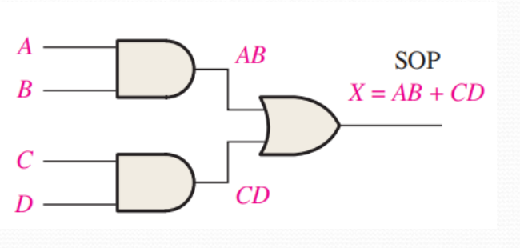

### 5.1.2 与或非逻辑（AND-OR-Invert）与积之和的反（POS）

> [!knowledge]
> - SOP 形式可直接用 AND-OR 结构实现。
> - 积之和的反（product of sums, POS）可用 AND-OR-Invert 结构实现：先形成各个和项的乘积，再对结果取反。
> - 如下图中：在 AND-OR 结构最后+非门即可
> 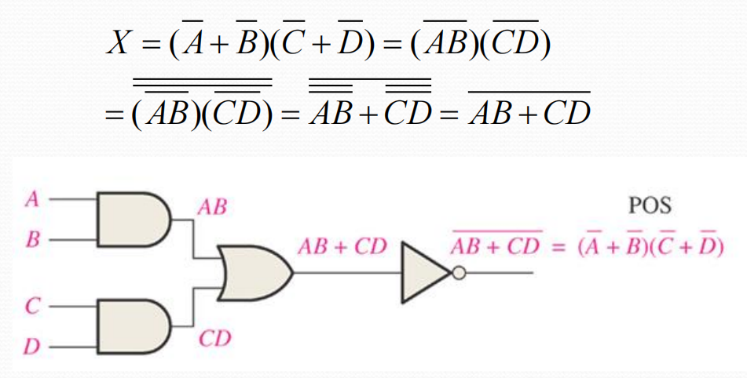

### 5.1.3 异或（exclusive-OR, XOR） 与同或（exclusive-OR, XOR） 

> [!knowledge]
>
> | 门电路  | 输出为 $1$ 的条件 | 表达式                                               |
> | ---  | ----------- | ---------------------------------------------------- |
> | 异或门 |  两个输入不同      | $X=A\overline B+\overline A B=A\oplus B$             |
> | 同或门 |  两个输入相同      | $X=AB+\overline A\,\overline B=\overline{A\oplus B}$|
> 1. 异或门
> 	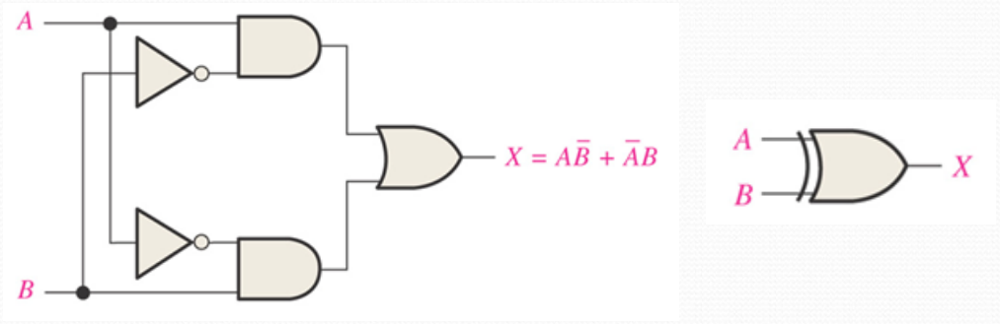
> 2. 与或门 （两种形式）
> 	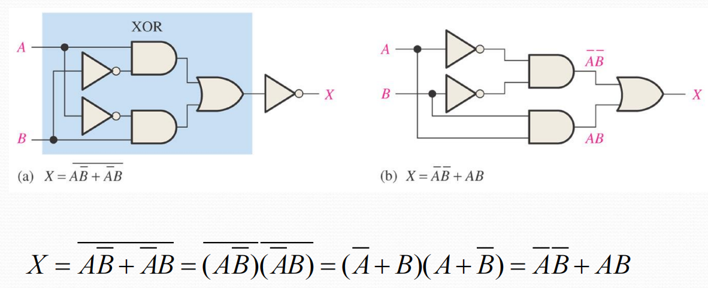

### 5.1.4 偶校验的生成与检查

> [!knowledge]
> **偶校验校验位生成：每两位两位之间进行“异或”运算**
> 如图：四位数据 $A_0,A_1,A_2,A_3$ 的偶校验位为 $P=A_0\oplus A_1\oplus A_2\oplus A_3$。
> - 若四位数据中 $1$ 的个数为奇数，则 $P=1$，使五位码中 $1$ 的总数变为偶数。
>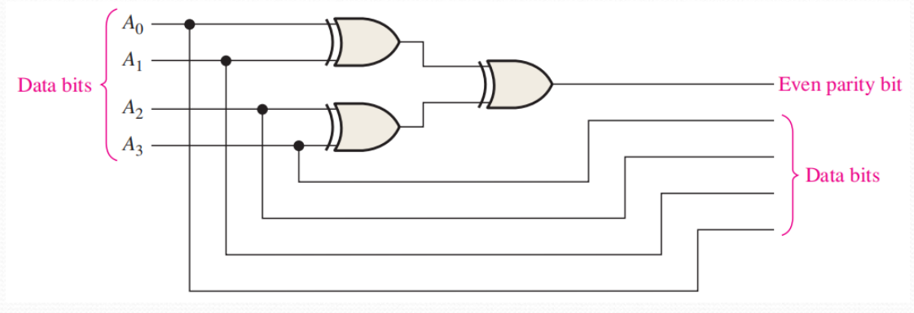
> 
> - 检查时，对四位数据和偶校验位继续异或；**结果为 $1$ **表示发生奇偶校验错误。
> - 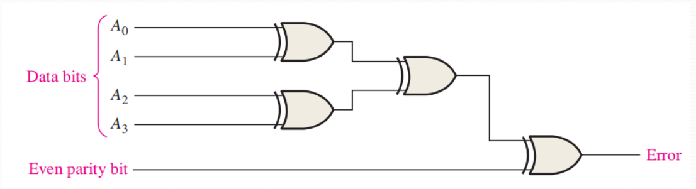

## 5.2 组合逻辑的实现

### 5.2.1 由布尔表达式画逻辑电路

> [!knowledge]
> 按运算层级设置中间节点，再按从内到外的顺序连接门电路。
>
> | 表达式                     | 直接实现思路                                   |
> | ----------------------- | ---------------------------------------- |
> | $X=AB+CDE$              | 先形成 $AB$、$CDE$，再经 OR 门相加。                |
> | $X=AB(C\overline D+EF)$ | 先得到 $C\overline D$ 与 $EF$，相加后再与 $AB$ 相与。 |
> | $X=ABC\overline D+ABEF$ | 这是上一式展开后的 SOP 形式。                        |
> 下图均表示同一个逻辑，但是图b更优：级数更少
> （a）
> 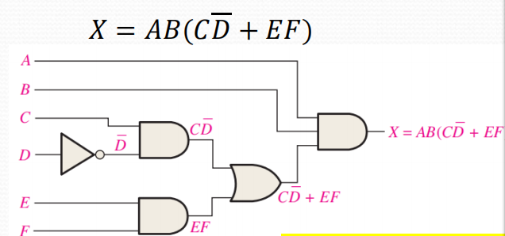
>（b）
> 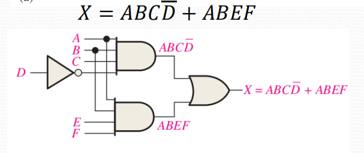

### 5.2.2 由真值表写出逻辑表达式

> [!knowledge]
> 1. 对每一行 $X=1$：输入为 $1$ 的变量写原变量，输入为 $0$ 的变量写反变量；将得到的所有最小项相加得到SOP。
>   
>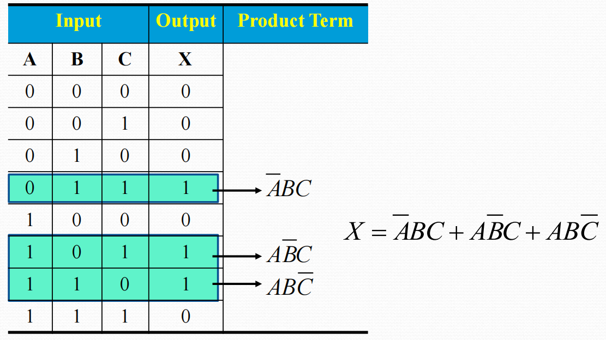
>
>1. 通过SOP画出逻辑电路。
>
>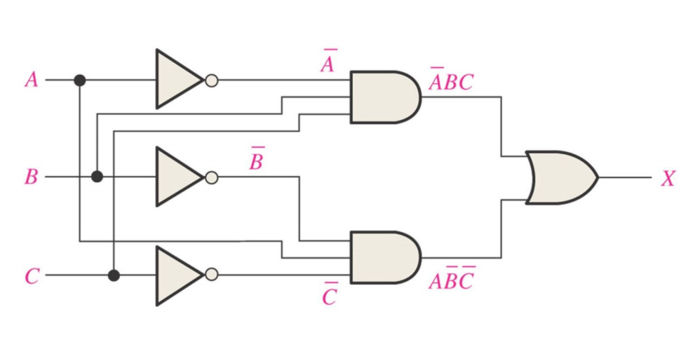

> [!tip] 关键提示
> 写最小项时，一行真值表必须包含所有输入变量；不要省略该行取 $0$ 的变量的反变量。

### 5.2.3 典型例题

**[ 例题 ] 交通信号灯故障监视器**
输入为红 $R$、黄 $A$、绿 $G$；输出 $Z=1$ 表示故障。正常状态仅为 $001$、$010$、$100$，其余五种状态均为故障。
1. 根据真值表，写出表达式为 $Z=\overline R\,\overline A\,\overline G+\overline R A G+R\overline A G+RA\overline G+RAG=\overline R\,\overline A\,\overline G+RA+RG+AG$。
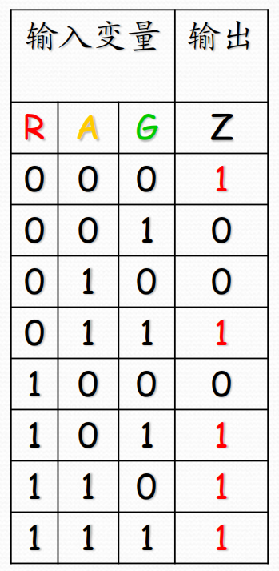

2. 画出逻辑电路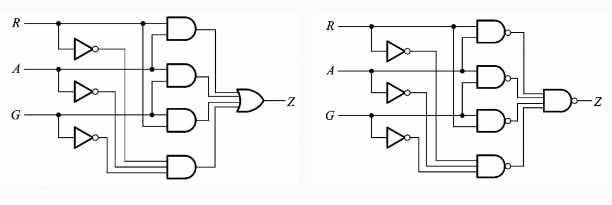

**[ 例题 ] 卡诺图化简**
-  将原电路的函数用卡诺图化简，得到 $X=A\overline C\,\overline D+\overline B\,\overline C$
- 需要注意卡诺图上下本质上**相连**
 - 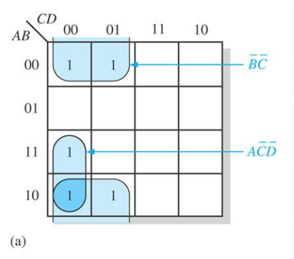

## 5.3 NAND 与 NOR 门的通用性

### 5.3.1  NAND 门搭建其他“门”

> [!knowledge]
> - NAND逻辑  $X =\overline{AB}$
> - 
> | 目标门 | 使用NAND 门实现 | 
> | --- | --- |
> | NOT | 将 NAND 门的两个输入端相连：$\overline{AA}=\overline A$ | 
> | AND | 用非门将 NAND=$\overline{AB}$ 反相：$\overline{\overline{AB}}=AB$ 
> | OR | 先产生 $\overline A,\overline B$，再 NAND：$\overline{\overline A\,\overline B}=A+B$ 
> | NOR | 在上述 OR 输出后再反相 
> 1. NOT 
>   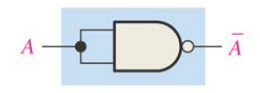
> 2. AND
>   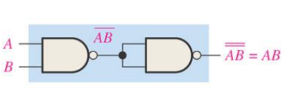
> 3. OR
>  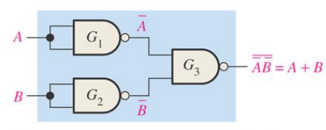
> 4. NOR
>  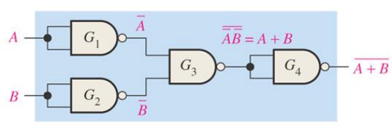

### 5.3.2 NOR 门搭建其他“门”

> [!knowledge]
>NOR逻辑：$X = \overline{A+B}$
>
> | 目标门 | 使用NOR 门实现                                                                     | 
> | ---- | --------------------------------------------------------------------------- | 
> | NOT  | 将 NOR 门的两个输入端相连：$\overline{A+A}=\overline A$                          |
> | OR   | 先得 $\overline{A+B}$，再用 NOR 作反相：$\overline{\overline{A+B}}=A+B$              |
> | AND  | 先产生 $\overline A,\overline B$，再 NOR：$\overline{\overline A+\overline B}=AB$ |
> | NAND | 在上述 AND 输出后再反相                                                              | 
> 1. NOT 
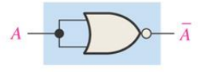
> 2. OR
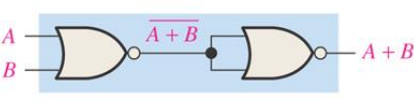
> 3. AND
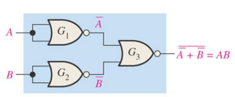
> 4. NAND
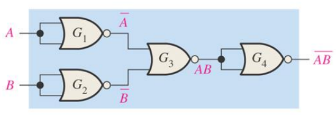

> [!knowledge]
> 因为 NAND 与 NOR 各自都能实现 NOT、AND、OR，所以它们都是通用逻辑门（universal logic gate）。

## 5.4 仅用 NAND / NOR 门实现组合逻辑

### 5.4.1 用 NAND 门实现 SOP

> [!knowledge]
> 1. 对 SOP 函数 $X=AB+CD$，有 $X=\overline{\overline{AB}\cdot\overline{CD}}=AB+CD$。
>2. 实现逻辑：第一级 NAND 门分别产生 $\overline{AB}$、$\overline{CD}$，最后一级 NAND 门依据德摩根定律得到 OR 运算。
> 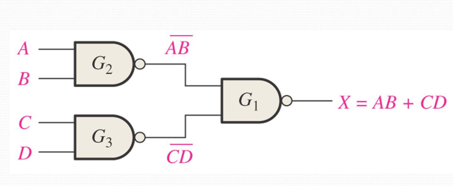

### 5.4.2 用 NOR 门实现 POS

> [!knowledge]
> 1. 对 POS 函数 $X=(A+B)(C+D)$，有 $X=\overline{\overline{A+B}+\overline{C+D}}=(A+B)(C+D)$。
> 2. 实现方式：第一级 NOR 门分别产生 $\overline{A+B}$、$\overline{C+D}$，最后一级 NOR 门得到 AND 运算。

### 5.4.3 双重符号与气泡抵消

> [!knowledge]
> - 门端相连的两个反相小圆圈（气泡）可相互抵消。
> - 利用双重符号，可直接按等效的 AND/OR 功能逐级读取电路，而不必反复展开全部反相符号。（课件 p. 30–33）

> [!tip] 关键提示
> 读多级 NAND/NOR 电路时，先标出每一级输出；若相邻连接端的两个气泡相对，则先抵消，再判断该级等效为 AND 还是 OR。

**[例题] 双重符号读式（课件 p. 33）**

图中的 NOR 网络可改用双重符号读取，其输出表达式为 $X=(\overline A\,\overline B+C)(\overline D\,\overline E+F)$。

> [!note] 待插图
> 来源：课件 p. 30–33；内容：NAND/NOR 电路的双重符号、气泡抵消和读出输出表达式的例题；用途：练习把门图直接转为表达式。

## 5.5 脉冲波形输入下的逻辑电路分析

### 5.5.1 四类基本门的时序判定

> [!knowledge]
>
> | 门 | 输出为高电平的条件 | 输出为低电平的条件 |
> | --- | --- | --- |
> | AND | 所有输入同时为高 | 至少一个输入为低 |
> | OR | 至少一个输入为高 | 所有输入均为低 |
> | NAND | 至少一个输入为低 | 所有输入同时为高 |
> | NOR | 所有输入均为低 | 至少一个输入为高 |

### 5.5.2 通用分析步骤

> [!knowledge]
> 1. 按电路的信号流向，为各中间节点命名并写出其表达式。
> 2. 以所有输入的跳变时刻划分时间区间。
> 3. 从最前级门开始，逐区间画出中间节点波形。
> 4. 最后由中间波形得到输出波形，并用总表达式复核。

**[例题] NAND 输出波形（课件 p. 35）**

中间节点 $Y=B+C$，输出为 $X=\overline{A(B+C)}=\overline A+\overline B\,\overline C$。

因而仅当 $A=1$ 且 $B+C=1$ 时，$X=0$。

**[例题] 同或输出波形（课件 p. 36）**

电路输出为 $X=AB+\overline A\,\overline B$；即 $A,B$ 同为 $0$ 或同为 $1$ 时，$X=1$。

**[例题] 多级门电路的波形化简（课件 p. 38）**

课件将多级网络化为 $X=\overline A C+\overline B C+\overline C D$。画波形时可分别标出这三个乘积项为 $1$ 的时间区间，再取并集。

> [!note] 待插图
> 来源：课件 p. 35–38；内容：从输入波形逐级画出中间节点与最终输出的完整过程；用途：核对时间区间划分与每一级门的输出。
> 裁剪建议：保留输入波形、虚线时间分界、中间节点及绿色输出波形。

## 5.6 本章复习主线

> [!abstract] 本节小结
> 1. **表达式实现：** SOP 对应 AND-OR；真值表中所有 $X=1$ 的行写成最小项后求和。
> 2. **设计流程：** 逻辑抽象 → 定义输入/输出 → 真值表 → 表达式 → 化简 → 画电路。
> 3. **通用门：** NAND 与 NOR 都能单独构成 NOT、AND、OR，因此可实现任意组合逻辑。
> 4. **门图读式：** NAND 适合实现 SOP，NOR 适合实现 POS；双重符号和气泡抵消可减少反相符号干扰。
> 5. **时序分析：** 先画中间节点，再画最终输出；每次跳变都按各门的逻辑条件逐区间判断。

## 5.7 课后作业

课件 p. 41：教材 p. 276–278，第 13、14、24、25、30 题。

## 待处理清单

- 待核对：课件 p. 39 仅给出带液位、温度传感器的储罐监测与控制框图，未附本页文字分析；未将其扩展为新的知识结论。
