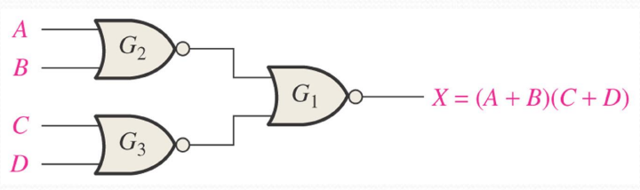
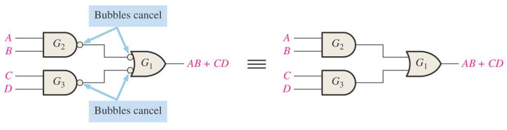
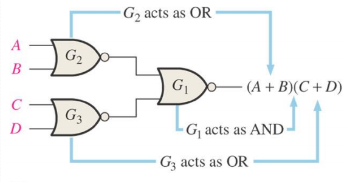
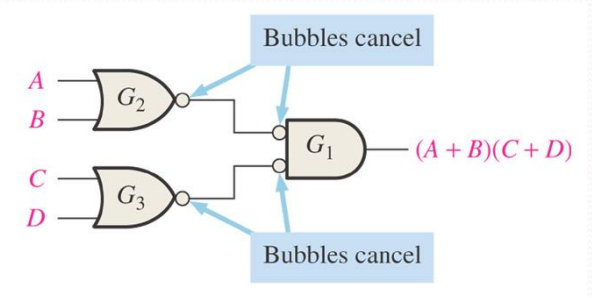
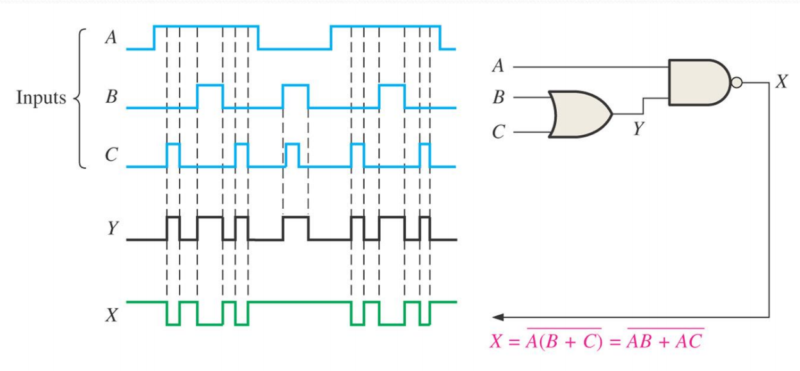

# 第五章：组合逻辑分析

## 5.1 基本组合逻辑电路

### 5.1.1 与或逻辑（AND-OR）与积之和（SOP）

> [!knowledge]
> 积之和（sum of products, SOP）表达式可直接用与或两级结构实现：
>
> 1. 每个乘积项对应一个 AND 门；
> 2. 用一个 OR 门对所有乘积项求和。
> - 

### 5.1.2 与或非逻辑（AND-OR-Invert）与积之和的反（POS）

> [!knowledge]
> - SOP 形式可直接用 AND-OR 结构实现。
> - 积之和的反（product of sums, POS）可用 AND-OR-Invert 结构实现：先形成各个和项的乘积，再对结果取反。
> - 如下图中：在 AND-OR 结构最后+非门即可
> 

### 5.1.3 异或（exclusive-OR, XOR） 与同或（exclusive-OR, XOR） 

> [!knowledge]
>
> | 门电路  | 输出为 $1$ 的条件 | 表达式                                               |
> | ---  | ----------- | ---------------------------------------------------- |
> | 异或门 |  两个输入不同      | $X=A\overline B+\overline A B=A\oplus B$             |
> | 同或门 |  两个输入相同      | $X=AB+\overline A\,\overline B=\overline{A\oplus B}$|
> 1. 异或门
> 	
> 2. 与或门 （两种形式）
> 	

### 5.1.4 偶校验的生成与检查

> [!knowledge]
> **偶校验校验位生成：每两位两位之间进行“异或”运算**
> 如图：四位数据 $A_0,A_1,A_2,A_3$ 的偶校验位为 $P=A_0\oplus A_1\oplus A_2\oplus A_3$。
> - 若四位数据中 $1$ 的个数为奇数，则 $P=1$，使五位码中 $1$ 的总数变为偶数。
>
> 
> - 检查时，对四位数据和偶校验位继续异或；**结果为 $1$ **表示发生奇偶校验错误。
> - 

## 5.2 组合逻辑的实现

### 5.2.1 由布尔表达式画逻辑电路

> [!knowledge]
> 按运算层级设置中间节点，再按从内到外的顺序连接门电路。
>
> | 表达式                     | 直接实现思路                                   |
> | ----------------------- | ---------------------------------------- |
> | $X=AB+CDE$              | 先形成 $AB$、$CDE$，再经 OR 门相加。                |
> | $X=AB(C\overline D+EF)$ | 先得到 $C\overline D$ 与 $EF$，相加后再与 $AB$ 相与。 |
> | $X=ABC\overline D+ABEF$ | 这是上一式展开后的 SOP 形式。                        |
> 下图均表示同一个逻辑，但是图b更优：级数更少
> （a）
> 
>（b）
> 

### 5.2.2 由真值表写出逻辑表达式

> [!knowledge]
> 1. 对每一行 $X=1$：输入为 $1$ 的变量写原变量，输入为 $0$ 的变量写反变量；将得到的所有最小项相加得到SOP。
>   
>
>
>1. 通过SOP画出逻辑电路。
>
>

> [!tip] 关键提示
> 写最小项时，一行真值表必须包含所有输入变量；不要省略该行取 $0$ 的变量的反变量。

### 5.2.3 典型例题

**[ 例题 ] 交通信号灯故障监视器**
输入为红 $R$、黄 $A$、绿 $G$；输出 $Z=1$ 表示故障。正常状态仅为 $001$、$010$、$100$，其余五种状态均为故障。
1. 根据真值表，写出表达式为 $Z=\overline R\,\overline A\,\overline G+\overline R A G+R\overline A G+RA\overline G+RAG=\overline R\,\overline A\,\overline G+RA+RG+AG$。

2. 画出逻辑电路

**[ 例题 ] 卡诺图化简**
-  将原电路的函数用卡诺图化简，得到 $X=A\overline C\,\overline D+\overline B\,\overline C$
- 需要注意卡诺图上下本质上**相连**
 - 

## 5.3 NAND 与 NOR 门的通用性

### 5.3.1  NAND 门搭建其他“门”

> [!knowledge]
> - NAND逻辑  $X =\overline{AB}$
> - 
> | 目标门 | 使用NAND 门实现 | 
> | --- | --- |
> | NOT | 将 NAND 门的两个输入端相连：$\overline{AA}=\overline A$ | 
> | AND | 用非门将 NAND=$\overline{AB}$ 反相：$\overline{\overline{AB}}=AB$ |
> | OR | 先产生 $\overline A,\overline B$，再 NAND：$\overline{\overline A\,\overline B}=A+B$ |
> | NOR | 在上述 OR 输出后再反相 |
> 1. NOT 
>   
> 2. AND
>   
> 3. OR
>  
> 4. NOR
>  

### 5.3.2 NOR 门搭建其他“门”

> [!knowledge]
>NOR逻辑：$X = \overline{A+B}$
>
> | 目标门 | 使用NOR 门实现                                                                     | 
> | ---- | --------------------------------------------------------------------------- | 
> | NOT  | 将 NOR 门的两个输入端相连：$\overline{A+A}=\overline A$                          |
> | OR   | 先得 $\overline{A+B}$，再用 NOR 作反相：$\overline{\overline{A+B}}=A+B$              |
> | AND  | 先产生 $\overline A,\overline B$，再 NOR：$\overline{\overline A+\overline B}=AB$ |
> | NAND | 在上述 AND 输出后再反相                                                              | 
> 1. NOT 

> 2. OR

> 3. AND

> 4. NAND

> [!knowledge]
> 因为 NAND 与 NOR 各自都能实现 NOT、AND、OR，所以它们都是通用逻辑门（universal logic gate）。

## 5.4 仅用 NAND / NOR 门实现组合逻辑

### 5.4.1 用 NAND 门实现 SOP

> [!knowledge]
> 1. 对 SOP 函数 $X=AB+CD$，有 $X=\overline{\overline{AB}\cdot\overline{CD}}=AB+CD$。
>2. 实现逻辑：
>- 第一级 NAND 门分别产生 $\overline{AB}$、$\overline{CD}$
>- 最后一级 NAND 门依据德摩根定律得到 OR 运算。
> 

### 5.4.2 用 NOR 门实现 POS

> [!knowledge]
> 1. 对 POS 函数 $X=(A+B)(C+D)$，有 $X=\overline{\overline{A+B}+\overline{C+D}}=(A+B)(C+D)$。
> 2. 实现逻辑：  
>  - 第一级 NOR 门分别产生 $\overline{A+B}$、$\overline{C+D}$
>  - 最后一级 NOR 门得到 AND 运算。
>

### 5.4.3 双重符号与气泡抵消

> [!knowledge]
> - 导线相连的两个气泡（反相小圆圈）可相互抵消。
>    
>  - 利用双重符号，可直接按等效的 AND/OR 功能逐级读取电路，而不必反复展开全部反相符号。
> 	1. 原门电路逻辑
>  
> 	 2. 每个或非门实际扮演的门
>  
> 	 3. 可将后级的或非门转为非与门，然后气泡相消
>  

> [!tip] 关键提示
> 读多级 NAND/NOR 电路时，先标出每一级输出；若相邻连接端的两个气泡相对，则先抵消，再判断该级等效为 AND 还是 OR。

## 5.5 脉冲波形输入下的逻辑电路分析

### 5.5.1 四类基本门的时序判定

> [!knowledge]
>
> | 门 | 输出为高电平的条件 | 输出为低电平的条件 |
> | --- | --- | --- |
> | AND | 所有输入同时为高 | 至少一个输入为低 |
> | OR | 至少一个输入为高 | 所有输入均为低 |
> | NAND | 至少一个输入为低 | 所有输入同时为高 |
> | NOR | 所有输入均为低 | 至少一个输入为高 |

### 5.5.2 通用分析步骤

> [!knowledge]
> 1. 按电路的信号流向，为各中间节点命名并写出其表达式。
> 2. 以所有输入的跳变时刻划分时间区间。
> 3. 从最前级门开始，逐区间画出中间节点波形。
> 4. 最后由中间波形得到输出波形，并用总表达式复核。
> - 利用布尔化简、气泡化简、波特图化简，简化表达式

**[例题] NAND 输出波形

中间节点 $Y=B+C$，输出为 $X=\overline{A(B+C)}=\overline A+\overline B\,\overline C$。
因而仅当 $A=1$ 且 $B+C=1$ 时，$X=0$。

## 5.6 本章复习主线

> [!abstract] 本节小结
> 1. **表达式实现：** SOP 对应 AND-OR；真值表中所有 $X=1$ 的行写成最小项后求和。
> 2. **设计流程：** 逻辑抽象 → 定义输入/输出 → 真值表 → 表达式 → 化简 → 画电路。
> 3. **通用门：** NAND 与 NOR 都能单独构成 NOT、AND、OR，因此可实现任意组合逻辑。
> 4. **门图读式：** NAND 适合实现 SOP，NOR 适合实现 POS；双重符号和气泡抵消可减少反相符号干扰。
> 5. **时序分析：** 先画中间节点，再画最终输出；每次跳变都按各门的逻辑条件逐区间判断。

## 5.7 课后作业

课件 p. 41：教材 p. 276–278，第 13、14、24、25、30 题。

# 第六章：组合逻辑功能

## 6.1 基本加法器

### 6.1.1 半加器（Half-Adder）

> [!knowledge]
> - 半加器把两个 1 位二进制数相加：$0+0=0$，$0+1=1$，$1+0=1$，$1+1=10$。
> - 输入为加数 $A$、$B$；输出为和 $\Sigma$ 与进位 $C_{out}$。
> - 由真值表得 $\Sigma=A\oplus B=A\overline B+\overline AB$（异或门），$C_{out}=AB$（与门）。
>
> | $A$ | $B$ | $C_{out}$ | $\Sigma$ |
> | --- | --- | --- | --- |
> | 0 | 0 | 0 | 0 |
> | 0 | 1 | 0 | 1 |
> | 1 | 0 | 0 | 1 |
> | 1 | 1 | 1 | 0 |

> [!note] 待插图
> 来源：课件 p.3–4；内容：半加器框图（输入位/输出）与真值表、异或加与门逻辑图；用途：对应 $\Sigma$ 与 $C_{out}$ 的门实现。
> 裁剪建议：保留框图输入输出标注与两门电路接线。

### 6.1.2 全加器（Full-Adder）

> [!knowledge]
> - 全加器在半加器基础上增加低位进位输入 $C_{in}$，输入为加数 $A$、$B$ 与 $C_{in}$，输出为和 $\Sigma$ 与进位 $C_{out}$。
> - 和的 SOP 式为 $\Sigma=\overline A\,\overline B C_{in}+\overline AB\overline{C_{in}}+A\overline B\,\overline{C_{in}}+ABC_{in}=A\oplus B\oplus C_{in}$。
> - 进位为 $C_{out}=\overline ABC_{in}+A\overline BC_{in}+AB\overline{C_{in}}+ABC_{in}=AB+(A\oplus B)C_{in}$。
> - 实现结构：两个半加器加一个或门；第一半加处理 $A$、$B$，第二半加处理其和与 $C_{in}$，两半加的进位经或门得 $C_{out}$。
>
> | $A$ | $B$ | $C_{in}$ | $C_{out}$ | $\Sigma$ |
> | --- | --- | --- | --- | --- |
> | 0 | 0 | 0 | 0 | 0 |
> | 0 | 0 | 1 | 0 | 1 |
> | 0 | 1 | 0 | 0 | 1 |
> | 0 | 1 | 1 | 1 | 0 |
> | 1 | 0 | 0 | 0 | 1 |
> | 1 | 0 | 1 | 1 | 0 |
> | 1 | 1 | 0 | 1 | 0 |
> | 1 | 1 | 1 | 1 | 1 |

> [!note] 待插图
> 来源：课件 p.6–7；内容：全加器真值表、SOP 化简到异或形式的逻辑图、双半加器加或门框图；用途：跟踪 $A$、$B$、$C_{in}$ 到 $\Sigma$、$C_{out}$ 的路径。
> 裁剪建议：保留真值表、化简式与框图三级级联。

**[ 例题 ] 全加器逐级求值**
输入 $A=1$、$B=0$、$C_{in}=1$，确定中间与最终输出。
解：
1. 第一半加器输入 $1$、$0$，得和 $1$、进位 $0$。
2. 第二半加器输入 $1$、$1$，得和 $0$、进位 $1$。
3. 或门综合两进位得最终 $C_{out}=1$；最终和 $\Sigma=0$。

## 6.2 并行二进制加法器

> [!knowledge]
> - 加 1 位以上的二进制数需级联多个全加器：每级进位输出接高一位的进位输入。
> - 2 位并行加法器由两个全加器构成，最低位进位输入一般接地（$C_0=0$）。

> [!note] 待插图
> 来源：课件 p.10–11；内容：2 位并行加法器框图、3 位并行加法器例图；用途：看清 $C_1$、$C_2$、$C_3$ 的级联方向。
> 裁剪建议：保留各级 $A_i$、$B_i$、$\Sigma_i$ 与进位链标注。

**[ 例题 ] 3 位并行加法器**
$101+011$，标出中间进位。
解：
1. 第 0 位：$1+1$ 得 $\Sigma_0=0$、$C_1=1$。
2. 第 1 位：$0+1+C_1$ 得 $\Sigma_1=0$、$C_2=1$。
3. 第 2 位：$1+0+C_2$ 得 $\Sigma_2=0$、$C_3=1$。
4. 和为 $\Sigma_2\Sigma_1\Sigma_0=000$，$C_{out}=C_3=1$，即 $1000$。

### 6.2.1 集成加法器 74LS283

> [!knowledge]
> - 74LS283 为 4 位并行加法器芯片，引脚编号见课件图。
> - 两片 74LS283 级联构成 8 位并行加法器：低位片进位输出接高位片进位输入。

> [!note] 待插图
> 来源：课件 p.13–16；内容：74LS283 引脚与逻辑符号、两片级联成 8 位加法器、用加法器构成的投票系统；用途：记住级联接法与应用形态。
> 裁剪建议：保留引脚号、进位链与投票系统框图。

**[ 例题 ] 8 位级联求和**
$A_8\cdots A_1=10111001$，$B_8\cdots B_1=10011110$，$C_0=0$。
解：逐位相加得 $S_8\cdots S_1=01010111$，$C_{out}=1$，即 $185+158=343$。

## 6.3 纹波进位与超前进位加法器

> [!knowledge]
> - 纹波进位加法器（异步进位）：每级进位输出接下一级进位输入，进位逐级“纹波”传递；存在最坏情形的进位传播延迟。
> - 超前进位加法器：根据本级与低级输入提前算出各级输出进位，不必等待纹波到达，速度更快。

> [!knowledge]
> - 进位生成 $C_g$ 与进位传递 $C_p$ 均由本级输入位决定（具体关系见课件 p.22 图）。
> - 每级输出进位满足 $C_{out,i}=C_{g,i}+C_{p,i}C_{in,i}$，逐级代入得：
> - $C_{out2}=C_{g2}+C_{p2}C_{g1}+C_{p2}C_{p1}C_{in1}$。
> - $C_{out3}=C_{g3}+C_{p3}C_{g2}+C_{p3}C_{p2}C_{g1}+C_{p3}C_{p2}C_{p1}C_{in1}$。
> - $C_{out4}=C_{g4}+C_{p4}C_{g3}+C_{p4}C_{p3}C_{g2}+C_{p4}C_{p3}C_{p2}C_{g1}+C_{p4}C_{p3}C_{p2}C_{p1}C_{in1}$。
> - 4 级超前加法器的各级输出进位只与初始进位 $C_{in1}$、本级及低级的 $C_g$、$C_p$ 有关。

> [!note] 待插图
> 来源：课件 p.18–24；内容：4 位纹波加法最坏延迟示意、$C_g$/$C_p$ 与输入位关系图、4 级超前逻辑图；用途：对比“等进位”与“算进位”两种思想。
> 裁剪建议：保留延迟标注、$C_g$/$C_p$ 定义与超前逻辑级联。

## 6.4 比较器

> [!knowledge]
> - 比较器判断两个数是否相等；相等比较用同或门逐位判等后再相与。
> - 用途：计算机的标识符地址比较器。

> [!note] 待插图
> 来源：课件 p.26；内容：2 位数相等比较逻辑图（两同或门加与门）；用途：记住“逐位同或再相与”的结构。
> 裁剪建议：保留门输入标注与输出电平。

**[ 例题 ] 跟踪比较器电平**
1. 输入 $10$ 与 $10$：两同或门输出均为 $1$，与门输出 $1$，判相等。
2. 输入 $11$ 与 $10$：$A_0=1$、$B_0=0$ 的同或门输出 $0$，与门输出 $0$，判不等。

### 6.4.1 4 位数值比较与 74HC85

> [!knowledge]
> - 从最高位比起：若 $A_3=1$、$B_3=0$ 则 $A$ 大；若 $A_3=0$、$B_3=1$ 则 $A$ 小；若 $A_3=B_3$ 则看次低位有无不等。
> - 74HC85 为 4 位数值比较器芯片，引脚编号见课件图；两片可级联成 8 位比较器，低位片比较输出接高位片级联输入。
> - $X$ 表示无关项。
>
> | 本级比较 | 前级输入 | $F_{A>B}F_{A<B}F_{A=B}$ |
> | --- | --- | --- |
> | $A_3>B_3$ | 无关 | 100 |
> | $A_3<B_3$ | 无关 | 010 |
> | $A_3=B_3$，$A_2>B_2$ | 无关 | 100 |
> | $A_3=B_3$，$A_2<B_2$ | 无关 | 010 |
> | $A_3=B_3$，$A_2=B_2$，$A_1>B_1$ | 无关 | 100 |
> | $A_3=B_3$，$A_2=B_2$，$A_1<B_1$ | 无关 | 010 |
> | 前三位相等，$A_0>B_0$ | 无关 | 100 |
> | 前三位相等，$A_0<B_0$ | 无关 | 010 |
> | 全相等 | 前级 100 | 100 |
> | 全相等 | 前级 010 | 010 |
> | 全相等 | 前级 001 | 001 |

> [!note] 待插图
> 来源：课件 p.29–34；内容：4 位比较器逻辑符号、74HC85 引脚图、两片级联成 8 位比较器、内部逻辑图；用途：记住级联方向与前级输入的传递规则。
> 裁剪建议：保留引脚号、级联连线与内部逻辑分级。

### 6.4.2 比较逻辑表达式

比较 $A_3A_2A_1A_0$ 与 $B_3B_2B_1B_0$（$\overline{A\oplus B}$ 为同或，即对应位相等）：

$$Y_{(A<B)}=\overline{A}_3B_3+\overline{A_3\oplus B_3}\,\overline{A}_2B_2+\overline{A_3\oplus B_3}\,\overline{A_2\oplus B_2}\,\overline{A}_1B_1+\overline{A_3\oplus B_3}\,\overline{A_2\oplus B_2}\,\overline{A_1\oplus B_1}\,\overline{A}_0B_0$$

$$Y_{(A=B)}=\overline{(A_3\oplus B_3)(A_2\oplus B_2)(A_1\oplus B_1)(A_0\oplus B_0)}$$

$$Y_{(A>B)}=\overline{(Y_{(A<B)}+Y_{(A=B)})}$$

## 6.5 译码器

> [!knowledge]
> - 译码器（Decoder）检测输入端是否出现指定的位组合，并以规定的输出电平指示该码出现。
> - 用途：计算机读取指令时需要对指令译码。

### 6.5.1 基本二进制译码

> [!knowledge]
> - 译 $1001$ 且高有效：用与门组合 $A_3$、$\overline{A_2}$、$\overline{A_1}$、$A_0$。
> - 高有效输出用与门，低有效输出用与非门。

**[ 例题 ] 译 1011**
输入为 $1011$ 时输出高电平：用与门组合 $A_3$、$\overline{A_2}$、$A_1$、$A_0$。

> [!note] 待插图
> 来源：课件 p.38–40；内容：$1001$ 与 $1011$ 译码逻辑、4 线-16 线（1-of-16）译码器符号（低有效输出）；用途：区分高/低有效输出的门选择。
> 裁剪建议：保留输入反相标注与输出有效电平。

### 6.5.2 集成译码器 74HC154

> [!knowledge]
> - 74HC154 为 1-of-16 译码器，引脚编号见课件图。
> - 扩展：用两片译一个 5 位数，最高位 $A_4$ 接片选输入；输入 $10110$ 时输出为 $22$。
> - 应用：简化计算机 I/O 端口系统，用 4 条地址线作端口地址译码。

> [!note] 待插图
> 来源：课件 p.42–44；内容：74HC154 引脚与符号、两片扩展译 5 位数、I/O 端口译码应用；用途：记住 $A_4$ 选片与地址译码接法。
> 裁剪建议：保留引脚号、片选连线与端口框图。

### 6.5.3 BCD-十进制译码与七段显示

> [!knowledge]
> - BCD-十进制译码把 8421 码译成 10 个十进制指示之一，如 74HC42。
> - 七段显示按内部连接分为共阴极与共阳极两种。
> - 74LS47 低电平输出有效，74LS48 高电平输出有效；74LS47 的灭零示例见课件图。
> - $10$–$15$ 为无效 BCD 输入，表中输出按课件给出，化简时作无关项处理。
>
> | 数字 | $A_3A_2A_1A_0$ | $Y_aY_bY_cY_dY_eY_fY_g$ |
> | --- | --- | --- |
> | 0 | 0000 | 1111110 |
> | 1 | 0001 | 0110000 |
> | 2 | 0010 | 1101101 |
> | 3 | 0011 | 1111001 |
> | 4 | 0100 | 0110011 |
> | 5 | 0101 | 1011011 |
> | 6 | 0110 | 0011111 |
> | 7 | 0111 | 1110000 |
> | 8 | 1000 | 1111111 |
> | 9 | 1001 | 1110011 |
> | 10 | 1010 | 0001101 |
> | 11 | 1011 | 0001101 |
> | 12 | 1100 | 0100011 |
> | 13 | 1101 | 1001011 |
> | 14 | 1110 | 0001111 |
> | 15 | 1111 | 0000000 |

> [!note] 待插图
> 来源：课件 p.46–56；内容：BCD-七段译码表与字形、七段管段标、74LS47 引脚、灭零示例、74LS48 逻辑图；用途：背段码表与区分 47/48 输出极性。
> 裁剪建议：保留段码表、字形列与引脚号。

**[ 例题 ] e 段卡诺图化简**
对 $0$ 圈组，再在显示段内部逻辑基础上取反码得到最终表达式。
解：对 $1$ 圈得 $Y_e=A_1\overline{A_0}+\overline{A_2}\,\overline{A_0}$；对 $0$ 圈得 $Y_e=\overline{(A_0+A_2\overline{A_1})}$，化简后二者相同。

## 6.6 编码器

> [!knowledge]
> - 编码器（Encoder）实现译码的反功能：某输入端出现代表数字的有效电平即转为编码输出。
> - 用途：将助记指令转换成计算机可识别的机器码指令。

### 6.6.1 十进制-BCD 编码器

> [!knowledge]
> - 十进制数 $3$ 的编码过程：顶部两或门输出 $1$（见课件红线），故输出为 $0011$。

> [!note] 待插图
> 来源：课件 p.62–64；内容：十进制-BCD 编码器符号、功能表与逻辑图、$3\to0011$ 实例；用途：看清或门综合规则。
> 裁剪建议：保留功能表、或门接线与实例红线。

### 6.6.2 优先编码器

> [!knowledge]
> - 74HC147 为十进制-BCD 优先编码器，HPRI 表示最高位输入优先。
> - 74LS148 为 8 线-3 线编码器：使能输入 EI 低有效；EO 在 EI 低且无有效输入时为低；可扩展输出在 EI 低且有输入有效时为低。
> - 扩展：用 74LS148 加外部逻辑构成 16 线-4 线编码器。
> - 应用：键盘编码器用 HPRI/BCD 型 74HC147，按键输出 BCD 反码；$0$ 号线编码器不用，但可供其他电路检测按键。
> - 输入输出全低有效，输出为反码；$X$ 表示无关项。
>
> | $\overline{EI}$ | 最高优先的 $0$ 输入 | $\overline{Y_2}\,\overline{Y_1}\,\overline{Y_0}$ | $\overline{EO}$ $\overline{GS}$ |
> | --- | --- | --- | --- |
> | 1 | 无关 | 111 | 1 1 |
> | 0 | 无（全为 1） | 111 | 0 1 |
> | 0 | $\overline{I_7}$ | 000 | 1 0 |
> | 0 | $\overline{I_6}$ | 001 | 1 0 |
> | 0 | $\overline{I_5}$ | 010 | 1 0 |
> | 0 | $\overline{I_4}$ | 011 | 1 0 |
> | 0 | $\overline{I_3}$ | 100 | 1 0 |
> | 0 | $\overline{I_2}$ | 101 | 1 0 |
> | 0 | $\overline{I_1}$ | 110 | 1 0 |
> | 0 | $\overline{I_0}$ | 111 | 1 0 |

> [!note] 待插图
> 来源：课件 p.65–69；内容：74HC147 引脚与符号、74LS148 符号与真值表、16 线-4 线扩展、键盘编码器；用途：记住 EI/EO/GS 配合与优先规则。
> 裁剪建议：保留引脚号、扩展级联线与键盘矩阵接线。

> [!warning] 易错点
> 74LS148 输入输出全低有效，输出为反码；EI 为 $1$ 时输出全 $1$ 不代表编码 $7$，而是未使能。

## 6.7 多路选择器（数据选择器）

> [!knowledge]
> - 多路选择器（Multiplexer）把多路数字信息选一路送到单线上传输；用途如一条总线传输不同来源的数据。
> - 4 选 1 输出为 $Y=\overline{S_1}\,\overline{S_0}D_0+\overline{S_1}S_0D_1+S_1\overline{S_0}D_2+S_1S_0D_3$。
> - 74LS151 为 8 输入数据选择器，输出 $Y$ 为 8 个 $\overline{S_2}\,\overline{S_1}\,\overline{S_0}D_0$ 形式的最小项之和。
> - 扩展：两片 74LS151 构成 16 选 1，$S_3$ 作片选。
> - 74HC157 为共用选择线的双 2 选 1 四路选择器；另有七段显示多路复用逻辑等应用。

> [!note] 待插图
> 来源：课件 p.70–83；内容：4 选 1 与 74LS151 逻辑图、两片扩展成 16 选 1、74HC157 符号、七段复用逻辑；用途：记住选择线与数据线的对应下标。
> 裁剪建议：保留 $S$/$D$ 下标标注与片选连线。

**[ 例题 ] 用 74LS151 实现 3 变量函数**
真值表给出 $Y$ 在 $001$、$011$、$101$、$110$ 时为 $1$，即 $Y=\overline{A_2}\,\overline{A_1}A_0+\overline{A_2}A_1A_0+A_2\overline{A_1}A_0+A_2A_1\overline{A_0}$。
解：令 $A_2A_1A_0\to S_2S_1S_0$，按最小项号置数据端：

| $S_2S_1S_0$ | 最小项 | $Y$ | $D_i$ |
| --- | --- | --- | --- |
| 000 | $m_0$ | 0 | 0 |
| 001 | $m_1$ | 1 | 1 |
| 010 | $m_2$ | 0 | 0 |
| 011 | $m_3$ | 1 | 1 |
| 100 | $m_4$ | 0 | 0 |
| 101 | $m_5$ | 1 | 1 |
| 110 | $m_6$ | 1 | 1 |
| 111 | $m_7$ | 0 | 0 |

> [!tip] 关键提示
> 出现该最小项的 $D_i$ 接高电平 $1$，不出现的接地 $0$；选择线直接接函数变量。

## 6.8 数据分配器

> [!knowledge]
> - 数据分配器（Demultiplexer）是多路选择器的反功能：把单线数字信息分发到指定条输出线。
> - 1 线-4 线分配器：数据输入与选择线经与门阵列产生 $D_0$–$D_3$，时序见课件波形。
> - 1 线-8 线分配器：通道选择 $A$、$B$、$C$，输入数据 $D$，各通道输出即带 $D$ 的最小项。
>
> | 通道 | $ABC$ | 输出 |
> | --- | --- | --- |
> | $F_0$ | 000 | $\overline{A}\,\overline{B}\,\overline{C}D$ |
> | $F_1$ | 001 | $\overline{A}\,\overline{B}CD$ |
> | $F_2$ | 010 | $\overline{A}B\overline{C}D$ |
> | $F_3$ | 011 | $\overline{A}BCD$ |
> | $F_4$ | 100 | $A\overline{B}\,\overline{C}D$ |
> | $F_5$ | 101 | $A\overline{B}CD$ |
> | $F_6$ | 110 | $AB\overline{C}D$ |
> | $F_7$ | 111 | $ABCD$ |

> [!note] 待插图
> 来源：课件 p.85–87；内容：1 线-4 线分配器逻辑与各通道时序、1 线-8 线分配器框图；用途：核对选择码与通道波形的对应。
> 裁剪建议：保留选择线虚线时刻、通道波形标注与 $F_0$–$F_7$ 表达式。

**[ 例题 ] 用分配器实现任意 4 变量函数**
输入数据 $D$ 接高电平 $1$ 即得 8 个最小项输出，再用或门综合所需的最小项；具体接法见课件 p.87 图。

## 6.9 奇偶发生器/校验器

> [!knowledge]
> - 奇偶校验是检错法：给信息位附加校验位，使 $1$ 的总数为偶（偶校验）或为奇（奇校验）；原理与 5.1.4 的偶校验生成一致。
> - 模 2 和规律（不计进位）：偶数个 $1$ 之和总为 $0$，奇数个 $1$ 之和总为 $1$。
> - 4 位模 2 和可用 3 个异或门级联得到；74LS280 为 9 位奇偶发生器/校验器。
> - 数据传输系统：发送端用奇校验和 $\Sigma Odd$ 产生校验位，接收端作偶校验；有误码与无误码示例见课件图。

> [!note] 待插图
> 来源：课件 p.89–92；内容：异或级联模 2 和、74LS280、带检错的传输系统、有无误码传输示例；用途：记住发送端产生、接收端校验的分工。
> 裁剪建议：保留 $\Sigma Odd$/Even check 标注与误码示例对比。

## 6.10 本章复习主线

> [!abstract] 本节小结
> 1. **加法器：** 半加和异或、进位相与；全加为双半加加或门；多位级联进位链，超前加法用 $C_g$/$C_p$ 算进位。
> 2. **比较器：** 逐位同或判等；自高位向下比，首个不等位定大小；74HC85 级联靠前级输入传递。
> 3. **译码器：** 指定码出现即有效输出；1-of-16 低有效；BCD 转十进制与七段码表要熟，47 低有效、48 高有效。
> 4. **编码器：** 译码之逆；优先编码高位优先；74LS148 全低有效、输出反码，注意 EI/EO/GS 配合。
> 5. **复用与分配：** 选择线定下标，数据端按最小项置 $1$/$0$；分配器 $D$ 接 $1$ 即作译码器用。
> 6. **奇偶校验：** 模 2 和判 $1$ 的个数奇偶，发送产生、接收校验。

## 6.11 课后作业

HW-6：教材 p. 347–352，第 14、19、23、28、29、31、46、51 题。

## 待处理清单

- 待插图：6.1 p.3–8 半/全加器框图与逻辑图（正文已占位）。
- 待插图：6.2 p.10–17 并行加法器、74LS283、8 位级联与投票系统图（正文已占位）。
- 待插图：6.3 p.18–24 纹波延迟、$C_g$/$C_p$ 与超前逻辑图（正文已占位）。
- 待插图：6.4 p.26–34 比较器逻辑、74HC85 引脚级联与内部逻辑图（正文已占位）。
- 待插图：6.5 p.38–56 译码逻辑、74HC154、I/O 端口、74HC42、七段显示与 74LS47/48 图（正文已占位）。
- 待插图：6.6 p.62–69 编码器符号功能表、74HC147/148、扩展与键盘图（正文已占位）。
- 待插图：6.7 p.70–83 选择器逻辑、74LS151、扩展、74HC157 与复用逻辑图（正文已占位）。
- 待插图：6.8 p.85–87 分配器逻辑时序与 1-8 分配器框图（正文已占位）。
- 待插图：6.9 p.89–92 异或级联、74LS280、传输系统与误码示例图（正文已占位）。

