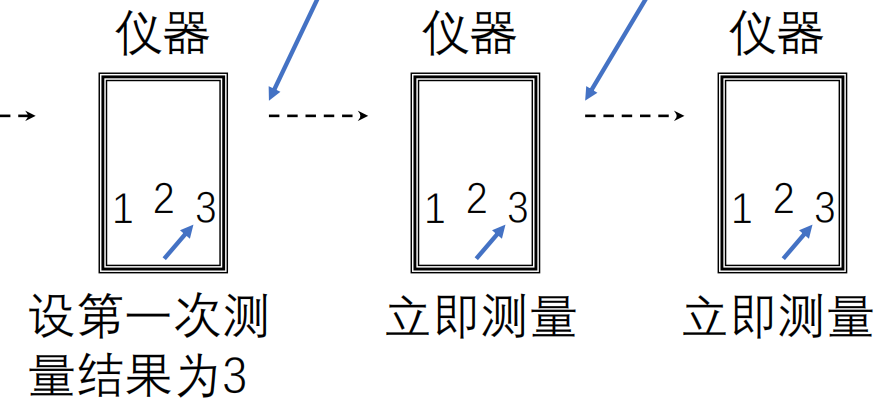

# 量子力学

## 第 0 章：数学基础

### 0.1 复数与复指数

> [!knowledge]
> - ==🔴复数==：
> 	- $z=a+\mathrm{i}b$，其中 $a,b\in\mathbb R$，$\mathrm{i}^2=-1$。
> 	- $\operatorname{Re}z=a$，$\operatorname{Im}z=b$。
> - ==复共轭与模==：$z^*=a-\mathrm{i}b$，$|z|^2=z^*z=a^2+b^2$。
> - ==欧拉公式==：$e^{\mathrm{i}x}=\cos x+\mathrm{i}\sin x$；因此 $\cos x=\frac{e^{\mathrm{i}x}+e^{-\mathrm{i}x}}2$，$\sin x=\frac{e^{\mathrm{i}x}-e^{-\mathrm{i}x}}{2\mathrm{i}}$。
> - ==相位因子==：$e^{\mathrm{i}(x+\delta)}=e^{\mathrm{i}x}e^{\mathrm{i}\delta}$，且 $|e^{\mathrm{i}\delta}|=1$。**这正是波函数整体相位不改变概率密度的数学基础。**

#### 0.1.1 复数在波函数中的两层角色

> [!knowledge]
> - ==相位的周期性==：$e^{\mathrm{i}\pi}=-1$，$e^{\mathrm{i}\pi/2}=\mathrm{i}$，$e^{3\mathrm{i}\pi/2}=-\mathrm{i}$，$e^{2\mathrm{i}\pi}=1$。
> - ==整体相位与相对相位==：
> 	- 单独态的整体相位不改变 $|\Psi|^2$。
> 	- 两个态叠加时，**相对相位**进入交叉项并改变干涉图样。
> - ==复共轭的作用==：概率密度、内积与平均值都由 $\Psi^*\Psi$ 或 $\int\Phi^*\Psi\,d\tau$ 构成实数。

### 0.2 Kronecker δ 与 Dirac δ 函数

> [!knowledge]
> - ==🔴Kronecker $\delta$==（分立指标）：
> 	- $\delta_{mn}=1$（$m=n$），否则 $\delta_{mn}=0$；故 $\sum_n a_n\delta_{mn}=a_m$。
> 	- 分立谱函数的正交归一关系为 $\int\Psi_m^*(x)\Psi_n(x)\,dx=\delta_{mn}$。
> - ==🔴Dirac $\delta$==（连续变量）：
> 	- $\int\delta(x-x_0)\,dx=1$，$\int F(x)\delta(x-x_0)\,dx=F(x_0)$。
> 	- 连续谱的正交归一关系为 $\int\Psi_{\lambda_1}^*(x)\Psi_{\lambda_2}(x)\,dx=\delta(\lambda_1-\lambda_2)$；**单个连续谱波函数通常不归一化为 $1$。**
> - ==常用关系==：$\int_{-\infty}^{\infty}e^{\mathrm{i}kx}\,dk=2\pi\delta(x)$，$\delta(-x)=\delta(x)$，$\delta(ax)=\delta(x)/|a|$。

#### 0.2.1 分立谱与连续谱的区别

> [!knowledge]
> - ==分立谱与连续谱的对比==：
>
> | 情形 | 正交归一关系 | 展开/求和方式 | 归一化含义 |
> | --- | --- | --- |
> | 分立谱 | $\int\Psi_m^*\Psi_n\,dx=\delta_{mn}$ | $\sum_n$ | 每个本征态可归一化到 $1$ |
> | 连续谱 | $\int\Psi_{\lambda'}^*\Psi_\lambda\,dx=\delta(\lambda-\lambda')$ | $\int d\lambda$ | 单个平面波归一到 $\delta$ 函数，不是 $1$ |
>
> - 注意：自由粒子的平面波属于连续谱。**全空间积分发散不表示它不合法，而表示它是确定动量的理想化极限态。**

### 0.3 傅里叶展开

> [!knowledge]
> - ==🔴傅里叶级数==：周期为 $T$ 的函数可展开为 $f(t)=\frac{a_0}{2}+\sum_{n=1}^{\infty}\left[a_n\cos\!\left(\frac{2\pi n}{T}t\right)+b_n\sin\!\left(\frac{2\pi n}{T}t\right)\right]$。
> - ==复指数基底的正交性==：$\int_{t_0}^{t_0+T}e^{-\mathrm{i}m2\pi t/T}e^{\mathrm{i}n2\pi t/T}\,dt=T\delta_{mn}$，故 $c_n=\frac1T\int_{t_0}^{t_0+T}e^{-\mathrm{i}n2\pi t/T}f(t)\,dt$。
> - ==傅里叶变换==：当 $T\to\infty$，级数过渡为 $f(t)=\frac1{2\pi}\int_{-\infty}^{\infty}c(\omega)e^{\mathrm{i}\omega t}\,d\omega$，$c(\omega)=\int_{-\infty}^{\infty}e^{-\mathrm{i}\omega t}f(t)\,dt$。
> - **坐标表象波函数与动量表象展开系数正是一对傅里叶变换；同一量子态可用不同完备基底表示。**

#### 0.3.1 从周期函数到连续谱展开

> [!knowledge]
> - ==实形式系数==：对周期为 $T$ 的函数，课件给出的 $a_n,b_n$ 为

$$
a_n=\frac2T\int_{t_0}^{t_0+T}f(t)\cos\!\left(\frac{2\pi nt}{T}\right)dt,
\qquad
b_n=\frac2T\int_{t_0}^{t_0+T}f(t)\sin\!\left(\frac{2\pi nt}{T}\right)dt.
$$

> [!knowledge]
> - ==从级数到变换的逻辑==：
> 	- 先利用不同频率基函数的正交性逐一“投影”出系数。
> 	- 当 $T\to\infty$，允许频率间隔变为连续，离散求和变成积分。
> 	- **动量展开完全沿用这一逻辑，只是把频率变量替换为动量变量。**

### 0.4 微分方程、分离变量与本征问题

> [!knowledge]
> - ==🔴常系数微分方程==：对 $y''+py'+qy=0$，令 $y=ce^{rx}$，由 $r^2+pr+q=0$ 求线性无关解；通解为 $c_1y_1+c_2y_2$。
> - ==🔴分离变量==：对偏微分方程设 $u(x,t)=X(x)T(t)$，将不同自变量的等式设为同一分离常数，从而化为常微分方程。
> - ==🔴本征问题==：$F\varphi=\lambda\varphi$；一组线性无关本征向量（或本征函数）可作为展开任意状态的基底。

#### 0.4.1 常系数方程的解法与分离变量

> [!knowledge]
> - ==常系数方程的步骤==：
> 	1. 对 $y''+py'+qy=0$ 试探 $y=ce^{rx}$，解 $r^2+pr+q=0$。
> 	2. 两个不同根 $r_1,r_2$ 给出 $y=c_1e^{r_1x}+c_2e^{r_2x}$；虚根等价于正弦、余弦形式。
> - ==分离变量的步骤==：对 $\partial_t^2u-a^2\partial_x^2u=0$，设 $u=X(x)T(t)$，得到 $T''/(a^2T)=X''/X=\lambda$。**这正是定态薛定谔方程的同一数学策略。**
> - **通解**由线性无关解线性组合而成；物理边界条件再筛出允许的常数和本征值。

#### 0.4.2 线性代数：向量、矩阵与本征分解

> [!knowledge]
> - ==🔴向量与内积==：列向量 $\varphi=(a_1,a_2,\ldots,a_m)^T$ 表示有限维态；矩阵 $F$ 作用后得 $F\varphi$。实向量内积为 $\psi^T\varphi=\sum_mb_ma_m$；复向量应使用复共轭转置。
> - ==本征方程==：$F\varphi=\lambda\varphi$ 等价于 $(F-\lambda I)\varphi=0$；非零解要求特征行列式为零。
> - ==本征基==：线性无关本征向量可展开一般向量；连续变量的本征函数与有限维本征向量扮演同一角色。
> - ==相似变换==：$SFS^{-1}=G$ 不改变特征值。**选择本征态基底能使相应力学量的测量描述变得简单。**

### 0.5 坐标与微分算符

> [!knowledge]
> - ==🔴直角坐标==：$\nabla=\mathbf i\,\partial_x+\mathbf j\,\partial_y+\mathbf k\,\partial_z$，$\nabla^2=\partial_x^2+\partial_y^2+\partial_z^2$。
> - ==圆柱坐标 $(\rho,\varphi,z)$==：
> 	- $x=\rho\cos\varphi$，$y=\rho\sin\varphi$，体积元 $d\tau=\rho\,d\rho\,d\varphi\,dz$。
> 	- $\nabla^2u=\frac1\rho\partial_\rho(\rho\partial_\rho u)+\frac1{\rho^2}\partial_\varphi^2u+\partial_z^2u$。
> - ==球坐标 $(r,\theta,\varphi)$==：
> 	- $x=r\sin\theta\cos\varphi$，$y=r\sin\theta\sin\varphi$，$z=r\cos\theta$，体积元 $d\tau=r^2\sin\theta\,dr\,d\theta\,d\varphi$。
> 	- $\nabla^2u=\frac1{r^2}\partial_r(r^2\partial_ru)+\frac1{r^2\sin\theta}\partial_\theta(\sin\theta\,\partial_\theta u)+\frac1{r^2\sin^2\theta}\partial_\varphi^2u$。
> - **写积分或检查归一化时，必须同时替换体积元和微分算符。**

## 第 1 章：绪论

### 1.1 经典物理的困难与量子论的发端

> [!knowledge]
> - ==🔴经典物理的困难==：黑体辐射、光电效应、氢原子分立光谱与低温固体比热共同表明，**连续能量与经典轨道不足以描述微观世界。**
>
> | 现象 | 关键实验事实 | 引出的量子观念 |
> | --- | --- | --- |
> | 黑体辐射 | 平衡光谱只由温度决定，经典理论失效 | 普朗克提出能量量子 $E=h\nu$ |
> | 光电效应 | 是否逸出取决于频率而非仅取决于强度 | 单光子与单电子的能量交换 |
> | 氢原子光谱 | 发射谱为分立亮线 | 原子定态与能级差 |
> | 康普顿散射 | 散射后 X 射线波长变长 | 光子有动量 |

#### 1.1.1 建立量子理论的实验线索

> [!knowledge]
> - ==实验线索==：
> 	1. 1900 年普朗克以光量子假设解释黑体辐射；1905 年爱因斯坦用其解释光电效应。
> 	2. 1913 年玻尔以离散定态解释氢原子光谱；1923 年康普顿散射显示 X 射线会与电子交换动量。
> 	3. 1924 年德布罗意提出物质波；1926 年薛定谔提出波动方程、波恩给出概率解释；1927 年电子衍射实验验证物质波。
> - **重点不是年代记忆，而是光的粒子性、原子能级量子化与实物粒子的波动性共同迫使人们放弃经典图像。**

### 1.2 光的波粒二象性

#### 1.2.1 波的描述与黑体辐射

> [!knowledge]
> - ==波动描述==：$u(\mathbf r,t)=u_0\cos(\mathbf k\cdot\mathbf r-\omega t-\phi_0)$，其中 $\lambda=2\pi/k$、$T=2\pi/\omega$；干涉和衍射是波动性的直接表现。
> - ==🔴普朗克量子假设==：单个光量子的能量为 $E=h\nu=hc/\lambda$。
> - 常数 $h=6.626\times10^{-34}\,\mathrm{J\cdot s}$，常用 $hc\approx1240\,\mathrm{eV\cdot nm}$。

#### 1.2.1.1 黑体、空腔辐射与普朗克假设

> [!knowledge]
> - ==🔴黑体与空腔辐射==：
> 	- 黑体是完全吸收入射电磁辐射的理想物体；带小孔的空腔可近似实现黑体。
> 	- 小孔射出的光代表腔内平衡辐射，其光谱与腔壁材料无关，只由温度决定。
> - ==经典理论的失效==：瑞利—金斯理论在高频端失败，维恩近似只在特定范围有效；普朗克公式与实验谱线在全区间符合。
> - ==结论==：频率为 $\nu$ 的辐射由能量为 $h\nu$ 的不可分光量子组成。**能量交换的单位由频率决定，而非连续可调。**

> [!note] 待插图
> 来源：第 1 章课件 p. 11；内容：瑞利—金斯、维恩近似、普朗克公式与黑体实验谱线的比较；用途：理解经典理论在高频端失效以及量子假设的必要性。
> 裁剪建议：保留横轴波长、纵轴能量密度和三条曲线的标注。

#### 1.2.2 光电效应

> [!knowledge]
> - ==🔴发生条件==：只有入射光频率超过极限频率（或波长小于截止波长）时，金属才发射光电子；**增强低频光强度也不能越过功函数。**
> - ==爱因斯坦光电方程==：$h\nu=K_{\max}+W_s$，其中 $W_s$ 为逸出功。
> - ==物理图像==：单个光子向单个电子传递能量，先支付 $W_s$，余下部分成为 $K_{\max}$；因此 $K_{\max}$ 随频率线性增加。
> - ==遏止电压==：$eU_s=K_{\max}$，将能量关系转化为可测电压。

> [!note] 待插图
> 来源：第 1 章课件 p. 15–17；内容：光电效应装置、功函数与光电子能量关系；用途：对应“频率阈值”和 $h\nu=K_{\max}+W_s$。
> 裁剪建议：保留入射光、金属表面、逸出电子和能级/功函数标注。

**[ 例题 ]** 某金属的功函数 $W_s=4.0\,\mathrm{eV}$。分别用 $660\,\mathrm{nm}$、$365\,\mathrm{nm}$、$248\,\mathrm{nm}$ 单色光照射；判断哪些能产生单光子外光电效应。若能，求最大初动能和遏止电压；再求截止波长。取 $hc=1240\,\mathrm{eV\cdot nm}$。

> 解
> 1. **按 $E_\gamma=hc/\lambda$ 计算光子能量。** 分别为 $E_{660}=1240/660\approx1.88\,\mathrm{eV}$，$E_{365}=1240/365\approx3.40\,\mathrm{eV}$，$E_{248}=1240/248=5.00\,\mathrm{eV}$。
> 2. **比较光子能量与逸出功。** 前两者都小于 $W_s=4.0\,\mathrm{eV}$，不能发生单光子外光电效应；只有 $248\,\mathrm{nm}$ 光满足 $E_\gamma>W_s$。
> 3. **对能逸出的情形使用光电方程。** $K_{\max}=E_{248}-W_s=5.00-4.00=1.00\,\mathrm{eV}$；由 $eU_s=K_{\max}$，遏止电压大小为 $U_s=1.00\,\mathrm{V}$。
> 4. **计算截止波长并检查。** $\lambda_0=hc/W_s=1240/4.0=310\,\mathrm{nm}$。$248\,\mathrm{nm}<310\,\mathrm{nm}$ 而另两种波长均大于截止波长，与第 2 步一致。

#### 1.2.3 康普顿散射与光子动量

> [!knowledge]
> - ==🔴光子动量==：对零静质量光子，$p=E/c=h\nu/c=h/\lambda$。
> - ==康普顿散射==：光子向电子转移动量与能量，故散射后光子频率降低、波长变长。
> - **波动性与粒子性不相互排斥：** 干涉、衍射体现波动性；光电效应、康普顿散射体现粒子性。应按实验装置和可观测量选择描述。

### 1.3 原子结构的玻尔理论

> [!knowledge]
> - ==🔴氢原子分立光谱==：例如巴耳末线系满足 $\nu=R_H\left(\frac1{2^2}-\frac1{n^2}\right)$，$n=3,4,\ldots$。
> - ==玻尔定态假设==：原子只能稳定存在于离散能量的**定态** $E_1,E_2,\ldots$；定态间跃迁吸收或发射光子，满足 $h\nu=E_n-E_m$。
> - ==对应原理==：量子数很大时，量子系统行为趋近经典行为。

#### 1.3.1 为什么玻尔模型是必要的过渡

> [!knowledge]
> - ==经典核式模型的矛盾==：电子若按经典电动力学绕核加速运动，应连续辐射、损失能量并坠入原子核，无法解释原子稳定性。
> - ==玻尔模型的贡献==：以离散定态与跃迁频率条件解释氢原子为何是亮线而非连续谱，并可导出类 Rydberg 公式。
> - ==适用边界==：玻尔模型仍把电子看成经典轨道上的质点，不能给出定态形成的本质，也不能正确处理复杂原子与谱线强度。**它是通向量子力学的过渡理论。**

### 1.4 微粒的波粒二象性

> [!knowledge]
> - ==🔴德布罗意关系==：$E=h\nu=\hbar\omega$，$p=h/\lambda=\hbar k$，其中 $\hbar=h/(2\pi)$。
> - ==自由粒子平面波==：$\Psi(\mathbf r,t)=A\exp\!\left[\frac{\mathrm{i}}\hbar(\mathbf p\cdot\mathbf r-Et)\right]$。
> - ==实验事实==：戴维孙—革末电子衍射证实电子的波动性；单电子双缝实验同时显示单点记录（粒子性）与累计干涉条纹（波动性）。

#### 1.4.1 从德布罗意关系到物质波的可见条件

> [!knowledge]
> - ==低速粒子的波长==：用 $p=mv$ 与 $\lambda=h/p$；非相对论动能计算不使用静止能量。
> - ==可见条件==：电子等微观粒子的波长可与晶格间距同量级，能产生衍射；宏观物体波长远小于原子尺度，波动效应难以观测。
> - ==单电子双缝==：单个电子留下局域点，大量事件的概率分布却呈干涉条纹；若探测路径，干涉消失。**这是量子波粒二象性的集中体现。**

> [!note] 待插图
> 来源：第 1 章课件 p. 32、p. 34–36；内容：电子在晶体上的衍射图样和单电子双缝干涉累计图；用途：区分单次局域记录与统计干涉图样。
> 裁剪建议：分别保留电子衍射环纹、双缝装置与累计条纹，不必保留视频链接。

**[ 例题 ]** （1）质量为 $1\,\mathrm g$ 的宏观物体以 $1\,\mathrm{cm/s}$ 运动，求德布罗意波长，并与原子尺度 $10^{-10}\,\mathrm m$ 比较。（2）求动能为 $10\,\mathrm{eV}$ 的电子、能量为 $10\,\mathrm{eV}$ 的光子的波长。取 $h=6.63\times10^{-34}\,\mathrm{J\cdot s}$，$m_e=9.1\times10^{-31}\,\mathrm{kg}$。

> 解
> 1. **宏观物体。** $m=1\,\mathrm g=10^{-3}\,\mathrm{kg}$，$v=1\,\mathrm{cm/s}=10^{-2}\,\mathrm{m/s}$。由 $\lambda=h/(mv)$，得 $\lambda=6.63\times10^{-29}\,\mathrm m$。
> 2. **比较尺度。** 该波长比原子尺度 $10^{-10}\,\mathrm m$ 小约 $19$ 个数量级，故宏观物体的波动性不可见。
> 3. **$10\,\mathrm{eV}$ 电子。** $K=p^2/(2m_e)$，故 $\lambda=h/\sqrt{2m_eK}\approx0.388\,\mathrm{nm}$。
> 4. **$10\,\mathrm{eV}$ 光子与检查。** $\lambda=hc/E=1240/10=124\,\mathrm{nm}$。电子波长已接近原子尺度而光子更长，均远大于宏观物体波长，符合微观粒子更易显示波动性的结论。

#### 1.4.2 圆环上的周期条件与角动量量子化

> [!knowledge]
> - ==圆环周期条件==：环周长 $C=2\pi r$，同一时刻弧长 $s$ 与 $s+C$ 表示同一空间点，故 $\psi(s+C)=\psi(s)$。
> - 若 $\psi(s)=Ae^{\mathrm{i}ks}$，周期条件给出 $k2\pi r=2\pi n$。
> - 因而 $p_s=\hbar n/r$，$L=rp_s=n\hbar$。**角动量只能取 $\hbar$ 的整数倍。**

## 第 2 章：波函数和薛定谔方程

### 2.1 波函数的统计解释

#### 2.1.1 自由粒子的平面波与 Born 解释

对于能量、动量均确定的自由粒子，德布罗意关系给出平面波

$$
\Psi(\mathbf r,t)=A e^{\mathrm{i}(\mathbf k\cdot\mathbf r-\omega t)}
=A\exp\!\left[\frac{\mathrm{i}}\hbar(\mathbf p\cdot\mathbf r-Et)\right].
$$

> [!knowledge]
> - ==波函数不是经典实物波==：单电子衍射表明它不是许多电子形成的“疏密波”；电子也不会像经典连续波包一样被探测到“半个”。
> - ==🔴Born 统计解释==：$\rho(\mathbf r,t)=|\Psi(\mathbf r,t)|^2=\Psi^*\Psi$ 是概率密度，$\Psi$ 是概率幅。
> - ==概率与归一化==：体积元 $d\tau$ 内的概率为 $|\Psi|^2d\tau$，总概率为 $\int |\Psi|^2d\tau=1$。
> - ==可接受波函数的条件==：乘以非零常数只改变归一化，整体相位 $e^{\mathrm{i}\delta}$ 不改变概率；波函数通常应连续、有限、单值且平方可积。

#### 2.1.2 波函数不是什么

> [!knowledge]
> - ==波函数不是经典对象==：
>
> | 片面解释 | 为什么不成立 | 课件给出的量子图像 |
> | --- | --- | --- |
> | “电子波是大量电子在空间中的疏密波” | 单电子逐个通过狭缝，长期累积仍产生衍射图样 | 单个电子本身具有波动性 |
> | “电子本质是有有限大小的连续波包” | 经典波包会扩散；实验只探测到完整电子的局域记录 | 波函数是概率幅，不是空间中分布的实物物质 |
>
> - **“粒子”保留不可分割、质量和电荷等颗粒性；“波”保留相干叠加、干涉和衍射。二者都不能完全按经典概念理解。**

#### 2.1.3 概率、归一化与相位

> [!knowledge]
> - ==区域概率==：$dP=|\Psi(x,y,z,t)|^2d\tau$，$P_V=\int_V|\Psi|^2d\tau$，其中 $d\tau=dx\,dy\,dz$。
> - ==归一化==：若先写未归一化函数 $\Phi$，则 $\Psi=\Phi/\sqrt{\int|\Phi|^2d\tau}$；归一化常数的整体相位可任选。
> - ==定域态与平面波==：定域态通常满足 $\Psi(\mathbf r)\to0$（$r\to\infty$）并可归一化；全空间平面波模恒定，须使用连续谱的 $\delta$ 归一化。

**[ 例题 ]** 某时刻一维波函数为 $\Psi(x)=A\sin(\pi x/L)$（$0<x<L$），区间外为 $0$。求：（1）归一化系数 $A$；（2）粒子出现在 $0<x<L/2$ 的概率。

> 解
> 1. **写出归一化条件。** 波函数只在 $0<x<L$ 非零，故 $1=\int_0^L|\Psi(x)|^2dx=|A|^2\int_0^L\sin^2(\pi x/L)\,dx$。
> 2. **计算积分并确定常数。** 一个半周期内 $\sin^2$ 的平均值为 $1/2$，所以积分为 $L/2$；于是 $|A|^2L/2=1$。取整体相位为零，得 ==$A=\sqrt{2/L}$==。
> 3. **积分所求区域。** $P(0<x<L/2)=\int_0^{L/2}(2/L)\sin^2(\pi x/L)\,dx=1/2$。
> 4. **检查。** 左、右半阱由 $\sin^2(\pi x/L)$ 的镜像对称性等概率，故结果 $1/2$ 合理。

**[ 例题 ]** 一个粒子被限制在 $0<x<a$、$0<y<b$、$0<z<c$ 的长方体中，波函数为 $\Psi(\mathbf r,t)=Ae^{\frac{\mathrm{i}}\hbar(\mathbf p\cdot\mathbf r-Et)}$，区域外为零。求：（1）粒子出现在下半空间 $0<z<c/2$ 的概率；（2）归一化系数 $A$。

> 解
> 1. **先求概率密度。** 指数的模为 $1$，故 $|\Psi(\mathbf r,t)|^2=|A|^2$，在长方体内为常数。
> 2. **用全空间间归一化。** $1=\int_0^a\int_0^b\int_0^c|A|^2\,dz\,dy\,dx=|A|^2abc$，可取 ==$A=1/\sqrt{abc}$==。
> 3. **计算下半空间概率。** 区域 $0<z<c/2$ 的体积为 $ab(c/2)$，所以 $P=|A|^2ab(c/2)=1/2$。
> 4. **检查。** 概率密度不随 $z$ 变化；上、下两个等体积区域的概率应相等。

### 2.2 态叠加原理

> [!knowledge]
> - ==🔴态叠加原理==：若 $\Psi_1,\Psi_2$ 是可能状态，则 $\Psi=C_1\Psi_1+C_2\Psi_2$ 也是可能状态；**相加的是概率幅，不是概率。**
> - ==干涉项==：$|C_1\Psi_1+C_2\Psi_2|^2$ 含 $C_1^*C_2\Psi_1^*\Psi_2$ 及其共轭项，双缝干涉正源于它。
> - ==完备基展开==：离散指标时 $\int g_i^*g_j\,dx=\delta_{ij}$、$f=\sum_i a_ig_i$；连续指标时对应 $\delta(\lambda-\lambda')$ 与积分展开。

#### 2.2.1 相干叠加为何出现干涉

设双缝对应的两个概率幅分别为 $C_1\Psi_1$、$C_2\Psi_2$，则

$$
|C_1\Psi_1+C_2\Psi_2|^2
=|C_1\Psi_1|^2+|C_2\Psi_2|^2
+C_1^*C_2\Psi_1^*\Psi_2+C_1C_2^*\Psi_1\Psi_2^*.
$$

后两项随相对相位变化，可在某些位置增强、另一些位置相消；若只把两个路径的**概率**相加，便会错误地丢失干涉条纹。

#### 2.2.2 波包、完备性与两种表象

> [!knowledge]
> - ==波包==：局域在有限空间范围的粒子态可看成不同动量平面波的叠加；$c(\mathbf p)$ 描述各动量成分的概率幅。
> - ==正交与完备==：正交性保证不同基函数互不混淆，完备性保证任意允许波函数都能展开；**二者缺一不可。**
> - ==两种表象==：$\Psi(\mathbf r,t)$ 与 $c(\mathbf p,t)$ 由傅里叶型积分一一对应；前者便于读取位置概率，后者便于读取动量分布。

对一维情形，课件给出的变换对是

$$
\Psi(x,t)=\frac1{\sqrt{2\pi\hbar}}\int_{-\infty}^{\infty}c(p,t)e^{\mathrm{i}px/\hbar}\,dp,
\qquad
c(p,t)=\frac1{\sqrt{2\pi\hbar}}\int_{-\infty}^{\infty}\Psi(x,t)e^{-\mathrm{i}px/\hbar}\,dx.
$$

#### 2.2.3 平面波基底与动量表象

三维动量本征平面波常取

$$
\psi_{\mathbf p}(\mathbf r)=\frac{1}{(2\pi\hbar)^{3/2}}
e^{\frac{\mathrm{i}}\hbar\mathbf p\cdot\mathbf r},
\qquad
\int\psi_{\mathbf p_1}^*\psi_{\mathbf p_2}\,d\mathbf r
=\delta(\mathbf p_1-\mathbf p_2).
$$

任意态可作动量基展开 $\psi(\mathbf r)=\int c(\mathbf p)\psi_{\mathbf p}(\mathbf r)\,d\mathbf p$，且 $c(\mathbf p)=\int\psi_{\mathbf p}^*(\mathbf r)\psi(\mathbf r)\,d\mathbf r$。$\psi(\mathbf r)$ 与 $c(\mathbf p)$ 是同一状态的坐标、动量两种表象。

**[ 例题 ]** 两个不同动量平面波为 $\psi_1(\mathbf r)=Ae^{\frac{\mathrm{i}}\hbar\mathbf p_1\cdot\mathbf r}$、$\psi_2(\mathbf r)=Ae^{\frac{\mathrm{i}}\hbar\mathbf p_2\cdot\mathbf r}$。求 $A$，使 $\int\psi_1^*\psi_2\,d\mathbf r=\delta(\mathbf p_1-\mathbf p_2)$。

> 解
> 1. **代入两个平面波。** $\psi_1^*\psi_2=|A|^2\exp[\mathrm{i}(\mathbf p_2-\mathbf p_1)\cdot\mathbf r/\hbar]$。
> 2. **按三个坐标方向使用 $\delta$ 函数关系。** 三维积分给出 $\int e^{\mathrm{i}(\mathbf p_2-\mathbf p_1)\cdot\mathbf r/\hbar}d\mathbf r=(2\pi\hbar)^3\delta(\mathbf p_1-\mathbf p_2)$。
> 3. **比较题设的归一化系数。** 要使积分恰为 $\delta(\mathbf p_1-\mathbf p_2)$，必须有 $|A|^2(2\pi\hbar)^3=1$，故 $|A|=(2\pi\hbar)^{-3/2}$。
> 4. **结论与检查。** 整体相位不影响正交归一，可取 ==$A=(2\pi\hbar)^{-3/2}$==；代回后积分系数正好为 $1$。

**[ 例题 ]** （1）一粒子波函数为 $\psi(x)=\frac{\mathrm{i}}{\sqrt{\pi\hbar}}\sin kx$，$x\in(-\infty,+\infty)$，求动量分布。（2）宽度为 $a$ 的一维无限深势阱中，粒子处于已归一化态 $\psi_n(x)=\sqrt{\frac2a}\sin\frac{n\pi x}{a}$（$0<x<a$，区间外为零），求动量分布。

> 解
> 1. **第一问：拆成动量本征平面波。** 由 $\sin kx=(e^{\mathrm{i}kx}-e^{-\mathrm{i}kx})/(2\mathrm{i})$，给定态可写成 $\psi=(\psi_{+\hbar k}-\psi_{-\hbar k})/\sqrt2$。
> 2. **读取离散测量结果。** $e^{\mathrm{i}kx}$、$e^{-\mathrm{i}kx}$ 分别对应动量 $+\hbar k$、$-\hbar k$；两项系数模平方均为 $1/2$，所以二者各以概率 $1/2$ 出现。
> 3. **第二问：写投影公式。** 令 $k_n=n\pi/a$，按一维平面波基投影 $c_n(p)=(2\pi\hbar)^{-1/2}\int_0^a\psi_n(x)e^{-\mathrm{i}px/\hbar}dx$，积分结果为

$$
c_n(p)=\frac{k_n\left[1-(-1)^ne^{-\mathrm{i}pa/\hbar}\right]}
{\sqrt{\pi\hbar a}\,[k_n^2-(p/\hbar)^2]},
\qquad P(p)=|c_n(p)|^2.
$$

> 4. **解释结果并检查。** 阱中定态虽有确定能量，却不是动量确定态；动量概率密度由 $P(p)=|c_n(p)|^2$ 给出，定义在连续 $p$ 上。**不要把能级离散误写成动量只能取离散值。**

### 2.3 薛定谔方程

> [!knowledge]
> - ==🔴量子替换==：由自由平面波求导可识别 $E\mapsto\mathrm{i}\hbar\partial_t$、$\mathbf p\mapsto-\mathrm{i}\hbar\nabla$。
> - 将经典关系 $E=\mathbf p^2/(2m)+U(\mathbf r)$ 量子化，得到==含时薛定谔方程==。

$$
\mathrm{i}\hbar\frac{\partial\Psi(\mathbf r,t)}{\partial t}
=\left[-\frac{\hbar^2}{2m}\nabla^2+U(\mathbf r)\right]\Psi(\mathbf r,t)
=\hat H\Psi(\mathbf r,t).
$$

#### 2.3.1 从自由平面波识别方程结构

对 $\Psi=Ae^{\mathrm{i}(\mathbf p\cdot\mathbf r-Et)/\hbar}$，时间微分给出 $\mathrm{i}\hbar\partial_t\Psi=E\Psi$；空间二阶微分的三项相加给出 $\nabla^2\Psi=-p^2\Psi/\hbar^2$，即 $-\hbar^2\nabla^2\Psi/(2m)=p^2\Psi/(2m)$。

> [!knowledge]
> - ==从平面波识别方程==：对自由粒子 $E=p^2/(2m)$，两式相等得到 $\mathrm{i}\hbar\partial_t\Psi=-\hbar^2\nabla^2\Psi/(2m)$；加入 $U(\mathbf r)$ 后得一般形式。
> - **这一过程只用于识别正确形式；薛定谔方程本身仍是由实验检验的量子力学基本假设。**

> [!knowledge]
> - ==哈密顿算符==：$\hat H=-\frac{\hbar^2}{2m}\nabla^2+U$；给定初态 $\Psi(\mathbf r,0)$ 后，含时薛定谔方程决定其演化。
> - ==多粒子体系==：$\hat H=-\sum_i\frac{\hbar^2}{2m_i}\nabla_i^2+U(\mathbf r_1,\mathbf r_2,\ldots)$，波函数依赖所有粒子坐标。
> - **波函数必须是复函数，不能用单独的实余弦波替代。**

#### 2.3.2 一粒子与多粒子方程的变量范围

> [!knowledge]
> - ==一粒子体系==：波函数写作 $\Psi(\mathbf r,t)$，势能为 $U(\mathbf r)$。
> - ==多粒子体系==：波函数写作 $\Psi(\mathbf r_1,\mathbf r_2,\ldots,t)$，势能 $U(\mathbf r_1,\mathbf r_2,\ldots)$ 可包含粒子间相互作用；它定义在所有粒子坐标构成的构型空间。
> - **给定势能、边界条件与初态后，方程确定演化；实际任务是求解该方程。**

**[ 例题 ]** 根据经典能量关系分别写出含时薛定谔方程：（1）质子固定在原点的氢原子电子，$E=p^2/(2m_e)-\kappa/r$，$\kappa=e^2/(4\pi\varepsilon_0)$；（2）一维原子链电子，$E=p_x^2/(2m_e)+U(x)$，且 $U(x+a)=U(x)$。

> 解
> 1. **氢原子电子。** 对三维动量平方作替换 $p^2\mapsto-\hbar^2\nabla^2$，并保留库仑势 $-\kappa/r$，得 $\mathrm{i}\hbar\partial_t\Psi=\left[-\frac{\hbar^2}{2m_e}\nabla^2-\frac\kappa r\right]\Psi$。
> 2. **一维原子链电子。** 只存在 $x$ 向运动，故 $p_x^2\mapsto-\hbar^2d^2/dx^2$，得 $\mathrm{i}\hbar\partial_t\Psi(x,t)=\left[-\frac{\hbar^2}{2m_e}\frac{d^2}{dx^2}+U(x)\right]\Psi(x,t)$。
> 3. **检查。** 第二式仍保留 $U(x+a)=U(x)$，因为量子替换只作用于动量项，不改变给定的周期势。

### 2.4 粒子流密度与粒子数守恒

令概率密度 $w=|\Psi|^2$。把薛定谔方程及其复共轭代入 $\partial_tw$，可得连续性方程

$$
\frac{\partial w}{\partial t}+\nabla\cdot\mathbf J=0,
\qquad
\mathbf J=\frac{\mathrm{i}\hbar}{2m}
\left(\Psi\nabla\Psi^*-\Psi^*\nabla\Psi\right).
$$

#### 2.4.1 连续性方程的推导骨架

1. 从 $w=\Psi^*\Psi$ 出发，使用乘积求导：$\partial_tw=\Psi\,\partial_t\Psi^*+\Psi^*\partial_t\Psi$。
2. 分别代入含时薛定谔方程及其复共轭；当势能 $U=U^*$ 为实数时，势能项相消。
3. 将余下的二阶导数项按 $\nabla\cdot(\Psi\nabla\Psi^*-\Psi^*\nabla\Psi)$ 合并，得到 $\partial_tw=-\nabla\cdot\mathbf J$。

> [!knowledge]
> - ==🔴连续性方程的物理意义==：概率守恒的**局域形式**。有限区域中概率的改变完全由概率流穿越边界造成；全空间归一化只是区域扩至无穷远后的特例。

> [!knowledge]
> - ==积分形式==：$\frac{d}{dt}\int_Vw\,dV=-\oint_S\mathbf J\cdot d\mathbf S$。
> - **区域内概率的变化等于穿过边界的净概率流；全空间且波函数平方可积时，表面积分趋零，总概率守恒。**

**[ 例题 ]** 一维自由粒子平面波为 $\psi_p(x)=(2\pi\hbar)^{-1/2}e^{\mathrm{i}px/\hbar}$。求其在区间 $[0,a]$ 内的概率密度，以及边界处的概率流密度。

> 解
> 1. **概率密度。** 平面波指数因子的模为 $1$，故 $\rho=|\psi_p|^2=(2\pi\hbar)^{-1}$；它在整个区间内为常数。
> 2. **计算导数。** $d\psi_p/dx=(\mathrm{i}p/\hbar)\psi_p$。
> 3. **代入一维概率流公式。** $J=(\hbar/m)\operatorname{Im}(\psi_p^*\,d\psi_p/dx)=(\hbar/m)\operatorname{Im}[\mathrm{i}p/(2\pi\hbar^2)]=p/(2\pi\hbar m)=\rho v$，其中 $p=mv$。
> 4. **检查区间守恒。** $x=0$ 与 $x=a$ 处的 $J$ 相同，流入与流出相抵，故区间内的概率不随时间改变。

### 2.5 定态薛定谔方程

当势能不显含时间，令 $\Psi(x,t)=\psi(x)f(t)$，分离变量得到

$$
\hat H\psi_n(x)=E_n\psi_n(x),
\qquad
\Psi_n(x,t)=\psi_n(x)e^{-\mathrm{i}E_nt/\hbar}.
$$

> [!knowledge]
> - ==🔴定态==：$\psi_n$ 是能量本征态，$E_n$ 是本征能量；定态只随时间获得整体相位，故 $|\Psi_n|^2$ 与各力学量的概率分布不随时间变。
> - ==一般态的演化==：$\Psi(x,0)=\sum_nc_n\psi_n(x)$，$c_n=\int\psi_n^*(x)\Psi(x,0)\,dx$；随后 $\Psi(x,t)=\sum_nc_n\psi_n(x)e^{-\mathrm{i}E_nt/\hbar}$。
> - ==简并==：一个能量对应一个线性无关本征态时不简并；对应多个线性无关本征态时简并。

#### 2.5.1 分离变量的两条方程

当 $U=U(x)$ 与时间无关，令 $\Psi(x,t)=\psi(x)f(t)$ 并除以 $\psi f$，有

$$
\mathrm{i}\hbar\frac1f\frac{df}{dt}
=\frac1\psi\left[-\frac{\hbar^2}{2m}\frac{d^2}{dx^2}+U(x)\right]\psi
=E.
$$

左右分别只依赖 $t$、$x$，却处处相等，因此必须同为常数 $E$。于是 $f(t)=e^{-\mathrm{i}Et/\hbar}$，空间部分满足定态薛定谔方程 $\hat H\psi=E\psi$。$E$ 的允许值由势能与边界条件共同筛选，而不是任意选定。

#### 2.5.2 自由粒子的定态解

对一维自由粒子 $U=0$，定态方程化为 $\psi''+k^2\psi=0$，其中 $k^2=2mE/\hbar^2$。两个线性无关解为 $e^{\mathrm{i}kx}$、$e^{-\mathrm{i}kx}$，分别代表动量 $+\hbar k$、$-\hbar k$ 而能量相同的平面波。

> [!knowledge]
> - ==一般时间演化流程==：
> 	1. 先求全部能量本征态 $\psi_n,E_n$。
> 	2. 将初态投影到这组基上。
> 	3. 让每个成分乘以 $e^{-\mathrm{i}E_nt/\hbar}$ 后叠加。
> - **不要直接猜测一般初态在任意时刻的形状。**

**[ 例题 ]** 某时间无关势能系统有两个正交归一的能量本征函数 $\psi_1(x),\psi_2(x)$，对应能量 $E_1,E_2$。（1）若 $\Psi(x,0)=\psi_1(x)$，写出 $\Psi(x,t)$，粒子状态是否随时间改变？（2）若 $\Psi(x,0)=[\psi_1(x)+\psi_2(x)]/\sqrt2$，写出 $\Psi(x,t)$，粒子状态是否随时间改变？

> 解
> 1. **第一问：初态为单个能量本征态。** 定态演化规则给出 $\Psi(x,t)=\psi_1(x)e^{-\mathrm{i}E_1t/\hbar}$。
> 2. **判断是否改变。** 时间因子是整体相位，故 $|\Psi(x,t)|^2=|\psi_1(x)|^2$；所有可观测概率分布不变，==这是定态==。
> 3. **第二问：初态为两个本征态叠加。** $\Psi(x,t)=[\psi_1(x)e^{-\mathrm{i}E_1t/\hbar}+\psi_2(x)e^{-\mathrm{i}E_2t/\hbar}]/\sqrt2$。
> 4. **判断是否改变。** 当 $E_1\ne E_2$，两项的相对相位为 $e^{-\mathrm{i}(E_2-E_1)t/\hbar}$，随时间改变；交叉项因而变化，**该态一般是非定态。**

### 2.6 一维无限深方势阱

#### 2.6.1 模型与边界条件

> [!knowledge]
> 
> - ==🔴无限深方势阱模型==：$0<x<a$ 时 $V(x)=0$，其他位置 $V(x)=+\infty$。
> - ==定态方程==：$\frac{d^2\psi(x)}{dx^2}-\frac{2m}{\hbar^2}[V(x)-E]\psi(x)=0$。
> - ==边界条件==：物理上粒子被限制在 $0<x<a$，数学上势阱外 $\psi(x)=0$；因此阱内波函数满足 ==$\psi(0)=\psi(a)=0$==。

#### 2.6.2 定态方程的完整求解

> [!knowledge]
> - ==求解对象==：阱内 $0<x<a$ 有 $V(x)=0$。令 $k^2=\frac{2mE}{\hbar^2}$，定态方程化为 $\frac{d^2\psi(x)}{dx^2}+k^2\psi(x)=0$。

**推导 1 · 从特征根得到阱内通解**

   试探 $\psi(x)=ce^{\lambda x}$，代入阱内方程：
$$
\lambda^2+k^2=0
\quad\Longrightarrow\quad
\lambda=\pm\mathrm{i}k.
$$
因此先得到两个线性无关复解 $e^{\mathrm{i}kx}$、$e^{-\mathrm{i}kx}$；重新线性组合后可取两个线性无关实解 $\sin(kx)$、$\cos(kx)$。故
$$
\psi(x)=c_1\sin(kx)+c_2\cos(kx)
=A\sin(kx+\delta),
$$
其中 $A$ 为常数，$\delta\in[-\pi/2,\pi/2]$ 为常数。

**推导 2 · 边界条件导致能量量子化**

势阱外 $\psi(x)=0$，由波函数连续性，阱内必须满足 $\psi(0)=\psi(a)=0$。依次代入上式：
$$
\begin{aligned}
\psi(0)=A\sin\delta=0
&\quad\Longrightarrow\quad \delta=0,\\
\psi(a)=A\sin(ka+\delta)=0
&\quad\Longrightarrow\quad ka+\delta=n\pi.
\end{aligned}
$$
于是 $k=\frac{n\pi}{a}$，并且
$$
E_n=\frac{n^2\pi^2\hbar^2}{2ma^2},
\qquad
\psi_n(x)=A\sin\left(\frac{n\pi x}{a}\right),
\qquad n=1,2,3,\ldots
$$
注意：$n=0$ 时得到零函数，不能归一化；$n<0$ 时的波函数与对应 $n>0$ 的函数线性相关。因此只保留正整数 $n$。

**推导 3 · 归一化系数**

对本征函数施加 $\int_0^a\psi_n^2(x)\,dx=1$。令 $y=\pi x/a$，并使用 $\sin^2(ny)=\frac{1-\cos(2ny)}{2}$：

$$
\begin{aligned}
1
&=\int_0^a A^2\sin^2\left(\frac{n\pi x}{a}\right)dx
=\frac{a}{\pi}A^2\int_0^\pi\sin^2(ny)dy\\
&=\frac{a}{\pi}A^2\int_0^\pi\frac{1-\cos(2ny)}{2}\,dy\\
&=\frac{a}{2\pi}A^2\int_0^\pi dy
-\frac{a}{4n\pi}A^2\int_0^{2n\pi}\cos z\,dz
=\frac{a}{2}A^2.
\end{aligned}
$$

故 $A=\sqrt{2/a}$，归一化本征函数为

$$
\boxed{\psi_n(x)=\sqrt{\frac{2}{a}}\sin\left(\frac{n\pi x}{a}\right)}.
$$
> [!knowledge]
> - ==🔴能量本征值==：$E_n=\frac{n^2\pi^2\hbar^2}{2ma^2}$。
> - ==能量本征函数==：$\psi_n(x)=\sqrt{\frac{2}{a}}\sin\left(\frac{n\pi x}{a}\right)$。
> - **本征值—本征函数对：** 对每个 $n=1,2,3,\ldots$，$E_n$ 与对应的 $\psi_n(x)$ 成对出现。

#### 2.6.3 正交性、完备性与时间演化
> [!knowledge]
> - ==正交归一与完备==：$\int_0^a\psi_m^*(x)\psi_n(x)\,dx=\delta_{mn}$；任意初始波函数可展开为 $\Psi(x,0)=\sum_{n=1}^{\infty}a_n\psi_n(x)$。
> - ==时间演化==：第 $n$ 个定态为 $\Psi_n(x,t)=\psi_n(x)e^{-\mathrm{i}E_nt/\hbar}$；任意态为 $\Psi(x,t)=\sum_{n=1}^{\infty}a_n\psi_n(x)e^{-\mathrm{i}E_nt/\hbar}$。
#### 2.6.4 图像特征与物理结论

> [!knowledge]
> 
> - ==节点与零点能==：第 $n$ 个本征函数在势阱内部有 $n-1$ 个节点；能量离散且存在零点能，粒子没有静止状态。
> - ==势阱宽度的影响==：$a$ 越大，能级间距越小；$a\to\infty$ 时能级趋于连续，过渡到经典情形。
> - ==对称性==：以势阱中心为原点时，基态为偶函数，激发态奇偶交替。
#### 2.6.5 课堂练习

**[ 例题 ]** 有三个无限深方势阱，宽度依次为 $a$、$2a$、$3a$，每个势阱中各有一个处于定态的粒子。已知三个波函数均为正弦函数，且分别在势阱内完成 $1$、$2$、$3$ 个完整周期（如图）。求：（1）各波函数的内部节点数与能级序数 $n$；（2）三个粒子能量的大小关系，并从波函数波长角度解释。

> 解
> 1. **由完整周期数确定量子数。** 宽度为 $L$ 的 $\sin(n\pi x/L)$ 在阱内完成 $n/2$ 个完整周期；题图中的三个量子数因此为 $n=2,4,6$。
> 2. **数内部节点。** 第 $n$ 个本征函数有 $n-1$ 个内部节点，故依次为 $1,3,5$。
> 3. **比较能量。** $E_n\propto n^2/L^2$，故三者对应的比例分别为 $2^2/a^2$、$4^2/(2a)^2$、$6^2/(3a)^2$，三者相等。
> 4. **从波长检查。** 三个波函数的波长均为 $a$，于是 $p=h/\lambda$ 的大小相同，动能相同；这与第 3 步一致。

**[ 例题 ]** 给无限深势阱中的初态 $\Psi(x,0)=\frac1{\sqrt2}[\psi_1(x)+\psi_2(x)]$。求：（1）两个定态成分时间相位因子的圆频率；（2）含时波函数的位置概率密度，并指出其随时间变化的圆频率。

> 解
> 1. **读取两个定态的时间因子。** 第 $n$ 个定态的相位因子为 $e^{-\mathrm{i}E_nt/\hbar}$，所以 $\omega_1=E_1/\hbar=\pi^2\hbar/(2ma^2)$，$\omega_2=E_2/\hbar=4\omega_1$。
> 2. **叠加后分别演化。** 含时波函数为

$$
\Psi(x,t)=\frac1{\sqrt2}\left[\psi_1(x)e^{-\mathrm{i}E_1t/\hbar}+\psi_2(x)e^{-\mathrm{i}E_2t/\hbar}\right].
$$

> 3. **计算位置概率密度。** 方势阱本征函数可取实函数，因此

$$
|\Psi(x,t)|^2=\frac{\psi_1^2(x)+\psi_2^2(x)}2
+\psi_1(x)\psi_2(x)\cos\!\left[\frac{E_2-E_1}{\hbar}t\right].
$$

> 4. **结论与检查。** 概率密度以 $\omega_p=(E_2-E_1)/\hbar=3\pi^2\hbar/(2ma^2)$ 变化。这来自两个能量成分的**相对相位**，不是任一单独定态的概率密度在变化；若只保留任一项，交叉项消失，概率密度不随时间变。

#### 2.6.6 类比与应用
> [!knowledge]
> - ==类比==：无限深方势阱的定态可类比为两端固定的一维弦振动；允许频率不连续，构成基音及其整数倍的泛音。
> - ==应用==：一维金原子链中电子密度与概率密度成正比，密度最小点对应波函数节点；金属薄膜中电子在垂直方向受限，表现出量子化能级。

#### 2.6.7 有限深势阱
> [!knowledge]
> 
> - ==🔴有限深方势阱==：
> 	- $-a/2<x<a/2$ 时 $V(x)=0$。
> 	- 其他位置 $V(x)=V_0$；本节考虑 $0<E<V_0$ 的束缚态。

**推导 1 · 分区方程与衰减解**

将定态薛定谔方程分别写在 I、II、III 区：
$$
\begin{aligned}
\mathrm{I}:&\quad -\frac{\hbar^2}{2m}\psi_{\mathrm{I}}''+V_0\psi_{\mathrm{I}}=E\psi_{\mathrm{I}},\\
\mathrm{II}:&\quad -\frac{\hbar^2}{2m}\psi_{\mathrm{II}}''=E\psi_{\mathrm{II}},\\
\mathrm{III}:&\quad -\frac{\hbar^2}{2m}\psi_{\mathrm{III}}''+V_0\psi_{\mathrm{III}}=E\psi_{\mathrm{III}}.
\end{aligned}
$$
记 $k=\frac{\sqrt{2mE}}{\hbar}$、$k'=\frac{\sqrt{2m(V_0-E)}}{\hbar}$，则：
$$
\psi_{\mathrm{I}}''-k'^2\psi_{\mathrm{I}}=0,
\qquad
\psi_{\mathrm{II}}''+k^2\psi_{\mathrm{II}}=0,
\qquad
\psi_{\mathrm{III}}''-k'^2\psi_{\mathrm{III}}=0.
$$
一般解及束缚态条件为：
$$
\begin{aligned}
\psi_{\mathrm{I}}&=Ae^{k'x}+A'e^{-k'x}
\xrightarrow[x\to-\infty]{}Ae^{k'x},\\
\psi_{\mathrm{II}}&=B\sin(kx+\alpha),\\
\psi_{\mathrm{III}}&=C'e^{k'x}+Ce^{-k'x}
\xrightarrow[x\to+\infty]{}Ce^{-k'x}.
\end{aligned}
$$
注意:  左右两侧分别舍弃在 $x\to-\infty$、$x\to+\infty$ 发散的指数项。

**推导 2 · 四个匹配条件与相位限制**

在 $x=\pm a/2$ 处要求波函数及其一阶导数连续，得到：
$$
\begin{aligned}
Ae^{-ak'/2}&=B\sin\left(-\frac{ka}{2}+\alpha\right),\\
B\sin\left(\frac{ka}{2}+\alpha\right)&=Ce^{-ak'/2},\\
k'Ae^{-ak'/2}&=kB\cos\left(-\frac{ka}{2}+\alpha\right),\\
kB\cos\left(\frac{ka}{2}+\alpha\right)&=-k'Ce^{-ak'/2}.
\end{aligned}
$$
将第一、三式以及第二、四式分别相除，得

$$
\frac{k}{k'}=\tan\left(-\frac{ka}{2}+\alpha\right),
\qquad
\frac{k}{k'}=-\tan\left(\frac{ka}{2}+\alpha\right).
$$

从而 $\tan(ka/2-\alpha)=\tan(ka/2+\alpha)$。由于 $\tan x$ 的周期为 $\pi$ 且在一个周期内单调，有 $2\alpha=n\pi$，即 $\alpha=n\pi/2$。

> [!knowledge]
> - ==离散能量的来源==：未知量有 $A,B,C,\alpha,E$ 五个；四个边界连续方程加一个归一化条件恰可确定它们。
> - **因此 $E$ 只能取孤立值而非连续值。**

**推导 3 · 奇、偶宇称的超越方程**

当 $\alpha=0$ 时，$\psi_{\mathrm{II}}=B\sin(kx)$ 为奇函数；当 $\alpha=\pi/2$ 时，$\psi_{\mathrm{II}}=B\cos(kx)$ 为偶函数。对称势使整个波函数具有相同的奇偶性。

$$
\begin{array}{c|c|c}
\text{宇称} & \text{边界匹配方程} & \text{能量形式}\\
\hline
\text{奇宇称（奇函数）} & \displaystyle\frac{k}{k'}=-\tan\frac{ka}{2} & \displaystyle\sqrt{\frac{E}{V_0-E}}=-\tan\left(\frac{\sqrt{2mE}\,a}{2\hbar}\right)\\
\text{偶宇称（偶函数）} & \displaystyle\frac{k}{k'}=-\tan\left(\frac{ka}{2}+\frac{\pi}{2}\right) & \displaystyle\sqrt{\frac{E}{V_0-E}}=-\tan\left(\frac{\sqrt{2mE}\,a}{2\hbar}+\frac{\pi}{2}\right)
\end{array}
$$

二者均为超越方程，采用作图法求解。奇宇称右端的发散点满足 $\frac{\sqrt{2mE}\,a}{2\hbar}=(n+\frac12)\pi$；偶宇称右端的发散点满足 $\frac{\sqrt{2mE}\,a}{2\hbar}=n\pi$，其中 $n=0,1,2,\ldots$。

> [!knowledge]
> - ==奇、偶宇称解的差异==：奇宇称可能没有解；当 $V_0<\frac{\hbar^2}{2ma^2}\,4\pi^2\left(\frac12\right)^2=\frac{\pi^2\hbar^2}{2ma^2}$ 时没有奇宇称交点。
> - **偶宇称至少有一个解。**

**为什么有限阶跃处 $\psi'$ 连续？**

课件从 $\psi''=-\frac{2m}{\hbar^2}[E-V(x)]\psi$ 出发。在阶跃点 $x=a$ 的邻域积分：

$$
\psi'(a+0^+)-\psi'(a-0^+)
=\lim_{\varepsilon\to0^+}
-\frac{2m}{\hbar^2}\int_{a-\varepsilon}^{a+\varepsilon}[E-V(x)]\psi(x)\,dx.
$$

若 $V(x)$ 虽变化很快但保持有限，则 $[E-V(x)]\psi(x)$ 有限；积分区间宽度趋于零，右端趋于零，所以 $\psi'(a+0^+)=\psi'(a-0^+)$。无限深势壁不满足“势能有限”这一前提。

> [!knowledge]
> - ==与无限深势阱的差异==：有限深势阱的束缚态能量降低，且波函数可以穿入经典禁止区。

> [!note] 待插图
> 来源：课件 p. 23–25；内容：奇、偶宇称超越方程的作图求解，以及不同阱深下的能级与波函数比较；用途：理解离散解的交点来源和有限深势阱的穿透尾部。
> 裁剪建议：保留函数交点、发散线和能级/波函数示意。

#### 2.6.8 一维定态方程解的性质（补充）

> [!knowledge]
> - ==🔴定理 1：复共轭解== 若 $\psi(x)$ 是定态薛定谔方程的一个解，对应能量为 $E$，则 $\psi^*(x)$ 也是该方程的解，对应能量仍为 $E$。
> - **推论：** 若能级 $E$ 不简并，其本征函数总可取为实函数。

> [!knowledge]
> - ==🔴定理 2：实解基== 对应能量本征值 $E$，总可找到一组完备实解；属于 $E$ 的任意解都可表示为这组实解的线性叠加。因此定态本征函数总可以取为实函数。

> [!knowledge]
> - ==🔴定理 3：反射变换== 若势函数具有反射对称性 $V(x)=V(-x)$，而 $\psi(x)$ 是能量 $E$ 的解，则 $\psi(-x)$ 也是能量 $E$ 的解。

> [!knowledge]
> - ==🔴定理 4：奇偶性基== 对反射对称势 $V(x)=V(-x)$ 的任一本征能量 $E$，可找到一组每个元素都具有确定奇偶性的完备解；但该组中不同解的奇偶性不一定相同。

> [!knowledge]
> - ==🔴定理 5：Wronskian 常数== 对一维运动粒子，若 $\psi_1(x)$、$\psi_2(x)$ 是同一能量本征值 $E$ 的两个解，则 $\psi_1\psi_2'-\psi_2\psi_1'$ 是与 $x$ 无关的常数。

> [!knowledge]
> - ==🔴定理 6：一维束缚态不简并== 对无奇点的规则一维势场，若存在束缚态 $\psi(\pm\infty)=0$，则能级不简并。

**1 证明：** 物理上允许的能量本征值为实数，故 $E^*=E$；实势满足 $V^*(x)=V(x)$。对定态方程取复共轭：
$$
\left(-\frac{\hbar^2}{2m}\frac{d^2}{dx^2}+V(x)\right)\psi^*(x)=E\psi^*(x).
$$
因此 $\psi^*(x)$ 与 $\psi(x)$ 满足同一方程、对应同一能量。

**2 证明：** 若 $\psi$ 本身为实解，结论显然。若 $\psi$ 为复解，按定理 1，$\psi^*$ 也对应同一 $E$。利用线性方程的叠加性构造
$$
\varphi(x)=\psi(x)+\psi^*(x),
\qquad
\chi(x)=\frac{1}{\mathrm{i}}[\psi(x)-\psi^*(x)].
$$
$\varphi$、$\chi$ 都是实解，且
$$
\psi=\frac12(\varphi+\mathrm{i}\chi),
\qquad
\psi^*=\frac12(\varphi-\mathrm{i}\chi).
$$
故同一能量的复解可由实解基展开。

**3 证明：** 在原方程中作 $x\to-x$ 变换；由于 $\frac{d^2}{d(-x)^2}=\frac{d^2}{dx^2}$ 且 $V(-x)=V(x)$，有
$$
-\frac{\hbar^2}{2m}\frac{d^2}{dx^2}\psi(-x)+V(x)\psi(-x)=E\psi(-x).
$$

**4 构造：** 由定理 3，$\psi(x)$ 和 $\psi(-x)$ 均为能量 $E$ 的解。构造
$$
f(x)=\psi(x)+\psi(-x)=f(-x),
\qquad
g(x)=\psi(x)-\psi(-x)=-g(-x).
$$
其中 $f$ 为偶解，$g$ 为奇解，且反解为
$$
\psi(x)=\frac12[f(x)+g(x)],
\qquad
\psi(-x)=\frac12[f(x)-g(x)].
$$

**5 证明：** 两个解满足
$$
\psi_1''+\frac{2m}{\hbar^2}[E-V(x)]\psi_1=0,
\qquad
\psi_2''+\frac{2m}{\hbar^2}[E-V(x)]\psi_2=0.
$$
用 $\psi_2$ 乘第一式、用 $\psi_1$ 乘第二式再相减，得 $\psi_1\psi_2''-\psi_2\psi_1''=0$，即
$$
\bigl(\psi_1\psi_2'-\psi_2\psi_1'\bigr)'=0.
$$

**6 证明：** 由束缚态在无穷远消失，定理 5 的常数必须为零，故 $\psi_1\psi_2'-\psi_2\psi_1'=0$。在不含节点的区间可写为
$$
\left(\frac{\psi_1}{\psi_2}\right)'=0
\quad\Longrightarrow\quad
\psi_1(x)=C\psi_2(x).
$$

进一步说明：在节点处，规则势使 $\psi_1,\psi_2$ 及其导数连续，故两侧积分常数相同；两解并不线性无关，能级因而不简并。

#### 2.6.9 束缚态离散谱的定性理解（补充）

> [!knowledge]
> - ==🔴一维势阱==：正、负无穷远处满足 $V(x)>E$ 的体系称为一维势阱；局部地可把势函数近似为常数。
> - ==经典允许区==：当 $V(x)<E$，有 $\psi''+k^2\psi=0$，$k=\frac{\sqrt{2m[E-V(x)]}}{\hbar}$，解呈波动型，如 $e^{\mathrm{i}kx}$。
> - ==经典禁止区==：当 $V(x)>E$，有 $\psi''-\kappa^2\psi=0$，$\kappa=\frac{\sqrt{2m[V(x)-E]}}{\hbar}$，解呈指数型，如 $e^{\pm\kappa x}$；束缚态在无穷远处应指数衰减至零。

### 2.7 线性谐振子

#### 2.7.1 经典图像与近似来源

> [!knowledge]
> - ==🔴经典线性谐振子==：
> 	- 受弹性力 $F=-Kx$，满足 $m\frac{d^2x}{dt^2}=-Kx$，即 $x''+\omega^2x=0$，$\omega=\sqrt{K/m}$。
> 	- 运动函数为 $x=A\sin(\omega t+\delta)$，势能为 $V(x)=\frac12Kx^2=\frac12m\omega^2x^2$。
> - ==近似的适用性==：分子振动、晶格振动、原子核表面振动和辐射场振动等体系在平衡位置附近的小振动，常可分解为独立的一维简谐振动。

> [!knowledge]
> 
> - ==双原子分子的近似==：相对距离为 $x$ 时，势能在平衡位置 $x=a$ 取极小值 $V_0$，有 $V(x)=V(a)+V'(a)(x-a)+\frac12V''(a)(x-a)^2+\cdots$。
> - 因 $V'(a)=0$，忽略高阶小量后，==$V(x)\approx V_0+\frac12m\omega^2(x-a)^2$==。**这给出平衡位置附近的线性谐振子近似。**
#### 2.7.2 定态薛定谔方程与渐近解

> [!knowledge]
> - ==🔴一维谐振子哈密顿算符==：$\hat H=\frac{\hat p^2}{2m}+\frac12m\omega^2x^2=-\frac{\hbar^2}{2m}\frac{d^2}{dx^2}+\frac12m\omega^2x^2$；前一项是动能，后一项是势能。
> - ==定态薛定谔方程==：$\hat H\psi=E\psi$，即 $-\frac{\hbar^2}{2m}\frac{d^2\psi}{dx^2}+\frac12m\omega^2x^2\psi(x)=E\psi(x)$。

**推导 1 · 无量纲化定态方程**

先写为：
$$
\frac{d^2\psi}{dx^2}
+\frac{2m}{\hbar^2}\left(E-\frac12m\omega^2x^2\right)\psi(x)=0.
$$

定义无量纲坐标与无量纲能量参数
$$
\xi=\alpha x,
\qquad
\alpha=\sqrt{\frac{m\omega}{\hbar}},
\qquad
\lambda=\frac{2E}{\hbar\omega}.
$$
由于 $d^2/dx^2=\alpha^2d^2/d\xi^2$，方程变为
$$
\boxed{\frac{d^2\psi}{d\xi^2}+(\lambda-\xi^2)\psi(\xi)=0.}\tag{1}
$$

**推导 2 · 无穷远处的渐近行为**
当 $\xi\to\infty$，有 $\lambda-\xi^2\to-\xi^2$，故式 (1) 近似为
$$
\frac{d^2\psi_\infty}{d\xi^2}-\xi^2\psi_\infty=0.
$$
- 两个特解为 $\psi_\infty=Ce^{-\xi^2/2}$ 与 $\psi_\infty=Ce^{+\xi^2/2}$。
- 但波函数必须在无穷远趋于零，故只保留 $e^{-\xi^2/2}$ 型行为。

**[ 例题 ]** 验证试探解 $\psi_0(\xi)=e^{-\xi^2/2}$ 是否满足谐振子无量纲方程 $\psi''+(\lambda-\xi^2)\psi=0$，并判断它是否为最低能量态。

> 解
> 1. **求导数。** $\psi_0'=-\xi e^{-\xi^2/2}$，再求导得 $\psi_0''=(\xi^2-1)e^{-\xi^2/2}$。
> 2. **代回无量纲方程。** 左侧为 $[(\xi^2-1)+\lambda-\xi^2]e^{-\xi^2/2}=(\lambda-1)e^{-\xi^2/2}$。
> 3. **确定能量参数。** 要使方程对所有 $\xi$ 成立，必须有 $\lambda=1$。由 $\lambda=2E/(\hbar\omega)$，得到 ==$E_0=\hbar\omega/2$==。
> 4. **判断基态。** $e^{-\xi^2/2}$ 无节点、在无穷远衰减且对应允许能量中最小的 $\lambda=1$，故它是最低能量态。

#### 2.7.3 厄米方程、能谱与本征函数

> [!knowledge]
> - ==高斯衰减因子==：提取无穷远处必需的因子，令 $\psi(\xi)=H(\xi)e^{-\xi^2/2}$。
> - ==🔴厄米方程==：代回式 (1) 得 $H''-2\xi H'+(\lambda-1)H=0$。

**推导 3 · 幂级数求解与量子化结果**

令 $H$ 作多项式展开：
$$
H(\xi)=\sum_{k=0}^{+\infty}b_k\xi^k.
$$
将该展开代入厄米方程以确定 $b_k$。课件给出的可归一化解的量子化结果为：

> [!knowledge]
> - ==🔴能量本征值==：$E_n=\left(n+\frac12\right)\hbar\omega$，其中 $n=0,1,2,\ldots$。
> - ==对应本征函数==：$\psi_n(x)=N_ne^{-\xi^2/2}H_n(\alpha x)$。
> - ==参数==：$N_n=\left(\frac{m\omega}{\pi\hbar}\right)^{1/4}\frac{1}{\sqrt{2^n n!}}$，$\xi=\alpha x$，$\alpha=\sqrt{\frac{m\omega}{\hbar}}$。

> [!knowledge]
> - ==本征态族正交、归一且完备==：
> 	- $\int\psi_m^*(x)\psi_n(x)\,dx=\delta_{mn}$。
> 	- 任意不含时波函数可展为 $\Psi(x)=\sum_{n=0}^{\infty}a_n\psi_n(x)$。

> [!knowledge]
> - ==前几个厄米多项式==：$H_0(\xi)=1$，$H_1(\xi)=2\xi$，$H_2(\xi)=4\xi^2-2$，$H_3(\xi)=8\xi^3-12\xi$，$H_4(\xi)=16\xi^4-48\xi^2+12$。
> - ==低能级波函数==：基态 $\psi_0(x)=\left(\frac{m\omega}{\pi\hbar}\right)^{1/4}e^{-\alpha^2x^2/2}$；第一激发态 $\psi_1(x)=\left(\frac{m\omega}{\pi\hbar}\right)^{1/4}\sqrt2\,\alpha x\,e^{-\alpha^2x^2/2}$。

#### 2.7.4 图像特征与经典极限

> [!knowledge]
> - 
> - ==能谱与对称性==：谐振子能级分立且等间距；存在零点能，基态为偶函数，之后各态奇偶交替。
> - ==经典禁止区==：波函数可进入经典禁止区。
> - 
> - ==基态与经典极限==：基态在零点附近的概率最大；对基态，$|\alpha x|>1$ 的经典禁止区内概率约为 $16\%$。
> - **量子数增大时，空间概率分布逐渐接近经典行为。**
#### 2.7.5 课堂练习

**[ 例题 ]** 电荷为 $q$ 的线性谐振子受沿 $x$ 方向的均匀外电场 $\varepsilon$，势能为 $V(x)=\frac12m\omega^2x^2-q\varepsilon x$。求能量本征值与本征函数。

> 解
> 1. **写出给定势能对应的定态方程。**
$$
-\frac{\hbar^2}{2m}\frac{d^2\psi(x)}{dx^2}
+\left[\frac12m\omega^2x^2-q\varepsilon x\right]\psi(x)=E\psi(x).
$$
> 2. **对势能配方，以化为标准谐振子。**
$$
\begin{aligned}
V(x)
&=\frac12m\omega^2x^2-q\varepsilon x\\
&=\frac12m\omega^2\left(x-\frac{q\varepsilon}{m\omega^2}\right)^2
-\frac{q^2\varepsilon^2}{2m\omega^2}\\
&=\frac12m\omega^2(x-x_0)^2-V_0,
\end{aligned}
$$

> 3. **作坐标平移。** 令 $x_0=\frac{q\varepsilon}{m\omega^2}$，$V_0=\frac{q^2\varepsilon^2}{2m\omega^2}$，再取 $x'=x-x_0$；这只是坐标平移，故
$$
\hat p=-\mathrm{i}\hbar\frac{d}{dx}
=-\mathrm{i}\hbar\frac{d}{dx'}=\hat p',
$$

> 原方程因此严格化为
$$
-\frac{\hbar^2}{2m}\frac{d^2\psi(x')}{dx'^2}
+\left[\frac12m\omega^2x'^2-V_0\right]\psi(x')=E\psi(x').
$$
$$
\left[ -\frac{\hbar^2}{2m}\frac{d^2}{dx'^2} + \frac{1}{2}m\omega^2x'^2 \right]\psi(x') = (E + V_0)\psi(x').
$$

> 4. **与标准谐振子比较。** 左侧就是标准谐振子哈密顿量，右侧本征值为 $E+V_0$；对比 $\hat{H}_0\psi_n=(n+\frac12)\hbar\omega\psi_n$，得到：

> - **能量条件：** $E+V_0=\left(n+\frac12\right)\hbar\omega$。
> - **能级：** ==$E_n=\left(n+\frac12\right)\hbar\omega-V_0=\left(n+\frac12\right)\hbar\omega-\frac{q^2\varepsilon^2}{2m\omega^2}$==，$n=0,1,2,\dots$。
> - **本征函数：** $\psi_n(x)=N_n\exp\!\left[-\frac{\alpha^2}{2}(x-x_0)^2\right]H_n\!\left(\alpha(x-x_0)\right)$。
> - **检查：** $N_n=\left(\frac{m\omega}{\pi\hbar}\right)^{1/4}\frac{1}{\sqrt{2^n n!}}$，$\alpha=\sqrt{\frac{m\omega}{\hbar}}$；外电场只使本征函数沿 $x$ 轴平移到 $x_0$，并将所有能级整体下移 $V_0$。

### 2.8 势垒贯穿

#### 2.8.1 矩形势垒散射模型

> [!knowledge]
> 
> - ==🔴矩形势垒模型==：粒子自左向右射向有限高、有限宽的方势垒，满足 $0<E<V_0$。
> - ==分区势能==：$0<x<a$ 时 $V(x)=V_0$，其他位置 $V(x)=0$。

**推导 1 · 分区解的构造**

从一维定态方程出发：
$$
\frac{d^2\psi(x)}{dx^2}-\frac{2m}{\hbar^2}[V(x)-E]\psi(x)=0
$$
定义：
$$
k=\frac{\sqrt{2mE}}{\hbar},
\qquad
k'=\frac{\sqrt{2m(V_0-E)}}{\hbar}.
$$
因此 I、III 区满足 $\psi''+k^2\psi=0$，势垒区 II 满足 $\psi''-k'^2\psi=0$。解得：
$$
\psi(x)=
\begin{cases}
e^{\mathrm{i}kx}+Re^{-\mathrm{i}kx}, & x<0,\\
Ae^{k'x}+Be^{-k'x}, & 0<x<a,\\
Se^{\mathrm{i}kx}, & x>a.
\end{cases}
$$

> $R$ 是反射振幅，$S$ 是透射振幅。右侧舍去 $e^{-\mathrm{i}kx}$（负号代表向左传播，只考虑由左向右的透射波）
#### 2.8.2 概率流与边界匹配

> [!knowledge]
> - ==🔴一维概率流密度==：$J=\frac{\mathrm{i}\hbar}{2m}\left(\Psi\frac{d\Psi^*}{dx}-\Psi^*\frac{d\Psi}{dx}\right)=\frac{\hbar}{m}\operatorname{Im}\left(\Psi^*\frac{d\Psi}{dx}\right)$。
> - ==方势垒两侧的结果==：$x<0$ 有 $J=\frac{\hbar k}{m}(1-|R|^2)$；$x>a$ 有 $J=\frac{\hbar k}{m}|S|^2$。
> - ==概率流守恒==：定态时 $|R|^2+|S|^2=1$。

**[ 例题 ]** 左侧入射的矩形势垒问题中，$x<0$ 的波函数为 $\psi=e^{\mathrm{i}kx}+Re^{-\mathrm{i}kx}$，$x>a$ 的波函数为 $\psi=Se^{\mathrm{i}kx}$。求两个区域的概率流密度。

> 解
> 1. **入射与反射波。** 对 $e^{\mathrm{i}kx}$，有 $J_{\mathrm{in}}=\hbar k/m$；对 $Re^{-\mathrm{i}kx}$，传播方向相反，$J_{\mathrm{ref}}=-\hbar k|R|^2/m$。
> 2. **合并左侧概率流。** $J_{x<0}=J_{\mathrm{in}}+J_{\mathrm{ref}}=\frac{\hbar k}{m}(1-|R|^2)$。
> 3. **计算右侧概率流。** $\psi=Se^{\mathrm{i}kx}$ 只包含右行波，故 $J_{x>a}=\frac{\hbar k}{m}|S|^2$。
> 4. **检查。** 定态下流入、流出相等，故 $1-|R|^2=|S|^2$，即 $|R|^2+|S|^2=1$。

**推导 2 · 两个边界的连续性方程**

在 $x=0$，波函数和一阶导数连续：
$$
1+R=A+B,\\
\mathrm{i}k(1-R)=k'(A-B).
$$
在 $x=a$，波函数和一阶导数连续:
$$
\begin{aligned}
Ae^{k'a}+Be^{-k'a}&=Se^{\mathrm{i}ka},\\
k'Ae^{k'a}-k'Be^{-k'a}&=\mathrm{i}kSe^{\mathrm{i}ka}.
\end{aligned}
$$

由这四个方程可解出 $S$（具体代数过程参见教科书）。

#### 2.8.3 透射系数与隧道效应

> [!knowledge]
> - ==双曲函数==：$sh(x)=\frac{e^x-e^{-x}}{2}$，$ch(x)=\frac{e^x+e^{-x}}{2}$。
> - ==透射系数==：$D=|S|^2=\frac{4k^2k'^2}{(k^2+k'^2)^2sh^2(k'a)+4k^2k'^2}$。
> - ==反射系数==：$|R|^2=\frac{(k^2+k'^2)^2sh^2(k'a)}{(k^2+k'^2)^2sh^2(k'a)+4k^2k'^2}$，且 ==$|R|^2+|S|^2=1$==。

> [!knowledge]
> 
> - ==结论==：与经典情形不同，**能量低于势垒的粒子仍可能穿透势垒。**

[ 例子 ]  当 $k'a\gg1$，$sh(k'a)\sim\frac12e^{k'a}$。将此代入透射系数：
$$
\begin{aligned}
D
&=\frac{4k^2k'^2}{(k^2+k'^2)^2sh^2(k'a)+4k^2k'^2}\\
&\approx\frac{16}{\left(\frac{k}{k'}+\frac{k'}{k}\right)^2}e^{-2k'a}\\
&=D_0\exp\left[-\frac{2a}{\hbar}\sqrt{2m(V_0-E)}\right].
\end{aligned}
$$
> [!knowledge]
> - ==透射率的指数敏感性==：**透射系数随势垒宽度 $a$ 增加而指数减小，也随高度差 $V_0-E$ 增加而指数减小。**

**[ 例题 ]** 电子穿越方势垒时，$V_0-E=5\,\mathrm{eV}$，$a=2\times10^{-10}\,\mathrm{m}=2\,\mathring{\mathrm{A}}$。（1）使用 $D\sim\exp[-\frac{2a}{\hbar}\sqrt{2m(V_0-E)}]$ 估算透射率；（2）若宽度改为 $10\,\mathring{\mathrm{A}}$，透射率如何变化？（3）若粒子由电子换成质子（$m_p/m_e\approx1840$），透射率如何变化？

> 解
> 1. **写出需要估算的指数。** $D\sim e^{-\gamma}$，其中 $\gamma=\frac{2a}{\hbar}\sqrt{2m(V_0-E)}$；先换算 $V_0-E=5\,\mathrm{eV}=8.0\times10^{-19}\,\mathrm J$。
> 2. **电子穿越 $2\,\mathring{\mathrm A}$ 势垒。** 代入电子质量与 $a=2\times10^{-10}\,\mathrm m$，得 $\gamma_e\approx4.57$，故 $D_e\sim e^{-4.57}\approx0.0104$。
> 3. **改变宽度。** 宽度增至 $10\,\mathring{\mathrm A}$ 是原来的 $5$ 倍，$\gamma$ 也变为约 $22.8$，所以 $D\sim e^{-22.8}\approx1.23\times10^{-10}$。
> 4. **改变粒子质量并检查。** $\gamma\propto\sqrt m$；质子使指数变为电子情形的 $\sqrt{1840}$ 倍，得 $D\sim9.5\times10^{-86}$。**隧穿对宽度和粒子质量极其敏感。**

#### 2.8.4 隧穿效应
> [!knowledge]
> 
> - ==🔴不规则势垒的隧穿==：可近似看成连续穿过许多小势垒。
> - ==势垒近似==：$D\sim\exp\left[-\frac{2}{\hbar}\int_a^b\sqrt{2m[V(x)-E]}\,dx\right]$。

> [!knowledge]
> - ==隧穿效应实例：扫描隧道显微镜==：相距约 $1\,\mathrm{nm}$ 的固体之间，电子可越过真空势垒隧穿到邻近固体。
> - ==量子围栏==：电子波函数被原子反射/散射后与自身形成驻波；可对散射驻波作二维傅里叶变换以研究表面电子行为。

> [!knowledge]
> - ==隧穿效应实例：恒星核聚变==：原子核若仅靠热动能需克服约 $1\,\mathrm{MeV}$ 的库仑势垒，约为平均热动能的 $1000$ 倍；即使核能量低于势垒，量子隧穿仍可使其穿过库仑势垒而促成聚变。
#### 2.8.5 双势阱、弱连接与能带（补充）

**[ 例题 ]** 两个相同的无限深方势阱相邻。初始时中间势垒高度为无穷；将其降至仍很大的有限值 $V_0$。设单个势阱基态为 $E_1,\psi_1$，左右局域基态分别为 $\psi_{A1},\psi_{B1}$。定性分析弱连接后基态能级及基态波函数的形式。

> 解
> 1. **势垒无限高时。** 两个基态简并于 $E_1$；可组合为具有确定奇偶性的 $\psi_+=\frac{1}{\sqrt2}(\psi_{A1}+\psi_{B1})$（偶）与 $\psi_-=\frac{1}{\sqrt2}(\psi_{A1}-\psi_{B1})$（奇）。

> 2. **势垒很高但有限时。** 波函数仍近似具有偶/奇形式，但一维规则势束缚态不简并，故两能级发生分裂；偶宇称态为基态，课件记两条相近能级为 $E_1^-=E_1-\delta$ 与 $E_1^+=E_1+\delta$。

> 3. **检查高低次序。** “偶宇称态为基态”来自对称一维势阱的基态性质；因此弱连接后偶态低于奇态。

> [!knowledge]
> - ==推广到 $N$ 个势阱==：只考虑各阱基态；从最左侧起将势阱编号为 $j=0,1,\ldots,N-1$，并记局域基态为 $\psi^j$。

**从两个势阱到 $N$ 个势阱（课件 p. 60–61）**

对 $N=2$，两个组合态可写成离散相位变换的形式：

$$
\begin{aligned}
\psi_0
&=\frac{1}{\sqrt2}(\psi^0+\psi^1)
=\frac{1}{\sqrt2}\left(e^{\mathrm{i}2\pi\frac02\cdot0}\psi^0+e^{\mathrm{i}2\pi\frac02\cdot1}\psi^1\right),\\
\psi_1
&=\frac{1}{\sqrt2}(\psi^0-\psi^1)
=\frac{1}{\sqrt2}\left(e^{\mathrm{i}2\pi\frac12\cdot0}\psi^0+e^{\mathrm{i}2\pi\frac12\cdot1}\psi^1\right).
\end{aligned}
$$

推广到 $N$ 个势阱：

$$
\psi_n=\frac{1}{\sqrt N}\sum_{j=0}^{N-1}e^{\mathrm{i}2\pi\frac{n}{N}j}\psi^j,
\qquad n=0,1,\ldots,N-1.
$$

定义 $k=2\pi n/N$ 后，统一写为

$$
\boxed{\psi_k=\frac{1}{\sqrt N}\sum_{j=0}^{N-1}e^{\mathrm{i}kj}\psi^j}.
$$

> [!knowledge]
> - ==离散相位模式==：在 $\psi_k$ 中，粒子处于各势阱的概率相同；相邻势阱中波函数的相位变化为 $e^{\mathrm{i}k}$，整体相位变化快慢取决于 $k=2\pi n/N$。

> [!knowledge]
> - ==🔴能带形成==：$N$ 个势阱弱连接时，原本简并于 $E_1$ 的 $N$ 个态在 $E_1$ 附近分裂成 $N$ 个能级，称为能带。
> - 对由基态形成的组合态，课件以“振荡越快能量越大”概括 $k$ 越大时能量越大。

> [!knowledge]
> - ==基态与激发态的区别==：上述 $k$ 与能量的概括不能直接套用到激发态；以 $N=2$ 为例：
>
> | 组合所依据的单阱态 | $k=0$ 的组合态 | $k=\pi$ 的组合态 | 弱连接时能量更低者 |
> | --- | --- | --- | --- |
> | 基态 $E_1$ | 偶函数 | 奇函数 | $k=0$ 的偶函数 |
> | 第一激发态 $E_2$ | 奇函数 | 偶函数 | $k=\pi$ 的偶函数 |

> [!knowledge]
> - ==适用条件==：“对称一维势阱的基态具有偶宇称”只适用于对称势阱的基态。
> - **不能不加条件地把“$k$ 越大能量越大”的基态图像套用到由激发态形成的组合态。**

> [!note] 待插图
> 来源：课件 p. 60–62；内容：$N$ 势阱相位组合、能带形成，以及基态/第一激发态组合的奇偶性比较；用途：理解离散相位模式和基态、激发态能量排序的差异。
> 裁剪建议：保留 $\psi_k$ 的相位组合公式与两列奇偶性示意。

**[ 例题 ]** 双势阱的精确求解

课件将两个外侧无限深势阱取在 $[-L,-a]$、$[a,L]$，中央势垒取在 $[-a,a]$，并将中央势垒高度降为有限 $V_0$。令 $k=\sqrt{2mE}/\hbar$，$k'=\sqrt{2m(V_0-E)}/\hbar$。

> 解
> 1. **按三个区域写试探解。** 外侧无限深势壁要求在 $x=\pm L$ 为零；中间区处于有限势垒中，故先取

$$
\begin{aligned}
\mathrm{I}:&\quad \psi_{\mathrm{I}}=A\sin(kx+kL+\delta_1'),\\
\mathrm{II}:&\quad \psi_{\mathrm{II}}=Be^{k'x}+Ce^{-k'x},\\
\mathrm{III}:&\quad \psi_{\mathrm{III}}=D\sin(-kx+kL+\delta_2').
\end{aligned}
$$

> 2. **利用外壁与对称性。** 由 $\psi(-L)=\psi(L)=0$，可取 $\delta_1'=\delta_2'=0$；势场关于原点对称，因此再按偶、奇宇称分别匹配。

> 3. **偶宇称支。** 中央区取 $\psi_{\mathrm{II}}=2B\,ch(k'x)$；在 $x=a$ 连续，有

$$
2B\,ch(k'a)=A\sin[-ka+kL],
\qquad
2Bk'\,sh(k'a)=-Ak\cos[-ka+kL].
$$

> 两式相除，消去归一化常数后得到

$$
\cot[k(L-a)]= -\frac{k'}{k}\tanh(k'a).
$$

> 4. **奇宇称支。** 中央区取 $\psi_{\mathrm{II}}=2B\,sh(k'x)$；在 $x=a$ 连续，有

$$
2B\,sh(k'a)=A\sin[ka-kL],
\qquad
2Bk'\,ch(k'a)=Ak\cos[ka-kL].
$$

> 同样相除，得到

$$
\cot[k(L-a)]= -\frac{k'}{k}\coth(k'a).
$$

> 5. **弱连接极限与检查。** 当 $V_0\gg E$，$\tanh(k'a)\approx1-\delta$、$\coth(k'a)\approx1+\delta$；两支超越方程的右端只差很小量，作图解给出相近但不再简并的两条能级。这与前述“有限势垒导致简并分裂”的定性结论一致。

### 2.9 本章小结

> [!abstract] 本节小结
> 一维无限深方势阱由边界条件导致能量离散，$E_n\propto n^2/a^2$；其本征态构成正交、归一、完备基。
>
> 有限深势阱中束缚态在经典禁止区呈指数衰减，匹配条件导致超越方程和离散能谱；对称势下可按奇偶宇称分类。
>
> 线性谐振子能级为 $E_n=(n+\frac12)\hbar\omega$，等间距且有零点能；高量子数时概率分布趋近经典描述。
>
> 对能量低于矩形势垒的粒子，透射率仍非零，并随势垒宽度和高度差指数降低；这是扫描隧道显微镜、核聚变等现象的基础。
>
> 相邻势阱弱连接会解除简并并形成能带；奇偶性与一维束缚态不简并性是判断能级排序的重要依据。

## 第 3 章：量子力学中的力学量

### 3.1 表示力学量的算符

#### 3.1.1 测量、可能读数

> [!knowledge]
> - 运动的描述
>     - 在经典力学中，质点运动由==牛顿方程==描述，并用==动量、角动量==等力学量刻画运动特征；
> 	- 在量子力学中，微观粒子由==波函数 $\Psi$ 描述==、由==薛定谔方程==决定演化，==能量、动量、角动量==等仍是描述运动特征的力学量。
> - 力学量的测量：
> 	- 力学量是从波函数$\Psi$ 提取、供人观测理解的**物理特征**，而**不是波函数本身**。
> 	- 测量某一力学量，就是让粒子与测量仪器相互作用并读取一个**实数**。
#### 3.1.1.1 测量、塌缩

> [!knowledge]
> 
> - 测量：
> 	- 设测量力学量 $F$ 的仪器可能给出实数 $1,2,3$。
> 	- 若粒子的初态是叠加态 $\Psi=a_1\Psi_1+a_2\Psi_2+a_3\Psi_3$，首次测量恰读出 $3$，则测量后波函数塌缩为 $\Psi_3$；
> 	- 随后立刻进行相同测量，读数仍为 $3$，波函数保持 $\Psi_3$。
>
> - 说明：
> 	 - 首次测量的结果具有概率性；
>	-  测量后的同一力学量随即具有确定值。

#### 3.1.2 算符、线性、本征

> [!knowledge]
> - ==🔴算符== ：
> 	- 算符$\hat F$ 是代表对**波函数**做**某种运算或变换**的符号；它只有作用在函数上才有意义。$\hat Fu=v$ 表示 $u$ 经 $\hat F$ 作用后变为 $v$。形式和运算规则可类比于矩阵作用在列向量上。
> 	- 例如
> 		- 若 $\hat F=x$，则 $\hat Fu=xu$。
> 		- 若 $\hat F=d/dx$，则 $\hat Fu=du/dx$，它是微分算符。
> 		- 空间反演算符作用为 $\hat Pu(x)=u(-x)$。
> - ==🔴线性算符==：
> 	- 若对任意函数 $u_1,u_2$ 和常数 $c_1,c_2$，都有 $\hat F(c_1u_1+c_2u_2)=c_1\hat Fu_1+c_2\hat Fu_2$，则 $\hat F$ 为线性算符；
> 	- $x$、$d/dx$、$\partial^2/(\partial x\partial y)$ 都是线性算符。
> - ==🔴本征==：
> 	- 若算符作用在非恒为零的函数 $\psi$ 上满足 $\hat F\psi=\lambda\psi$，则 $\lambda$ 称为 $\hat F$ 的==本征值==，$\psi$ 称为==本征函数==，该式称为==本征方程==。
> 	- 若 $\hat F$ 表示力学量，则其==本征态==对应这个力学量的确定值。
> - ==🔴算符运算==：
> 	- ==算符乘积==：$(\hat F\hat G)u=\hat F(\hat Gu)$。一般 $\hat F\hat G\ne\hat G\hat F$；
> 		- 若两者相等，称它们对易，等价地 $[\hat F,\hat G]=0$。
> 	- ==算符的幂次==：表示重复作用：$\hat F^2u=\hat F(\hat Fu)$。
> 		- 例如 $\hat p=-\mathrm{i}\hbar d/dx$，所以 $\hat p^2u=-\hbar^2d^2u/dx^2$。
> 	- ==算符的复共轭==：记作 $\hat F^*$。
> 		- 例如 $\hat F=x+\mathrm{i}d/dx$ 时，$\hat F^*=x-\mathrm{i}d/dx$；
> 		- 但“复共轭”本身不等同于厄米共轭，是否厄米还要结合内积与边界条件检验

#### 3.1.3 内积、厄米算符

> [!knowledge]
> - ==🔴波函数内积==:
> 	- 定义为 $\langle u,v\rangle=\int u^*v\,dx$；
> 	- 正交是 $\langle u,v\rangle=0$，归一是 $\langle u,u\rangle=1$，正交归一写作 $\langle\phi_i,\phi_j\rangle=\delta_{ij}$。
> - ==🔴厄米算符==:
> 	- 对规定定义域内、满足相应边界条件的任意函数 $u,v$，若 $\int u^*\hat Fv\,dx=\int(\hat Fu)^*v\,dx$，也即 $\langle u,\hat Fv\rangle=\langle\hat Fu,v\rangle$，则称 $\hat F$ 为厄米算符。
> 	- **厄米性保证本征值和平均值为实数**。因此，是否能作为力学量算符，不只看形式，还必须在给定定义域和边界条件下检验其厄米性。
> 	
> 

#### 3.1.4 力学量

> [!knowledge]
> -  ==🔴力学量==：
> 	- 量子力学中，力学量 $F$ **用线性厄米算符 $\hat F$ 表示**（量子力学的一个基本假设）
>	 - 这个假设包含以下三层含义：
>
> 		- 当体系处于 $\hat F$ 的本征态时，力学量 $F$ 有确定值；该确定值就是此本征态所对应的本征值。
> 		- $\hat F$ 的本征态**构成完全系**，==系统的任意波函数可展开为 $\Psi=\sum_n a_n\Psi_n$。测量 $F$ 得到 $f_n$ 的概率为 $|a_n|^2$；对归一化态有 $\sum_n|a_n|^2=1$==。
> 		- 对任意态 $\Psi$，==力学量的平均值==为  $\overline F=\int\Psi^*\hat F\Psi\,d\tau$，也可写作 $\overline F=(\Psi,\hat F\Psi)$。
>
> 	- 这是一条由实验检验其正确性的基本假设。
> - ==🔴常用的力学量：==
>
> | 力学量 | 对应算符 | 作用含义 |
> | --- | --- | --- |
> | 坐标 | $\hat{\mathbf r}=\mathbf r$ | 以坐标函数相乘 |
> | 动量 | $\hat{\mathbf p}=-\mathrm{i}\hbar\nabla$ | 对空间变量微分 |
> | 能量 | $\hat H=-\hbar^2\nabla^2/(2m)+U(\mathbf r)$ | 动能算符与势能相加 |
> | 角动量 | $\hat{\mathbf L}=\mathbf r\times\hat{\mathbf p}$ | 位置与动量的叉乘 |
> 
>- 动量算符 $\hat{\mathbf p}=-\mathrm{i}\hbar\nabla$ 表示动量；坐标算符 $\hat{\mathbf r}=\mathbf r$ 表示坐标；哈密顿算符 $\hat H=-\hbar^2\nabla^2/(2m)+U(\mathbf r)$ 表示能量。（均为厄米算符）。
> - 对经典中更一般的力学量 $F(\mathbf r,\mathbf p)$，通常以 $\mathbf r\to\hat{\mathbf r}$、$\mathbf p\to\hat{\mathbf p}$ 的代换得到量子力学中的对应算符。
> 	- 例如，经典角动量 $\mathbf L=\mathbf r\times\mathbf p$ 对应角动量算符 $\hat{\mathbf L}=\hat{\mathbf r}\times\hat{\mathbf p}=\mathbf r\times(-\mathrm{i}\hbar\nabla)$。

**[ 例题 ]** 在周长为 $L$ 的一维自由圆环上，$x$ 为沿圆环的弧长坐标，$0\le x<L$；$x=0$ 与 $x=L$ 对应同一点，采用周期边界条件。令 $k=2\pi/L$、$p_0=\hbar k$，几个波函数写为：
$$
\phi_\pm(x)=\frac{1}{\sqrt L}e^{\pm\mathrm{i}kx},
\qquad
\chi(x)=\frac{\phi_+(x)+\phi_-(x)}{\sqrt2}.
$$
给定 $\hat p=-\mathrm{i}\hbar\,d/dx$、$\hat H=\hat p^2/(2m)$，求：（1）$\hat p\phi_\pm$；（2）$\chi$ 是否为动量本征函数；（3）测量 $\chi$ 的动量时，可能结果、概率、平均值；（4）其能量是否确定。

> 解
> 1. **先求两个基态的动量。** 由 $\phi_\pm=L^{-1/2}e^{\pm\mathrm{i}kx}$，有 $d\phi_+/dx=\mathrm{i}k\phi_+$、$d\phi_-/dx=-\mathrm{i}k\phi_-$。因此 $\hat p\phi_+=-\mathrm{i}\hbar(\mathrm{i}k)\phi_+=\hbar k\phi_+=p_0\phi_+$；同理，$\hat p\phi_-=-\mathrm{i}\hbar(-\mathrm{i}k)\phi_-=-\hbar k\phi_-=-p_0\phi_-$。所以 $\phi_+$、$\phi_-$ 分别是本征值 $+p_0$、$-p_0$ 的动量本征态。
> 2. **判断 $\chi$ 是否为动量本征函数。** 利用算符的线性性，$\hat p\chi=\left(\hat p\phi_++\hat p\phi_-\right)/\sqrt2=p_0(\phi_+-\phi_-)/\sqrt2$。而 $\chi=(\phi_++\phi_-)/\sqrt2$ 的两项是“同号相加”，$\hat p\chi$ 的两项是“异号相减”；不存在同一个常数 $\lambda$ 使 $\hat p\chi=\lambda\chi$，故 $\chi$ **不是**动量本征函数。
> 3. **由展开系数给出测量统计。** 因 $\chi=(1/\sqrt2)\phi_++(1/\sqrt2)\phi_-$，在动量本征态基底中两个系数均为 $1/\sqrt2$。故 $P(+p_0)=|1/\sqrt2|^2=1/2$，$P(-p_0)=|1/\sqrt2|^2=1/2$。一次测量后，体系分别塌缩到 $\phi_+$ 或 $\phi_-$；平均动量为 $\overline p=(+p_0)(1/2)+(-p_0)(1/2)=0$。检查：两概率之和为 $1$。
> 4. **判断能量是否确定。** 虽然 $\hat p\chi$ 不与 $\chi$ 成比例，但再次作用 $\hat p$ 有 $\hat p^2\phi_\pm=p_0^2\phi_\pm$。于是 $\hat p^2\chi=\left(p_0^2\phi_++p_0^2\phi_-\right)/\sqrt2=p_0^2\chi$。故 $\hat H\chi=\hat p^2\chi/(2m)=p_0^2\chi/(2m)$，能量是确定的，$E=p_0^2/(2m)$。这说明“动量不确定”并不妨碍“动能（即 $p^2/2m$）确定”。

**[ 例题 ]** 沿用圆环与周期边界，设 $\psi=a\phi_++b\phi_-$，$|a|^2+|b|^2=1$。（1）求动量平均值。（2）检验 $\hat p=-\mathrm{i}\hbar d/dx$ 的厄米性。（3）若 $u=v=\Psi$ 且 $\Psi$ 已归一化，$\int_0^L\Psi^*\hat p\Psi\,dx$ 是否一定为实数？

> 解
> 1. **展开并计算动量平均值。** 先用上题结果作用算符：$\hat p\psi=a\hat p\phi_++b\hat p\phi_-=a p_0\phi_+-b p_0\phi_-$。又 $\psi^*=a^*\phi_+^*+b^*\phi_-^*$，故 $\overline p=\int_0^L\psi^*\hat p\psi\,dx$ 展开后包含四项。由正交归一性，$\int_0^L\phi_+^*\phi_+dx=\int_0^L\phi_-^*\phi_-dx=1$，而 $\int_0^L\phi_+^*\phi_-dx=\int_0^L\phi_-^*\phi_+dx=0$；交叉项消失，留下 $\overline p=|a|^2p_0-|b|^2p_0=p_0(|a|^2-|b|^2)$。
> 2. **检验动量算符的厄米性。** 令 $I=\int_0^Lu^*\hat pv\,dx=\int_0^Lu^*(-\mathrm{i}\hbar v')dx$。对 $u^*v'$ 分部积分，得 $I=-\mathrm{i}\hbar[u^*v]_0^L+\mathrm{i}\hbar\int_0^L(u^*)'v\,dx$。周期边界给出 $u(L)=u(0)$、$v(L)=v(0)$，从而 $[u^*v]_0^L=u^*(L)v(L)-u^*(0)v(0)=0$。
> 3. 因此 $I=\int_0^L\left(-\mathrm{i}\hbar u'\right)^*v\,dx=\int_0^L(\hat pu)^*v\,dx$。这恰是厄米条件，所以 $\hat p=-\mathrm{i}\hbar d/dx$ 在“光滑且满足周期边界条件”的函数空间上是厄米算符；边界条件不可省略。
> 4. **判断积分是否为实数。** 令 $u=v=\Psi$，记 $A=\int_0^L\Psi^*\hat p\Psi\,dx$。由刚证明的厄米性，$A=\int_0^L(\hat p\Psi)^*\Psi\,dx=A^*$。一个复数等于其复共轭当且仅当它是实数，故 $A$ 必为实数。已归一化保证它正是动量的平均值 $\overline p$。

### 3.2 动量算符与角动量算符

#### 3.2.1 动量算符

> [!knowledge]
> - ==🔴动量算符==：
> 	- 在建立自由粒子的薛定谔方程时，课件从经典关系 $E=\mathbf p^2/(2m)$ 出发，作代换 ==$\mathbf p\to-\mathrm{i}\hbar\nabla$==。
> 	- 因而，动量这一力学量对应的算符为 $\hat{\mathbf p}=-\mathrm{i}\hbar\nabla$。
> - ==直角坐标形式==：
> 	- $\hat{\mathbf p}=-\mathrm{i}\hbar\left(\mathbf i\,\partial/\partial x+\mathbf j\,\partial/\partial y+\mathbf k\,\partial/\partial z\right)$。
> 	- $\mathbf i,\mathbf j,\mathbf k$ 分别是 $x,y,z$ 轴的单位向量。
> - ==一维常用形式==：$\hat p=-\mathrm{i}\hbar\,d/dx$。

#### 3.2.1.1 平面波为何是动量本征态

> [!info] 主动补充
> - ==平面波的验算==：对 $e^{\mathrm{i}px/\hbar}$ 作用一维动量算符，有 $(-\mathrm{i}\hbar\,d/dx)e^{\mathrm{i}px/\hbar}=p e^{\mathrm{i}px/\hbar}$。
> - 因而 $e^{\mathrm{i}px/\hbar}$ 是动量本征函数，测量动量时有==确定值 $p$==。
> - 不同动量本征态的叠加通常不再是动量本征态；此时测量结果由在动量本征态基底中的展开系数确定。

**[ 例题 ]** 已知一维谐振子能量本征态 $\psi_n(x)$ 已正交归一，且

$$
x\psi_n=\frac1\alpha\left(\sqrt{\frac n2}\psi_{n-1}+\sqrt{\frac{n+1}{2}}\psi_{n+1}\right),
\qquad
\frac{d\psi_n}{dx}=\alpha\left(\sqrt{\frac n2}\psi_{n-1}-\sqrt{\frac{n+1}{2}}\psi_{n+1}\right),
$$

其中 $\alpha=\sqrt{m\omega/\hbar}$。求第 $n$ 能级的 $\overline x$ 与 $\overline p$。

> 解
> 1. **先利用正交归一关系求 $\overline{x}$。** 由 $\overline{x}=\int\psi_n^*x\psi_n\,dx$，再代入题给的第一条递推式：
>
> $\overline{x}=\dfrac1\alpha\left[\sqrt{\dfrac n2}\int\psi_n^*\psi_{n-1}\,dx+\sqrt{\dfrac{n+1}{2}}\int\psi_n^*\psi_{n+1}\,dx\right]$。
>
> 2. **处理两个内积。** 由 $\int\psi_n^*\psi_m\,dx=\delta_{nm}$，有 $\int\psi_n^*\psi_{n-1}\,dx=\delta_{n,n-1}=0$，$\int\psi_n^*\psi_{n+1}\,dx=\delta_{n,n+1}=0$。因此 ==$\overline{x}=0$==。
> 3. **再利用动量算符求 $\overline{p}$。** 一维动量算符为 $\hat p=-\mathrm{i}\hbar\,d/dx$，故
>
> $\overline{p}=-\mathrm{i}\hbar\int\psi_n^*\dfrac{d\psi_n}{dx}\,dx=-\mathrm{i}\hbar\alpha\left[\sqrt{\dfrac n2}\int\psi_n^*\psi_{n-1}\,dx-\sqrt{\dfrac{n+1}{2}}\int\psi_n^*\psi_{n+1}\,dx\right]=0$。
>
> 4. **结论与检查。** ==$\overline{x}=\overline{p}=0$==。两个平均值为零来自 $\psi_n$ 与相邻能级态 $\psi_{n\pm1}$ 的正交性；这并不表示 $\psi_n$ 本身是位置或动量本征态。

#### 3.2.2 圆环上的角动量量子化

> [!knowledge]
> - ==🔴圆环上的坐标==：
> 	- 对周长为 $L=2\pi R$ 的一维自由圆环，取极坐标，并以弧长 $x=R\varphi$ 描述圆周位置。
> - ==🔴切向动量与角动量==：
> 	- $\hat L_z=R\hat p=-\mathrm{i}\hbar R\,d/dx=-\mathrm{i}\hbar\,d/d\varphi$。
> - ==周期边界条件（单值性）==：
> 	- 同一物理点 $\varphi$ 与 $\varphi+2\pi$ 的波函数必须相同，即 $\psi(\varphi)=\psi(\varphi+2\pi)$。
> 	- 这一条件会限制 $\hat L_z$ 的本征值，使其只能取离散值。

**[ 例题 ]** 在上述圆环上求 $\hat L_z\psi(\varphi)=\lambda\psi(\varphi)$ 的本征值和归一化本征函数；要求 $\psi(\varphi+2\pi)=\psi(\varphi)$。

> 解
> 1. **先解本征方程。** 代入 $\hat L_z=-\mathrm{i}\hbar\,d/d\varphi$：
>
> $-\mathrm{i}\hbar\dfrac{d\psi}{d\varphi}=\lambda\psi\quad\Rightarrow\quad\dfrac{d\psi}{\psi}=\dfrac{\mathrm{i}\lambda}{\hbar}\,d\varphi$。
>
> 	积分后得一般解 $\psi(\varphi)=C e^{\mathrm{i}\lambda\varphi/\hbar}$，其中 $C$ 是常数。
> 2. **由周期边界条件限制本征值。** 将一般解代入 $\psi(\varphi+2\pi)=\psi(\varphi)$，得到 $e^{\mathrm{i}2\pi\lambda/\hbar}=1$。因此 $\lambda/\hbar$ 必为整数，记为 $m$，即 ==$\lambda=m\hbar$==，其中 $m=0,\pm1,\pm2,\ldots$。
> 3. **确定归一化常数。** 圆环的长度元为 $ds=R\,d\varphi$，所以 $\int_0^{2\pi}|\psi|^2R\,d\varphi=1$。又因 $|e^{\mathrm{i}m\varphi}|^2=1$，有 $|C|^2(2\pi R)=1$。忽略整体相位后可取 $C=1/\sqrt{2\pi R}$。
> 4. **结论与检查。** 归一化本征函数可写为 $\psi_m(\varphi)=e^{\mathrm{i}m\varphi}/\sqrt{2\pi R}$，对应本征值为 ==$L_z=m\hbar$==。直接作用 $\hat L_z$ 可回得到 $m\hbar\psi_m$，且 $e^{\mathrm{i}m(\varphi+2\pi)}=e^{\mathrm{i}m\varphi}$，同时满足本征方程与周期条件。

#### 3.2.3 三维角动量

> [!knowledge]
> - ==🔴角动量算符==：
> 	- $\hat{\mathbf L}=\mathbf r\times\hat{\mathbf p}=-\mathrm{i}\hbar\,\mathbf r\times\nabla=\mathbf i\hat L_x+\mathbf j\hat L_y+\mathbf k\hat L_z$。
> - ==直角坐标形式==：
> 	- $\hat L_x=-\mathrm{i}\hbar(y\partial_z-z\partial_y)$。
> 	- $\hat L_y=-\mathrm{i}\hbar(z\partial_x-x\partial_z)$。
> 	- $\hat L_z=-\mathrm{i}\hbar(x\partial_y-y\partial_x)$。
> - ==球坐标形式==：
> 	- $\hat L_x=\mathrm{i}\hbar\left(\sin\varphi\,\partial_\theta+\cot\theta\cos\varphi\,\partial_\varphi\right)$。
> 	- $\hat L_y=-\mathrm{i}\hbar\left(\cos\varphi\,\partial_\theta-\cot\theta\sin\varphi\,\partial_\varphi\right)$。
> 	- $\hat L_z=-\mathrm{i}\hbar\partial_\varphi$。
> - ==🔴角动量平方算符==：
> 	- $\hat L^2=\hat{\mathbf L}\cdot\hat{\mathbf L}=\hat L_x^2+\hat L_y^2+\hat L_z^2$。
> 	- 在球坐标中，$\hat L^2=-\hbar^2\left[\dfrac1{\sin\theta}\partial_\theta(\sin\theta\,\partial_\theta)+\dfrac1{\sin^2\theta}\partial_\varphi^2\right]$。

#### 3.2.3.1 共同本征函数与量子数

> [!knowledge]
> - ==🔴共同本征函数==：
> 	- $\hat L^2$ 和 $\hat L_z$ 的共同本征函数为球谐函数 $Y_{lm}(\theta,\varphi)$。
> 	- $\hat L^2Y_{lm}=l(l+1)\hbar^2Y_{lm}$，故 $L^2$ 的本征值为 $l(l+1)\hbar^2$。
> 	- $\hat L_zY_{lm}=m\hbar Y_{lm}$，故 $L_z$ 的本征值为 $m\hbar$。
> - ==🔴量子数范围==：
> 	- $l=0,1,2,\ldots$。
> 	- 对给定的 $l$，$m=-l,-l+1,\ldots,0,\ldots,l-1,l$。
>
> | $l$ | 允许的 $m$ | $L^2$ | $L_z$ 的可能值 | $L^2$ 的角向简并度 |
> | --- | --- | --- | --- | --- |
> | $0$ | $0$ | $0$ | $0$ | $1$（不简并） |
> | $1$ | $-1,0,1$ | $2\hbar^2$ | $-\hbar,0,\hbar$ | $3$ |
> | $2$ | $-2,-1,0,1,2$ | $6\hbar^2$ | $-2\hbar,-\hbar,0,\hbar,2\hbar$ | $5$ |

> [!info] 主动补充
> - ==读表要点==：$l$ 决定 $L^2$ 的本征值，$m$ 决定 $L_z$ 的本征值。
> - 固定 $l$ 后，$m$ 只能逐整数从 $-l$ 取到 $l$，故一共有 $2l+1$ 个允许值。
> - 注意：$L^2$ 的本征值是 ==$l(l+1)\hbar^2$==，不是 $l^2\hbar^2$。

**[ 例题 ]** 已知归一化角向波函数 $\psi=\frac{\sqrt3}{2}Y_{1,1}+\frac12Y_{1,-1}$。求：（1）测量 $\hat L^2$ 的结果及其是否确定；（2）测量 $\hat L_z$ 的可能结果、概率与平均值。

> 解
> 1. **先核对给定态的归一化。** 球谐函数正交归一，故 $\left|\sqrt3/2\right|^2+\left|1/2\right|^2=3/4+1/4=1$；给定展开的系数可以直接作为测量概率振幅。
> 2. **求 $L^2$ 的测量结果。** 两项都是 $Y_{1,m}$，具有相同的 $l=1$，所以
>
> $\hat L^2\psi=\dfrac{\sqrt3}{2}(2\hbar^2)Y_{1,1}+\dfrac12(2\hbar^2)Y_{1,-1}=2\hbar^2\psi$。
>
> 	因此 $\psi$ 是 $\hat L^2$ 的本征态，测量 $L^2$ 只能得到 ==$2\hbar^2$==，概率为 $1$，是确定值。
> 3. **求 $L_z$ 的可能结果与概率。** $Y_{1,1}$ 对应本征值 $+\hbar$，$Y_{1,-1}$ 对应本征值 $-\hbar$；两项的本征值不同，所以 $\psi$ 不是 $\hat L_z$ 本征态。由展开系数得 $P(+\hbar)=|\sqrt3/2|^2=3/4$，$P(-\hbar)=|1/2|^2=1/4$。
> 4. **计算平均值并检查。** $\overline{L_z}=(+\hbar)(3/4)+(-\hbar)(1/4)=\hbar/2$。概率和 $3/4+1/4=1$，与第 1 步的归一化检验一致。

### 3.3 本章 Part1 小结

> [!abstract]
> - ==🔴力学量与测量==：力学量由线性厄米算符表示；本征值给出可能测量值，态在相应本征基中的展开系数决定各测量结果的概率。
> - ==平均值==：$\overline F=\langle\Psi|\hat F|\Psi\rangle$。
> - ==动量==：$\hat{\mathbf p}=-\mathrm{i}\hbar\nabla$。
> - ==角动量==：$\hat{\mathbf L}=\mathbf r\times\hat{\mathbf p}$；球谐函数 $Y_{lm}$ 是 $\hat L^2$ 与 $\hat L_z$ 的共同本征函数。
> - **角动量的大小与 $z$ 分量具有离散本征值：** $L^2=l(l+1)\hbar^2$，$L_z=m\hbar$。

## 课件勘误（已核对）

> [!warning]
> 在矩形势垒的概率流练习中，题设和分区波函数均将右侧透射区定义为 $x>a$；答案页写作 $x>0$ 与之不一致。笔记已统一采用 **$x>a$**，这是由势垒区间 $0<x<a$ 直接确定的正确分区。
