# 第 2 章：波函数和薛定谔方程--一维问题
## 2.6 一维无限深方势阱

### 2.6.1 模型与边界条件

> [!knowledge]
> 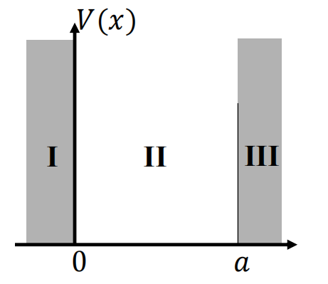
> - 无限深方势阱中，$0<x<a$ 时 $V(x)=0$，其他位置 $V(x)=+\infty$。
> - 定态波函数满足一维定态薛定谔方程 $\frac{d^2\psi(x)}{dx^2}-\frac{2m}{\hbar^2}[V(x)-E]\psi(x)=0$。
>
> 物理上，粒子被限制在 $0<x<a$；
> 数学上，势阱外必须有 $\psi(x)=0$。
> 因此势阱内波函数应满足边界条件 $\psi(0)=\psi(a)=0$。

### 2.6.2 定态方程的完整求解

> [!knowledge]
> **求解对象：** 
> 阱内 $0<x<a$ 有 $V(x)=0$。令 $k^2=\frac{2mE}{\hbar^2}$，定态方程化为 $\frac{d^2\psi(x)}{dx^2}+k^2\psi(x)=0$。

**推导 1 · 从特征根得到阱内通解**

   试探 $\psi(x)=ce^{\lambda x}$，代入阱内方程：
$$
\lambda^2+k^2=0
\quad\Longrightarrow\quad
\lambda=\pm\mathrm{i}k.
$$
因此先得到两个线性无关复解 $e^{\mathrm{i}kx}$、$e^{-\mathrm{i}kx}$；重新线性组合后可取两个线性无关实解 $\sin(kx)$、$\cos(kx)$。故
$$
\psi(x)=c_1\sin(kx)+c_2\cos(kx)
=A\sin(kx+\delta),
$$
其中 $A$ 为常数，$\delta\in[-\pi/2,\pi/2]$ 为常数。

**推导 2 · 边界条件导致能量量子化**

势阱外 $\psi(x)=0$，由波函数连续性，阱内必须满足 $\psi(0)=\psi(a)=0$。依次代入上式：
$$
\begin{aligned}
\psi(0)=A\sin\delta=0
&\quad\Longrightarrow\quad \delta=0,\\
\psi(a)=A\sin(ka+\delta)=0
&\quad\Longrightarrow\quad ka+\delta=n\pi.
\end{aligned}
$$
于是 $k=\frac{n\pi}{a}$，并且
$$
E_n=\frac{n^2\pi^2\hbar^2}{2ma^2},
\qquad
\psi_n(x)=A\sin\left(\frac{n\pi x}{a}\right),
\qquad n=1,2,3,\ldots
$$
注意：$n=0$ 时得到零函数，不能归一化；$n<0$ 时的波函数与对应 $n>0$ 的函数线性相关。因此只保留正整数 $n$。

**推导 3 · 归一化系数**

对本征函数施加 $\int_0^a\psi_n^2(x)\,dx=1$。令 $y=\pi x/a$，并使用 $\sin^2(ny)=\frac{1-\cos(2ny)}{2}$：

$$
\begin{aligned}
1
&=\int_0^a A^2\sin^2\left(\frac{n\pi x}{a}\right)dx
=\frac{a}{\pi}A^2\int_0^\pi\sin^2(ny)dy\\
&=\frac{a}{\pi}A^2\int_0^\pi\frac{1-\cos(2ny)}{2}\,dy\\
&=\frac{a}{2\pi}A^2\int_0^\pi dy
-\frac{a}{4n\pi}A^2\int_0^{2n\pi}\cos z\,dz
=\frac{a}{2}A^2.
\end{aligned}
$$

故 $A=\sqrt{2/a}$，归一化本征函数为

$$
\boxed{\psi_n(x)=\sqrt{\frac{2}{a}}\sin\left(\frac{n\pi x}{a}\right)}.
$$
> [!knowledge]
> **最终导出：** 
> - 能量本征值：$$E_n=\frac{n^2\pi^2\hbar^2}{2ma^2}
\qquad$$
>
>- 能量本征态波函数：
>$$
\boxed{\psi_n(x)=\sqrt{\frac{2}{a}}\sin\left(\frac{n\pi x}{a}\right)}.
$$

> [!knowledge]
> **本征值—本征函数对：** 对每个 $n=1,2,3,\ldots$，$E_n=\frac{n^2\pi^2\hbar^2}{2ma^2}$ 与上式的 $\psi_n(x)$ 成对出现；

### 2.6.3 正交性、完备性与时间演化
> [!knowledge]
> - 本征态函数族满足正交归一关系 $\int_0^a\psi_m^*(x)\psi_n(x)\,dx=\delta_{mn}$，并且完备：
> 	- 势阱中的任意初始波函数可展开为 $\Psi(x,0)=\sum_{n=1}^{\infty}a_n\psi_n(x)$。
>
> - 第 $n$ 个定态的完整含时波函数为 $\Psi_n(x,t)=\psi_n(x)e^{-\mathrm{i}E_nt/\hbar}$
> - 满足初始条件的任意态演化为 $\Psi(x,t)=\sum_{n=1}^{\infty}a_n\psi_n(x)e^{-\mathrm{i}E_nt/\hbar}$。
### 2.6.4 图像特征与物理结论

> [!knowledge]
> 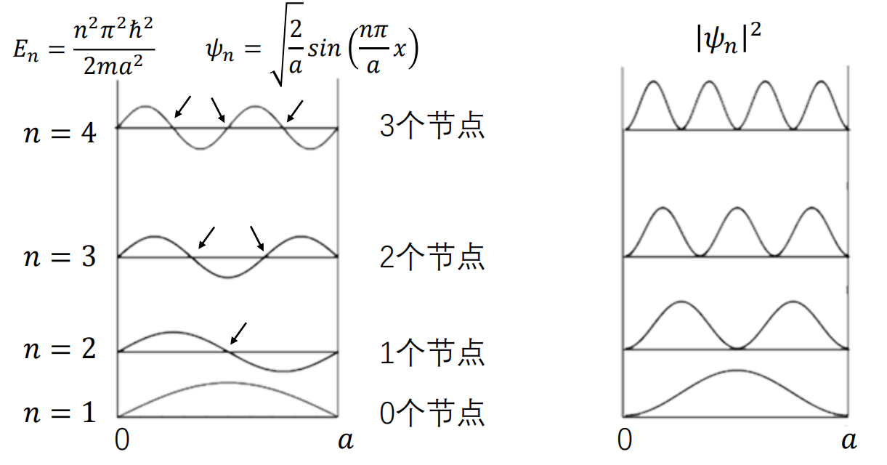
> - 第 $n$ 个本征函数在势阱内部有 $n-1$ 个节点。能量离散，且存在零点能：粒子没有静止状态。
>
> - 势阱宽度 $a$ 越大，能级间距越小；当 $a\to\infty$ 时，能级趋于连续，过渡到经典情形。
> - 基态为偶函数、激发态奇偶交替
### 2.6.5 课堂练习

**[ 例题 ] 三个势阱宽度依次为 $a,2a,3a$，每个势阱中各有一个定态粒子，判断节点数、能级序数及能量大小。

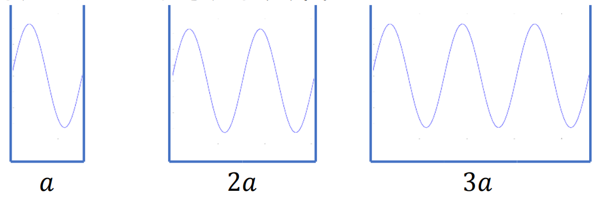
由长度 $L$ 内第 $n$ 个本征函数含 $n/2$ 个完整周期，可得三个量子的能级依次为 $n=2,4,6$，内部节点数依次为 $1,3,5$。又因 $E_n\propto n^2/L^2$，三者能量相等；等价地说，三者的波长相同。

**[ 例题 ] 给定无限深势阱的初态 $\Psi(x,0)=\frac{\sqrt{2}}{2}[\psi_1(x)+\psi_2(x)]$，求。。。

课件给出的两个定态相位角频率为 $\omega_1=\frac{E_1}{\hbar}=\frac{\pi^2\hbar}{2ma^2}$，$\omega_2=\frac{E_2}{\hbar}=4\omega_1$。

课件给出的概率密度为 $|\Psi(x,t)|^2=\frac{\psi_1^2(x)+\psi_2^2(x)}{2}+\psi_1(x)\psi_2(x)\cos[(\omega_2-\omega_1)t]$，其变化角频率为 $\omega_p=\omega_2-\omega_1=\frac{E_2-E_1}{\hbar}=\frac{3\pi^2\hbar}{2ma^2}$。

### 2.6.6 类比、实例与有限深势阱
> [!knowledge]
> - 无限深方势阱的定态可类比为两端固定的一维弦振动：允许的频率是不连续的，并构成基音及其整数倍的泛音。
>
> - 现实实例包括一维**金原子链与金属薄膜**。原子链中电子密度与概率密度成正比，密度最小点对应波函数节点；金属薄膜中电子在垂直薄膜的方向受限，表现出量子化能级。

### 2.6.6有限深势阱
> [!knowledge]
> 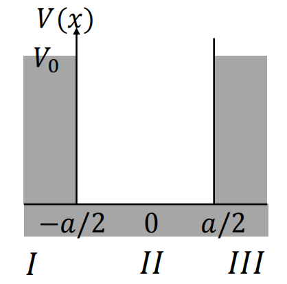
> **有限深方势阱：**
>  - $-a/2<x<a/2$ 时， $V(x)=0$
>  - 其他位置 $V(x)=V_0$，本节考虑 $0<E<V_0$ 的束缚态。

**推导 1 · 分区方程与衰减解**

将定态薛定谔方程分别写在 I、II、III 区：
$$
\begin{aligned}
\mathrm{I}:&\quad -\frac{\hbar^2}{2m}\psi_{\mathrm{I}}''+V_0\psi_{\mathrm{I}}=E\psi_{\mathrm{I}},\\
\mathrm{II}:&\quad -\frac{\hbar^2}{2m}\psi_{\mathrm{II}}''=E\psi_{\mathrm{II}},\\
\mathrm{III}:&\quad -\frac{\hbar^2}{2m}\psi_{\mathrm{III}}''+V_0\psi_{\mathrm{III}}=E\psi_{\mathrm{III}}.
\end{aligned}
$$
记 $k=\frac{\sqrt{2mE}}{\hbar}$、$k'=\frac{\sqrt{2m(V_0-E)}}{\hbar}$，则：
$$
\psi_{\mathrm{I}}''-k'^2\psi_{\mathrm{I}}=0,
\qquad
\psi_{\mathrm{II}}''+k^2\psi_{\mathrm{II}}=0,
\qquad
\psi_{\mathrm{III}}''-k'^2\psi_{\mathrm{III}}=0.
$$
一般解及束缚态条件为：
$$
\begin{aligned}
\psi_{\mathrm{I}}&=Ae^{k'x}+A'e^{-k'x}
\xrightarrow[x\to-\infty]{}Ae^{k'x},\\
\psi_{\mathrm{II}}&=B\sin(kx+\alpha),\\
\psi_{\mathrm{III}}&=C'e^{k'x}+Ce^{-k'x}
\xrightarrow[x\to+\infty]{}Ce^{-k'x}.
\end{aligned}
$$
注意:  左右两侧分别舍弃在 $x\to-\infty$、$x\to+\infty$ 发散的指数项。

**推导 2 · 四个匹配条件与相位限制**
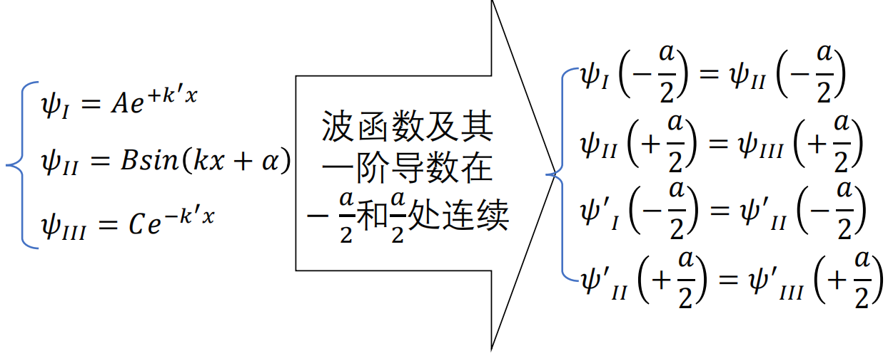
在 $x=\pm a/2$ 处要求波函数及其一阶导数连续，得到：
$$
\begin{aligned}
Ae^{-ak'/2}&=B\sin\left(-\frac{ka}{2}+\alpha\right),\\
B\sin\left(\frac{ka}{2}+\alpha\right)&=Ce^{-ak'/2},\\
k'Ae^{-ak'/2}&=kB\cos\left(-\frac{ka}{2}+\alpha\right),\\
kB\cos\left(\frac{ka}{2}+\alpha\right)&=-k'Ce^{-ak'/2}.
\end{aligned}
$$
将第一、三式以及第二、四式分别相除，得

$$
\frac{k}{k'}=\tan\left(-\frac{ka}{2}+\alpha\right),
\qquad
\frac{k}{k'}=-\tan\left(\frac{ka}{2}+\alpha\right).
$$

从而 $\tan(ka/2-\alpha)=\tan(ka/2+\alpha)$。由于 $\tan x$ 的周期为 $\pi$ 且在一个周期内单调，有 $2\alpha=n\pi$，即 $\alpha=n\pi/2$。

> [!knowledge]
> - 问题中有 $A,B,C,\alpha,E$ 五个参数；
> - 对应四个边界连续方程再加一个归一化条件，参数可完全确定。因此 $E$ 只能取孤立值而非连续值。

**推导 3 · 奇、偶宇称的超越方程**

当 $\alpha=0$ 时，$\psi_{\mathrm{II}}=B\sin(kx)$ 为奇函数；当 $\alpha=\pi/2$ 时，$\psi_{\mathrm{II}}=B\cos(kx)$ 为偶函数。对称势使整个波函数具有相同的奇偶性。

$$
\begin{array}{c|c|c}
\text{宇称} & \text{边界匹配方程} & \text{能量形式}\\
\hline
\text{奇宇称（奇函数）} & \displaystyle\frac{k}{k'}=-\tan\frac{ka}{2} & \displaystyle\sqrt{\frac{E}{V_0-E}}=-\tan\left(\frac{\sqrt{2mE}\,a}{2\hbar}\right)\\
\text{偶宇称（偶函数）} & \displaystyle\frac{k}{k'}=-\tan\left(\frac{ka}{2}+\frac{\pi}{2}\right) & \displaystyle\sqrt{\frac{E}{V_0-E}}=-\tan\left(\frac{\sqrt{2mE}\,a}{2\hbar}+\frac{\pi}{2}\right)
\end{array}
$$
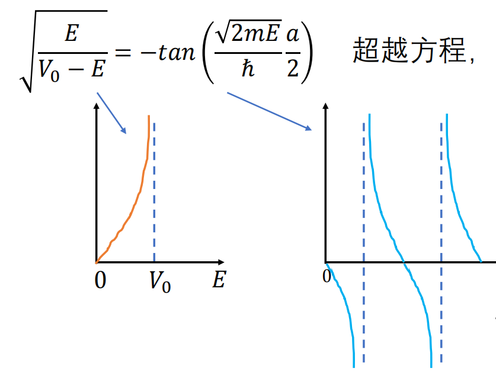
二者均为超越方程，采用作图法求解。奇宇称右端的发散点满足 $\frac{\sqrt{2mE}\,a}{2\hbar}=(n+\frac12)\pi$；偶宇称右端的发散点满足 $\frac{\sqrt{2mE}\,a}{2\hbar}=n\pi$，其中 $n=0,1,2,\ldots$。

> [!tip] 关键提示
> 奇宇称可能没有解；图示指出，当 $V_0<\frac{\hbar^2}{2ma^2}\,4\pi^2\left(\frac12\right)^2=\frac{\pi^2\hbar^2}{2ma^2}$ 时没有奇宇称交点。偶宇称至少有一个解。

**为什么有限阶跃处 $\psi'$ 连续？**

课件从 $\psi''=-\frac{2m}{\hbar^2}[E-V(x)]\psi$ 出发。在阶跃点 $x=a$ 的邻域积分：

$$
\psi'(a+0^+)-\psi'(a-0^+)
=\lim_{\varepsilon\to0^+}
-\frac{2m}{\hbar^2}\int_{a-\varepsilon}^{a+\varepsilon}[E-V(x)]\psi(x)\,dx.
$$

若 $V(x)$ 虽变化很快但保持有限，则 $[E-V(x)]\psi(x)$ 有限；积分区间宽度趋于零，右端趋于零，所以 $\psi'(a+0^+)=\psi'(a-0^+)$。无限深势壁不满足“势能有限”这一前提。

> [!knowledge]
> 与无限深势阱相比，有限深势阱的束缚态能量降低，且波函数可以穿入经典禁止区。

> [!note] 待插图
> 来源：课件 p. 23–25；内容：奇、偶宇称超越方程的作图求解，以及不同阱深下的能级与波函数比较；用途：理解离散解的交点来源和有限深势阱的穿透尾部。
> 裁剪建议：保留函数交点、发散线和能级/波函数示意。

### 2.6.8 一维定态方程解的性质（补充）

> [!knowledge]
> **定理 1：** 若 $\psi(x)$ 是定态薛定谔方程的一个解，对应能量为 $E$，则 $\psi^*(x)$ 也是该方程的解，对应能量仍为 $E$。
> **推论：** 若能级 𝐸 不简并，其本征函数总可取为实函数。

> [!knowledge]
> **定理 2：** 对应能量本征值 $E$，总可找到一组完备实解；属于 $E$ 的任意解都可表示为这组实解的线性叠加。因此定态本征函数总可以取为实函数。

> [!knowledge]
> **定理 3：** 若势函数具有反射对称性 $V(x)=V(-x)$，而 $\psi(x)$ 是能量 $E$ 的解，则 $\psi(-x)$ 也是能量 $E$ 的解。

> [!knowledge]
> **定理 4：** 对反射对称势 $V(x)=V(-x)$ 的任一本征能量 $E$，可找到一组每个元素都具有确定奇偶性的完备解；但该组中不同解的奇偶性不一定相同。

> [!knowledge]
> **定理 5：** 对一维运动粒子，若 $\psi_1(x)$、$\psi_2(x)$ 是同一能量本征值 $E$ 的两个解，则 $\psi_1\psi_2'-\psi_2\psi_1'$ 是与 $x$ 无关的常数。

> [!knowledge]
> **定理 6：** 对无奇点的规则一维势场，若存在束缚态 $\psi(\pm\infty)=0$，则能级不简并。

**1 证明：** 物理上允许的能量本征值为实数，故 $E^*=E$；实势满足 $V^*(x)=V(x)$。对定态方程取复共轭：
$$
\left(-\frac{\hbar^2}{2m}\frac{d^2}{dx^2}+V(x)\right)\psi^*(x)=E\psi^*(x).
$$
因此 $\psi^*(x)$ 与 $\psi(x)$ 满足同一方程、对应同一能量。

**2 证明：** 若 $\psi$ 本身为实解，结论显然。若 $\psi$ 为复解，按定理 1，$\psi^*$ 也对应同一 $E$。利用线性方程的叠加性构造
$$
\varphi(x)=\psi(x)+\psi^*(x),
\qquad
\chi(x)=\frac{1}{\mathrm{i}}[\psi(x)-\psi^*(x)].
$$
$\varphi$、$\chi$ 都是实解，且
$$
\psi=\frac12(\varphi+\mathrm{i}\chi),
\qquad
\psi^*=\frac12(\varphi-\mathrm{i}\chi).
$$
故同一能量的复解可由实解基展开。

**3 证明：** 在原方程中作 $x\to-x$ 变换；由于 $\frac{d^2}{d(-x)^2}=\frac{d^2}{dx^2}$ 且 $V(-x)=V(x)$，有
$$
-\frac{\hbar^2}{2m}\frac{d^2}{dx^2}\psi(-x)+V(x)\psi(-x)=E\psi(-x).
$$

**4 构造：** 由定理 3，$\psi(x)$ 和 $\psi(-x)$ 均为能量 $E$ 的解。构造
$$
f(x)=\psi(x)+\psi(-x)=f(-x),
\qquad
g(x)=\psi(x)-\psi(-x)=-g(-x).
$$
其中 $f$ 为偶解，$g$ 为奇解，且反解为
$$
\psi(x)=\frac12[f(x)+g(x)],
\qquad
\psi(-x)=\frac12[f(x)-g(x)].
$$

**5 证明：** 两个解满足
$$
\psi_1''+\frac{2m}{\hbar^2}[E-V(x)]\psi_1=0,
\qquad
\psi_2''+\frac{2m}{\hbar^2}[E-V(x)]\psi_2=0.
$$
用 $\psi_2$ 乘第一式、用 $\psi_1$ 乘第二式再相减，得 $\psi_1\psi_2''-\psi_2\psi_1''=0$，即
$$
\bigl(\psi_1\psi_2'-\psi_2\psi_1'\bigr)'=0.
$$

**6 证明：** 由束缚态在无穷远消失，定理 5 的常数必须为零，故 $\psi_1\psi_2'-\psi_2\psi_1'=0$。在不含节点的区间可写为
$$
\left(\frac{\psi_1}{\psi_2}\right)'=0
\quad\Longrightarrow\quad
\psi_1(x)=C\psi_2(x).
$$

进一步说明：在节点处，规则势使 $\psi_1,\psi_2$ 及其导数连续，故两侧积分常数相同；两解并不线性无关，能级因而不简并。

### 2.6.9 束缚态离散谱的定性理解（补充）

> [!knowledge]
> 正、负无穷远处满足 $V(x)>E$ 的体系称为一维势阱。局部地把势函数近似为常数时：
>
> 当 $V(x)<E$，有 $\psi''+k^2\psi=0$，$k=\frac{\sqrt{2m[E-V(x)]}}{\hbar}$，解呈波动型，如 $e^{\mathrm{i}kx}$。
>
> 当 $V(x)>E$，有 $\psi''-\kappa^2\psi=0$，$\kappa=\frac{\sqrt{2m[V(x)-E]}}{\hbar}$，解呈指数型，如 $e^{\pm\kappa x}$；束缚态在无穷远处应指数衰减至零。

## 2.7 线性谐振子

### 2.7.1 经典图像与近似来源

> [!knowledge]
> **经典谐振子**
> - 受弹性力 $F=-Kx$，满足 $m\frac{d^2x}{dt^2}=-Kx$，即 $x''+\omega^2x=0$（ $\omega=\sqrt{K/m}$）
> - 运动函数可写为 $x=A\sin(\omega t+\delta)$，势能为 $V(x)=\frac12Kx^2=\frac12m\omega^2x^2$。

> [!knowledge]
> - 任意体系在平衡位置附近的小振动，例如分子振动、晶格振动、原子核表面振动和辐射场振动，常可分解为彼此独立的一维简谐振动；

> [!knowledge]
> 以双原子分子为例：
> 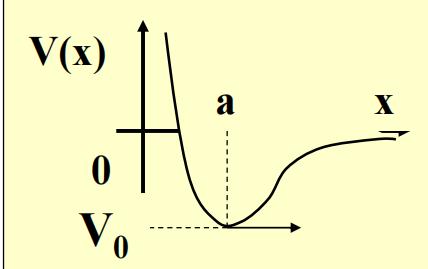
> - 若相对距离为 $x$，势能在平衡位置 $x=a$ 处取极小值 $V_0$，则泰勒展开为 $V(x)=V(a)+V'(a)(x-a)+\frac12V''(a)(x-a)^2+\cdots$。
>
> -  因 $V'(a)=0$，忽略高阶小量后，可**写为** $V(x)\approx V_0+\frac12m\omega^2(x-a)^2$。这给出平衡位置附近的线性谐振子近似。
### 2.7.2 定态薛定谔方程与渐近解

> [!knowledge]
> - **一维谐振子**的哈密顿算符为:
>  - $\hat H=\frac{\hat p^2}{2m}+\frac12m\omega^2x^2=-\frac{\hbar^2}{2m}\frac{d^2}{dx^2}+\frac12m\omega^2x^2$  (前一项是动能，后一项是势能)
>  - **定态薛定谔方程**： $$\hat H\psi=E\psi$$
>  $$
-\frac{\hbar^2}{2m}\frac{d^2\psi}{dx^2}
+\frac12m\omega^2x^2\psi(x)=E\psi(x),
$$

**推导 1 · 无量纲化定态方程**

先写为：
$$
\frac{d^2\psi}{dx^2}
+\frac{2m}{\hbar^2}\left(E-\frac12m\omega^2x^2\right)\psi(x)=0.
$$

定义无量纲坐标与无量纲能量参数
$$
\xi=\alpha x,
\qquad
\alpha=\sqrt{\frac{m\omega}{\hbar}},
\qquad
\lambda=\frac{2E}{\hbar\omega}.
$$
由于 $d^2/dx^2=\alpha^2d^2/d\xi^2$，方程变为
$$
\boxed{\frac{d^2\psi}{d\xi^2}+(\lambda-\xi^2)\psi(\xi)=0.}\tag{1}
$$

**推导 2 · 无穷远处的渐近行为**
当 $\xi\to\infty$，有 $\lambda-\xi^2\to-\xi^2$，故式 (1) 近似为
$$
\frac{d^2\psi_\infty}{d\xi^2}-\xi^2\psi_\infty=0.
$$
- 两个特解为 $\psi_\infty=Ce^{-\xi^2/2}$ 与 $\psi_\infty=Ce^{+\xi^2/2}$。
- 但波函数必须在无穷远趋于零，故只保留 $e^{-\xi^2/2}$ 型行为。

> [!info] 补充
> 检验上试探解（$\psi_0=e^{-\xi^2/2}$）：
> - 若 $\psi_0=e^{-\xi^2/2}$，则 $\psi_0''=(\xi^2-1)e^{-\xi^2/2}$；
> - 代回式 (1) 得 $(\lambda-1)e^{-\xi^2/2}=0$。
> - 所以 $\lambda=1$，对应 $E_0=\hbar\omega/2$，即最低能量态。

### 2.7.3 厄米方程、能谱与本征函数

> [!knowledge]
> **波函数的全空间形式：** 提取出无穷远处必需的高斯衰减因子，令 $\psi(\xi)=H(\xi)e^{-\xi^2/2}$。代回式 (1) 得**厄米方程：**
> $$H''-2\xi H'+(\lambda-1)H=0$$

**推导 3 · 幂级数求解与量子化结果**

令 $H$ 作多项式展开：
$$
H(\xi)=\sum_{k=0}^{+\infty}b_k\xi^k.
$$
将该展开代入厄米方程以确定 $b_k$。系数的具体递推过程指向曾谨言《量子力学 1》；其给出的可归一化解的量子化结果为：
> [!knowledge]
> $$能量本征值：
\boxed{E_n=\left(n+\frac12\right)\hbar\omega},
\qquad n=0,1,2,\ldots
>$$
>$$对应本征函数为: \psi_n(x)=N_ne^{-\xi^2/2}H_n(\alpha x)$$$$
>其中: N_n=\left(\frac{m\omega}{\pi\hbar}\right)^{1/4}\frac{1}{\sqrt{2^n n!}},
>\qquad
>\xi=\alpha x,
>\qquad
>\alpha=\sqrt{\frac{m\omega}{\hbar}}
>$$

> [!knowledge]
> **本征态族正交、归一且完备**：
> - $\int\psi_m^*(x)\psi_n(x)\,dx=\delta_{mn}$；
> - 任意不含时波函数可展为 $\Psi(x)=\sum_{n=0}^{\infty}a_n\psi_n(x)$。

> [!knowledge]
> - 前几个厄米多项式为 $H_0(\xi)=1$，$H_1(\xi)=2\xi$，$H_2(\xi)=4\xi^2-2$，$H_3(\xi)=8\xi^3-12\xi$，$H_4(\xi)=16\xi^4-48\xi^2+12$。
>
>  - 因而基态波函数： $\psi_0(x)=\left(\frac{m\omega}{\pi\hbar}\right)^{1/4}e^{-\alpha^2x^2/2}$，
>  - 第一激发态波函数：$\psi_1(x)=\left(\frac{m\omega}{\pi\hbar}\right)^{1/4}\sqrt2\,\alpha x\,e^{-\alpha^2x^2/2}$。

### 2.7.4 图像特征与经典极限

> [!knowledge]
> - 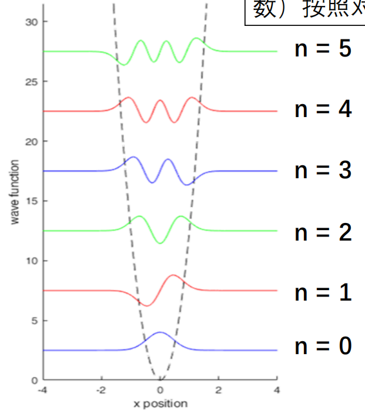
> 	- 谐振子具有分立且等间距的能级
> 	- 存在零点能；
> 	- 基态为偶函数，之后各态奇偶交替。
> 	- 波函数可进入经典禁止区。
> 	- 
>- 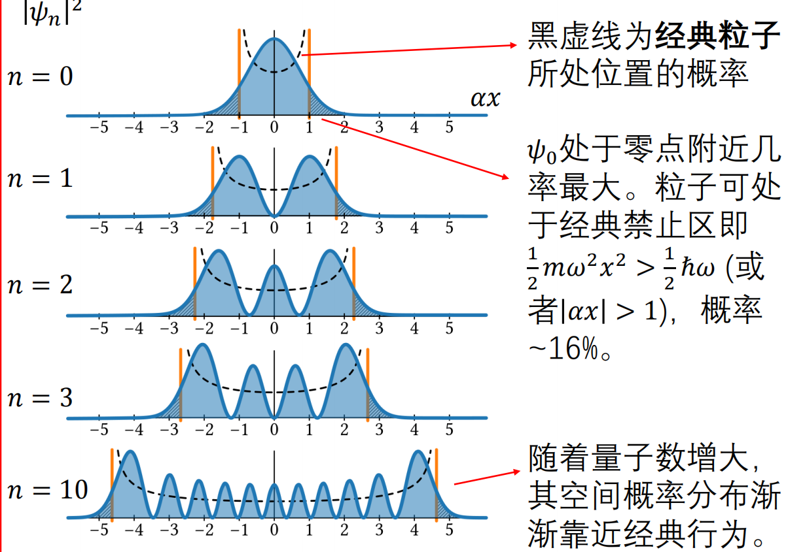
>	- 基态在零点附近的概率最大；
>	- 对基态，经典禁止区 $\frac12m\omega^2x^2>\frac12\hbar\omega$（即 $|\alpha x|>1$）内的概率约为 $16\%$。
>	- 量子数增大时，空间概率分布逐渐接近经典行为。
### 2.7.5 课堂练习：

**[ 例题 ] 电荷为 $q$ 的谐振子受沿 $x$ 方向的外电场 $\varepsilon$，势能为 $V(x)=\frac12m\omega^2x^2-q\varepsilon x$。要求求出能量本征值和本征函数。

先写出定态薛定谔方程：
$$
-\frac{\hbar^2}{2m}\frac{d^2\psi(x)}{dx^2}
+\left[\frac12m\omega^2x^2-q\varepsilon x\right]\psi(x)=E\psi(x).
$$
配方（目的是利用上述线性谐振子结果）：
$$
\begin{aligned}
V(x)
&=\frac12m\omega^2x^2-q\varepsilon x\\
&=\frac12m\omega^2\left(x-\frac{q\varepsilon}{m\omega^2}\right)^2
-\frac{q^2\varepsilon^2}{2m\omega^2}\\
&=\frac12m\omega^2(x-x_0)^2-V_0,
\end{aligned}
$$

其中 $x_0=\frac{q\varepsilon}{m\omega^2}$，$V_0=\frac{q^2\varepsilon^2}{2m\omega^2}$。令 $x'=x-x_0$（进仅对坐标平移），有
$$
\hat p=-\mathrm{i}\hbar\frac{d}{dx}
=-\mathrm{i}\hbar\frac{d}{dx'}=\hat p',
$$

从而原方程严格化为
$$
-\frac{\hbar^2}{2m}\frac{d^2\psi(x')}{dx'^2}
+\left[\frac12m\omega^2x'^2-V_0\right]\psi(x')=E\psi(x').
$$
$$
\left[ -\frac{\hbar^2}{2m}\frac{d^2}{dx'^2} + \frac{1}{2}m\omega^2x'^2 \right]\psi(x') = (E + V_0)\psi(x')$$

对比线性谐振子的标准结果：$\hat{H}_0 \psi_n = E_n \psi_n$，其中 $E_n = \left(n + \frac{1}{2}\right)\hbar\omega$，可知：
 $$E + V_0 = \left(n + \frac{1}{2}\right)\hbar\omega$$$$E_n = \left(n + \frac{1}{2}\right)\hbar\omega - V_0 = \left(n + \frac{1}{2}\right)\hbar\omega - \frac{q^2\varepsilon^2}{2m\omega^2}, \quad n=0,1,2,\dots$$
   标准线性谐振子的本征函数是 $\psi_n(x') = N_n e^{-\frac{1}{2}(\alpha x')^2} H_n(\alpha x')$，只需将 $x'$ 换回 $x - x_0$ 即可。
   $$\psi_n(x) = N_n e^{-\frac{\alpha^2}{2}(x-x_0)^2} H_n(\alpha(x-x_0))$$
   其中:$$N_n = \left(\frac{m\omega}{\pi\hbar}\right)^{1/4} \frac{1}{\sqrt{2^n n!}}, \quad \alpha = \sqrt{\frac{m\omega}{\hbar}}
   （H_n 为厄米多项式）$$
> [!info] 补充
> 由普通谐振子的结果可立即得到 $E_n=(n+\frac12)\hbar\omega-V_0$；相应本征函数是第 $n$ 个谐振子本征函数沿 $x$ 轴平移到 $x_0$ 后的形式。

## 2.8 势垒贯穿

### 2.8.1 矩形势垒散射模型

> [!knowledge]
> 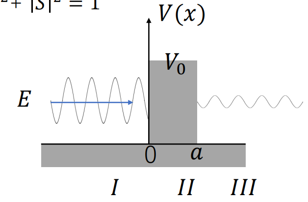
> **模型：** 
> - 粒子自左向右射向有限高、有限宽的方势垒，满足 $0<E<V_0$。
> - 在 $0<x<a$ 时 $V(x)=V_0$，其他位置 $V(x)=0$。

**推导 1 · 分区解的构造**

从一维定态方程出发：
$$
\frac{d^2\psi(x)}{dx^2}-\frac{2m}{\hbar^2}[V(x)-E]\psi(x)=0
$$
定义：
$$
k=\frac{\sqrt{2mE}}{\hbar},
\qquad
k'=\frac{\sqrt{2m(V_0-E)}}{\hbar}.
$$
因此 I、III 区满足 $\psi''+k^2\psi=0$，势垒区 II 满足 $\psi''-k'^2\psi=0$。解得：
$$
\psi(x)=
\begin{cases}
e^{\mathrm{i}kx}+Re^{-\mathrm{i}kx}, & x<0,\\
Ae^{k'x}+Be^{-k'x}, & 0<x<a,\\
Se^{\mathrm{i}kx}, & x>a.
\end{cases}
$$

> $R$ 是反射振幅，$S$ 是透射振幅。右侧舍去 $e^{-\mathrm{i}kx}$（负号代表向左传播，只考虑由左向右的透射波）
### 2.8.2 概率流与边界匹配

> [!knowledge]
> 概率流密度公式为 $$J=\frac{\mathrm{i}\hbar}{2m}\left(\Psi\frac{d\Psi^*}{dx}-\Psi^*\frac{d\Psi}{dx}\right)=\frac{\hbar}{m}\operatorname{Im}\left(\Psi^*\frac{d\Psi}{dx}\right)$$
>
> 由此公式，可求出：
> - $x<0$ 有 $J=\frac{\hbar k}{m}(1-|R|^2)$
> - $x>a$ 有 $J=\frac{\hbar k}{m}|S|^2$。
> - 定态概率守恒给出 $|R|^2+|S|^2=1$。

**推导 2 · 两个边界的连续性方程**

在 $x=0$，波函数和一阶导数连续：
$$
1+R=A+B,\\
\mathrm{i}k(1-R)=k'(A-B).
$$
在 $x=a$，波函数和一阶导数连续:
$$
\begin{aligned}
Ae^{k'a}+Be^{-k'a}&=Se^{\mathrm{i}ka},\\
k'Ae^{k'a}-k'Be^{-k'a}&=\mathrm{i}kSe^{\mathrm{i}ka}.
\end{aligned}
$$

由这四个方程可解出 $S$（具体代数过程参见教科书）。

### 2.8.3 透射系数与隧道效应

> [!knowledge]
> 定义双曲函数 $sh(x)=\frac{e^x-e^{-x}}{2}$、$ch(x)=\frac{e^x+e^{-x}}{2}$。
透射系数：
>$$
\begin{aligned}
D=|S|^2
&=\frac{4k^2k'^2}{(k^2-k'^2)^2sh^2(k'a)+4k^2k'^2ch^2(k'a)}\\
&=\frac{4k^2k'^2}{(k^2+k'^2)^2sh^2(k'a)+4k^2k'^2}.
\end{aligned}
>$$
>反射系数为
>
>$$
|R|^2=
\frac{(k^2+k'^2)^2sh^2(k'a)}{(k^2+k'^2)^2sh^2(k'a)+4k^2k'^2},
\qquad
|R|^2+|S|^2=1.
$$

> [!knowledge]
> 
> 结论：与经典情形不同，能量低于势垒的粒子仍可能穿透势垒。

[ 例子 ]  当 $k'a\gg1$，$sh(k'a)\sim\frac12e^{k'a}$。将此代入透射系数：
$$
\begin{aligned}
D
&=\frac{4k^2k'^2}{(k^2+k'^2)^2sh^2(k'a)+4k^2k'^2}\\
&\approx\frac{16}{\left(\frac{k}{k'}+\frac{k'}{k}\right)^2}e^{-2k'a}\\
&=D_0\exp\left[-\frac{2a}{\hbar}\sqrt{2m(V_0-E)}\right].
\end{aligned}
$$
> [!tip] 关键提示
> **透射系数**随势垒**宽度 $a$ 增加而指数减小**，也随势垒**高度差 $V_0-E$ 增加而指数减小**。

**[ 例题 ]   给定电子穿越方势垒，$V_0-E=5\,\mathrm{eV}$，$a=2\times10^{-10}\,\mathrm{m}=2\,\mathring{\mathrm{A}}$。（1）使用 $D\sim\exp[-\frac{2a}{\hbar}\sqrt{2m(V_0-E)}]$ 估算透射率；（2）将距离改为 $10\,\mathring{\mathrm{A}}$.（3）再将电子换为质子（$m_p/m_e\approx1840$）。

结果依次为：$D\sim0.0104$；距离为 $10\,\mathring{\mathrm{A}}$ 时 $D\sim1.23\times10^{-10}$；换为质子时 $D\sim9.5\times10^{-86}$。

### 2.8.4 隧穿效应
> [!knowledge]
> **隧道效应**
> 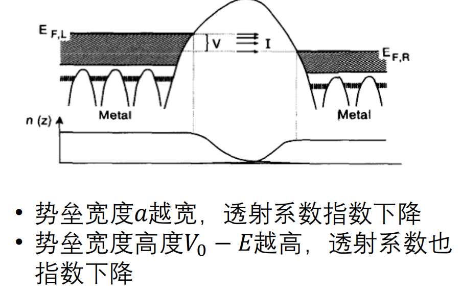
> - 对不规则势垒，可将其近似看成连续穿过许多小势垒
> - 势垒近似：$D\sim\exp\left[-\frac{2}{\hbar}\int_a^b\sqrt{2m[V(x)-E]}\,dx\right]$。

> [!knowledge]
> **隧穿效应实例**
> - 扫描隧道显微镜中，相距约 $1\,\mathrm{nm}$ 的固体之间，电子可越过真空势垒隧穿到邻近固体。
> - “量子围栏”实例：电子波函数被原子反射/散射后与自身形成驻波；可对散射驻波作二维傅里叶变换以研究表面电子行为。

> [!knowledge]
> **隧穿效应实例**
> - 恒星核聚变中，原子核若仅靠热动能需克服约 $1\,\mathrm{MeV}$ 的库仑势垒，约为平均热动能的 $1000$ 倍；即使核能量低于势垒，量子隧穿仍可使其穿过库仑势垒而促成聚变。
### 2.8.5 双势阱、弱连接与能带（补充）

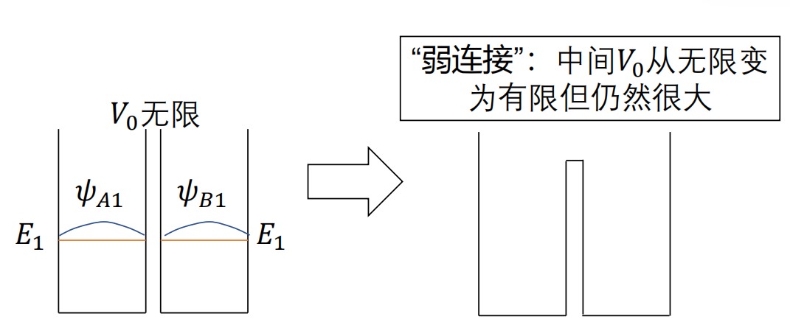
**[例题] 两个相同的无限深势阱相邻。初始时中间势垒高度为无穷；将其降至仍很大的有限值 $V_0$。设单个势阱基态为 $E_1,\psi_1$，左右局域基态分别为 $\psi_{A1},\psi_{B1}$。
1.  当 $V_0=\infty$，两个基态简并于 $E_1$。可重新组合为具有确定奇偶性的 $\psi_+=\frac{1}{\sqrt2}(\psi_{A1}+\psi_{B1})$（偶）与 $\psi_-=\frac{1}{\sqrt2}(\psi_{A1}-\psi_{B1})$（奇）。

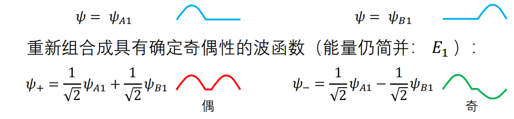

 2. 当 $V_0$ 很大但有限时，波函数仍近似具有偶/奇形式，但由一维规则势束缚态不简并可知能级分裂；偶宇称态为基态，课件将两条相近能级记为 $E_1^-=E_1-\delta$ 与 $E_1^+=E_1+\delta$。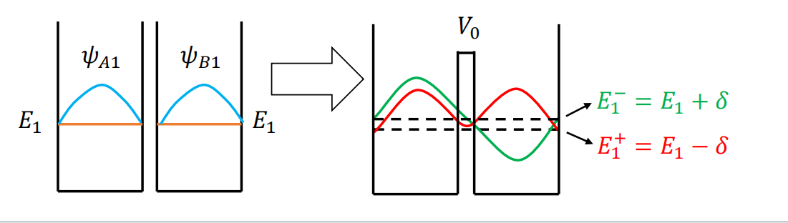

> [!tip] 关键提示
> 这里的“偶宇称态为基态”来自对称一维势阱的基态性质；用它确定弱连接后两条近简并能级的高低次序。

> [!knowledge]
> 推广到 $N$ 个相邻的相同无限深势阱时，只考虑各阱基态；从最左侧起将势阱编号为 $j=0,1,\ldots,N-1$，并记局域基态为 $\psi^j$。

**从两个势阱到 $N$ 个势阱（课件 p. 60–61）**

对 $N=2$，两个组合态可写成离散相位变换的形式：

$$
\begin{aligned}
\psi_0
&=\frac{1}{\sqrt2}(\psi^0+\psi^1)
=\frac{1}{\sqrt2}\left(e^{\mathrm{i}2\pi\frac02\cdot0}\psi^0+e^{\mathrm{i}2\pi\frac02\cdot1}\psi^1\right),\\
\psi_1
&=\frac{1}{\sqrt2}(\psi^0-\psi^1)
=\frac{1}{\sqrt2}\left(e^{\mathrm{i}2\pi\frac12\cdot0}\psi^0+e^{\mathrm{i}2\pi\frac12\cdot1}\psi^1\right).
\end{aligned}
$$

推广到 $N$ 个势阱：

$$
\psi_n=\frac{1}{\sqrt N}\sum_{j=0}^{N-1}e^{\mathrm{i}2\pi\frac{n}{N}j}\psi^j,
\qquad n=0,1,\ldots,N-1.
$$

定义 $k=2\pi n/N$ 后，统一写为

$$
\boxed{\psi_k=\frac{1}{\sqrt N}\sum_{j=0}^{N-1}e^{\mathrm{i}kj}\psi^j}.
$$

> [!knowledge]
> 在 $\psi_k$ 中，粒子处于各势阱的概率相同；相邻势阱中波函数的相位变化为 $e^{\mathrm{i}k}$，整体相位变化快慢取决于 $k=2\pi n/N$。

> [!knowledge]
> 当 $N$ 个势阱弱连接时，上述波函数形式基本保持；原本简并于 $E_1$ 的 $N$ 个态不再简并，而是在 $E_1$ 附近分裂成 $N$ 个能级，称为能带。课件在由基态形成的组合态中，以“振荡越快能量越大”概括 $k$ 越大时能量越大。

> [!knowledge]
> 课件随即指出，该规律不能直接套用到激发态。以 $N=2$ 为例：
>
> | 组合所依据的单阱态 | $k=0$ 的组合态 | $k=\pi$ 的组合态 | 弱连接时能量更低者 |
> | --- | --- | --- | --- |
> | 基态 $E_1$ | 偶函数 | 奇函数 | $k=0$ 的偶函数 |
> | 第一激发态 $E_2$ | 奇函数 | 偶函数 | $k=\pi$ 的偶函数 |

> [!warning] 易错点
> “对称一维势阱的基态具有偶宇称”适用于对称势阱的基态；不能不加条件地把“$k$ 越大能量越大”的基态图像套用到激发态形成的组合态。

> [!note] 待插图
> 来源：课件 p. 60–62；内容：$N$ 势阱相位组合、能带形成，以及基态/第一激发态组合的奇偶性比较；用途：理解离散相位模式和基态、激发态能量排序的差异。
> 裁剪建议：保留 $\psi_k$ 的相位组合公式与两列奇偶性示意。

**[例题] 双势阱精确求解的手写参考（课件 p. 63–64）**

课件将两个外侧无限深势阱取在 $[-L,-a]$、$[a,L]$，中央势垒取在 $[-a,a]$，并将中央势垒高度降为有限 $V_0$。令 $k=\sqrt{2mE}/\hbar$，$k'=\sqrt{2m(V_0-E)}/\hbar$。

手写参考先取三段试探解：

$$
\begin{aligned}
\mathrm{I}:&\quad \psi_{\mathrm{I}}=A\sin(kx+kL+\delta_1'),\\
\mathrm{II}:&\quad \psi_{\mathrm{II}}=Be^{k'x}+Ce^{-k'x},\\
\mathrm{III}:&\quad \psi_{\mathrm{III}}=D\sin(-kx+kL+\delta_2').
\end{aligned}
$$

由外侧无限深势壁 $\psi(-L)=\psi(L)=0$，并按手写解答中相位取值范围选取，可令 $\delta_1'=\delta_2'=0$。再利用势场关于原点的对称性，将解分成偶、奇两类。

**偶宇称：** 中央区取 $\psi_{\mathrm{II}}=2B\,ch(k'x)$；在 $x=a$ 连续，有

$$
2B\,ch(k'a)=A\sin[-ka+kL],
\qquad
2Bk'\,sh(k'a)=-Ak\cos[-ka+kL].
$$

两式相除得到

$$
\cot[k(L-a)]= -\frac{k'}{k}\tanh(k'a).
$$

**奇宇称：** 中央区取 $\psi_{\mathrm{II}}=2B\,sh(k'x)$；在 $x=a$ 连续，有

$$
2B\,sh(k'a)=A\sin[ka-kL],
\qquad
2Bk'\,ch(k'a)=Ak\cos[ka-kL].
$$

两式相除得到

$$
\cot[k(L-a)]= -\frac{k'}{k}\coth(k'a).
$$

当 $V_0\gg E$ 时，手写解答进一步写成 $\tanh(k'a)\approx1-\delta$、$\coth(k'a)\approx1+\delta$，于是偶、奇两支超越方程的右端只有很小差异；按作图法得到相近但不再简并的两条能级。

## 2.9 本节小结

> [!abstract] 本节小结
> 一维无限深方势阱由边界条件导致能量离散，$E_n\propto n^2/a^2$；其本征态构成正交、归一、完备基。
>
> 有限深势阱中束缚态在经典禁止区呈指数衰减，匹配条件导致超越方程和离散能谱；对称势下可按奇偶宇称分类。
>
> 线性谐振子能级为 $E_n=(n+\frac12)\hbar\omega$，等间距且有零点能；高量子数时概率分布趋近经典描述。
>
> 对能量低于矩形势垒的粒子，透射率仍非零，并随势垒宽度和高度差指数降低；这是扫描隧道显微镜、核聚变等现象的基础。
>
> 相邻势阱弱连接会解除简并并形成能带；奇偶性与一维束缚态不简并性是判断能级排序的重要依据。

## 待处理清单

- 待核对：课件 p. 48；原因：右侧透射区在答案中写为 $x>0$，与题设定义的 $x>a$ 不一致。
